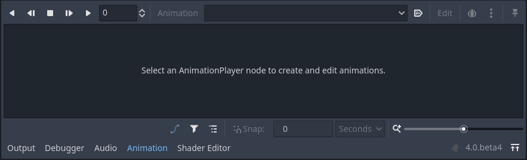
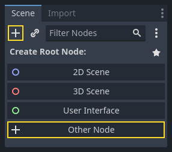

# Godot Engine v4.3

## Índice
- [Capítulo 1. Introducción](#capítulo-1-introducción)
- [Capítulo 2. Primeros pasos](#capítulo-2-primeros-pasos)
- [Capítulo 3. Tu primer juego 2D](#capítulo-3-tu-primer-juego-2d)

---

```
Scene > Create Root Node: 2D Scene
FileSystem > btn_der > New Script > new_script.gd
doble_clic > new_script.gd

print("hola mundo")
```

## Algunas caracteristicas de Godot 4

- GDScript 2.0 (C++[GDCPP] o C# [.NET 6.0])
- GDExtension reemplaza a GDNative
- GodotPhysics 2.0 > Character Body [2D y 3D]
- Nuevo editor de Tiles 2D
- Nuevo sistema multiplayer (nueva API)
- Internacionalización

Mobile Highend con Vulkan (iPhone y Galaxy) vs Mobile Lowend con OpenGL (el resto)

Importante: Lograr tanto una estética como una mecánica innovativa (Juan Linietsky).

**Componentes principales de Godot:**

- Nodos
- Escenas
- Árbol de escenas
- Señales
- Instancias
- Recursos


## Capítulo 1. Introducción	

Godot puede crear tanto juegos como aplicaciones de tipo desktop, mobile o web. También juegos de consola pero se debe tener altas habilidades de programación y adecuación a estandares de producción internacionales.

Algunos juegos realizados en la plataforma:

- Ex-Zodiac
- Helms of Fury
- Pixelorama

Tiene un editor de juego que incluye:

- un editor de código,
- un editor de animación,
- un editor de tilemap,
- un editor de shader,
- un debugger,
- un profiler, y mucho más.

### Aprende a programar con GDScript: GDScript en 27 lecciones

[Learn GDScript From Zero app](https://gdquest.github.io/learn-gdscript/?ref=godot-docs)

Lesson 1: What code is like
Lesson 2: Your first error
Lesson 3: We stand on the Shoulders of Giants
Lesson 4: Drawing a Rectangle
Lesson 5: Coding your first function
Lesson 6: Your First Function Parameter
Lesson 7: Introduction to Member Variables
Lesson 8: Defining your own variables
Lesson 9: Adding and subtracting
Lesson 10: The Game Loop
Lesson 11: Time Delta
Lesson 12: Using Variables to Make Code Easier to Read
Lesson 13: Conditions
Lesson 14: Multiplying
Lesson 15: 2D Vectors
Lesson 16: Introduction to While Loops
Lesson 17: Introduction to For Loops
Lesson 18: Creating Arrays
Lesson 19: Looping Over Arrays
Lesson 20: Strings
Lesson 21: Functions that return a value
Lesson 22: Appending and Popping values from arrays
Lesson 23: Accessing values in arrays
Lesson 24: Creating Dictionaries
Lesson 25: Looping over dictionaries
Lesson 26: Value types
Lesson 27: Specifying types with type hints

### Descripción de los conceptos clave de Godot

En Godot, un juego es un **árbol de escenas** y cada escena es un **árbol de nodos**. Los nodos pueden comunicarse entre sí mediante **señales**.

#### Escenas

La idea es que las escenas son elementos flexibles que suelen ser reutilizados. Una escena puede ser un personaje, un arma, un menú en la interfaz de usuario, una sola casa, un nivel entero o cualquier cosa que puedas imaginar.

#### Nodos

Un nodo es un componente de una escena, el bloque de construcción más pequeño. A continuación podemos ver los nodos que componen el personaje _Player_: 


Está compuesto de un nodo `CharacterBody2D` llamado _Player_, un nodo `Camera2D`, un nodo `Sprite2D`, y un nodo `CollisionShape2D`.

> **Nota:**
>
> Los nombres de los nodos terminan con "2D" porque se trata de una escena 2D. Sus contrapartes 3D tienen nombres que terminan con "3D". Tenga en cuenta que los nodos `Spatial` ahora se denominan `Nodo3D` a partir de Godot 4.

Godot ofrece una amplia biblioteca de `tipos de nodos` base que puedes combinar y ampliar para crear otros más potentes. 2D, 3D o interfaz de usuario, harás la mayoría de las cosas con estos nodos.

#### El árbol de escena

Todas las escenas de tu juego se reúnen en el **árbol de escena**, que es literalmente un árbol de escenas. Y como las escenas son árboles de nodos, el árbol de escenas también es un árbol de nodos. Pero es más fácil pensar en tu juego en términos de escenas, ya que pueden representar personajes, armas, puertas o tu interfaz de usuario.

All your game's scenes come together in the scene tree, literally a tree of scenes. And as scenes are trees of nodes, the scene tree also is a tree of nodes. But it's easier to think of your game in terms of scenes as they can represent characters, weapons, doors, or your user interface.

#### Señales

Los nodos emiten **señales** cuando se produce algún evento. Esta función le permite hacer que los nodos se comuniquen sin necesidad de cablearlos en el código. Le brinda mucha flexibilidad en la forma en que estructura sus escenas.


> **Nota:**
>
> Las señales son la versión de Godot del _patrón del observador_. Puedes leer más sobre esto aquí: https://gameprogrammingpatterns.com/observer.html.

Por ejemplo, los botones emiten una señal cuando se presionan. Puedes conectarte a esta señal para ejecutar código en reacción a este evento, como iniciar el juego o abrir un menú.

Otras señales integradas pueden indicarte cuándo chocaron dos objetos, cuándo un personaje o monstruo ingresó a un área determinada y mucho más. También puedes definir nuevas señales adaptadas a tu juego.

#### Resumen

Los nodos, las escenas, el árbol de escena y las señales son cuatro conceptos básicos de Godot que manipularás todo el tiempo.

Los `nodos` son los bloques de construcción más pequeños de tu juego. Los combinas para crear `escenas` que luego combinas y anidan en el `árbol de escena`. Luego puedes usar `señales` para hacer que los nodos reaccionen a eventos en otros nodos o en diferentes ramas del árbol de escena.

### Primer vistazo a la interfaz de Godot

#### El `Project Manager`

Cuando Godot inicia, la primera ventana que ve es el `Project Manager` (Administrador de Proyectos). En la pestaña predeterminada `Projects`, puede administrar proyectos existentes, importar o crear nuevos, y más.


En la parte superior de la ventana, hay otra pestaña llamada `Asset Library` (Biblioteca de activos). La primera vez que acceda a esta pestaña, verá un botón "Conectarse". Por razones de privacidad, el administrador de proyectos de Godot no accede a Internet de manera predeterminada. Para cambiar esto, haga clic en el botón "Conectarse". Puede cambiar esta opción más adelante en la configuración.

Una vez que el modo de red esté configurado en "en línea", puede buscar proyectos de demostración en la biblioteca de recursos de código abierto, que incluye muchos proyectos desarrollados por la comunidad:


La configuración del `Project Manager` se puede abrir mediante el menú `Settings`:


Desde aquí, puede cambiar el idioma del editor (el idioma predeterminado es el idioma del sistema), el tema de la interfaz, la escala de visualización, el modo de red y también la convención de nombres de directorios.

> **Consulte también:**
>
> Para conocer los entresijos del `Project Manager`, lea [Using the Project Manager](https://docs.godotengine.org/en/stable/tutorials/editor/project_manager.html#doc-project-manager).

#### Primer vistazo al editor de Godot


Cuando abres un proyecto nuevo o uno existente, aparece la interfaz del editor. Veamos sus áreas principales:


De manera predeterminada, a lo largo del borde superior de la ventana, se encuentra el `menú principal`. En el menú principal a la izquierda, los botones de cambio de `workspace` (espacio de trabajo) en el centro (el espacio de trabajo activo está resaltado) y los botones de `playtest` (prueba de juego) a la derecha:


Justo debajo de los botones del `workspace`, se ven las escenas abiertas como pestañas. El botón más (+) junto a las pestañas agregará una nueva escena al proyecto. Con el botón del extremo derecho se puede activar el modo sin distracciones, que maximiza o restaura el tamaño de la ventana gráfica ocultando los elementos acoplados en la interfaz:


En el centro, debajo del selector de escenas, se encuentra la `viewport` (ventana gráfica) con su `toolbar` (barra de herramientas) en la parte superior, donde encontrará diferentes herramientas para mover, escalar o bloquear los nodos de la escena (actualmente, el espacio de trabajo 3D está activo):


Esta `toolbar` cambia según el contexto y el nodo seleccionado. Aquí está la barra de herramientas 2D:


A continuación se muestra la barra de herramientas 3D:


A ambos lados de la `viewport` se encuentran los `docks` (muelles). Y en la parte inferior de la ventana se encuentra el `bottom panel` (panel inferior).

Veamos los docks. El dock `FileSystem` (sistema de archivos) muestra una lista de los archivos de su proyecto, incluidos scripts, imágenes, muestras de audio y más:


El dock `Scene` (Escena) muestra una lista de los nodos de la escena activa:


El dock `Inspector` le permite editar las propiedades de un nodo seleccionado:


El `bottom panel` (panel inferior), ubicado debajo de la _viewport_, es el host de la consola de depuración, el editor de animación, el mezclador de audio y más. Pueden ocupar un espacio muy valioso, por eso están plegados de forma predeterminada:


Al hacer clic en uno, se expande verticalmente. A continuación, puedes ver el editor de animaciones abierto:



Los paneles inferiores también se pueden mostrar u ocultar mediante los accesos directos definidos en `Editor Settings > Shortcuts`, en la categoría `Bottom Panels`.

#### Las cuatro pantallas principales

Hay cuatro botones de la pantalla principal centrados en la parte superior del editor: `2D`, `3D`, `Script` y `Asset Library` (biblioteca de recursos).

Usarás la `2D screen` para todo tipo de juegos. Además de los juegos 2D, la pantalla 2D es donde crearás tus interfaces.


En la `3D screen`, puedes trabajar con meshes (mallas), luces y niveles de diseño para juegos 3D.


La `Script screen` es un editor de código completo con un depurador, autocompletado enriquecido y referencia de código incorporada.


Por último, la `Asset Library screen` es una biblioteca de complementos, scripts y activos gratuitos y de código abierto para usar en sus proyectos.


#### Referencia de clase integrada (Integrated class reference)

Godot viene con una referencia de clase incorporada.

Puede buscar información sobre una clase, método, propiedad, constante o señal mediante cualquiera de los siguientes métodos:

- Presionando `F1` (u `Opt + Space` en macOS, o `Fn + F1` para computadoras portátiles con una tecla `Fn`) en cualquier parte del editor.
- Haciendo clic en el botón `Search Help` en la esquina superior derecha de la pantalla principal de Script.
- Haciendo clic en el menú Ayuda y Buscar ayuda.
- `Ctrl + clic` (`Cmd + clic` en macOS) en un nombre de clase, nombre de función o variable integrada en el editor de scripts.


Cuando haces cualquiera de estas cosas, aparece una ventana. Escribe para buscar cualquier elemento. También puedes usarla para explorar los objetos y métodos disponibles.


Haz doble clic en un elemento para abrir la página correspondiente en la pantalla principal del script.


Alternativamente,

- Haz clic mientras presionas la tecla `Ctrl` en un nombre de clase, nombre de función o variable integrada en el editor de scripts.
- Haz clic derecho en los nodos y elige `Open Documentation` o elige `Lookup Symbol` para elementos en el editor de scripts para abrir directamente su documentación.

### Aprendiendo nuevas funciones

Recomendamos:

- El curso CS50 de la universidad Harvard,
- El libro "Automate The Boring Stuff With Python" de _Al Sweigart_,
- y los [Community tutorials and resources](https://docs.godotengine.org/en/stable/community/tutorials.html#doc-community-tutorials)

### La filosofía del diseño de Godot

Cada motor de juegos ofrece una variedad de funciones que determinan flujos de trabajo (workflows) y estructuras de juegos con características específicas. 

#### Diseño y composición orientada a objetos

Esencialmente Godot adopta el **diseño orientado a objetos** que incorpora un **sistema de escenas flexible** y una **jerarquía de nodos**. Intenta mantenerse alejado de los patrones de programación estrictos para ofrecer una forma intuitiva de estructurar el juego.

En primer lugar, Godot te permite **componer o agregar escenas**. Es como prefabs (prefabricados) anidados. Además de eso, puedes **heredar** de cualquier escena.

##### Escenas

Una **escena** de Godot puede ser un arma, un personaje, un objeto, una puerta, un nivel, parte de un nivel... lo que quieras. Funciona como una **clase** en código puro, excepto que eres libre de diseñarla usando el editor, usando solo el código o mezclando y combinando los dos.

Es diferente de los prefabs que encuentras en varios motores 3D, ya que luego puedes **heredar** y **extender** esas escenas. Puedes crear un `Wizard` que extienda tu `Character`. Modifica el `Character` en el editor y el `Wizard` también se actualizará:


Te ayuda a construir tus proyectos para que su estructura coincida con el diseño del juego.

##### Nodos

Godot también ofrece muchos tipos diferentes de objetos llamados **nodos**, cada uno con un propósito específico. Los nodos son parte de un **árbol** y siempre heredan de sus padres hasta la clase `Node`. Aunque el motor sí presenta algunos nodos como _formas de colisión_ que utilizará un _cuerpo de física_ padre, la mayoría de los nodos funcionan de forma independiente entre sí.


`Sprite2D` es un `Node2D`, un `CanvasItem` y un `Node` (ver las relaciones en la imagen precedente). Tiene todas las _propiedades_ y _características_ de sus tres clases padre, como transformaciones o la capacidad de dibujar formas personalizadas y renderizar con un sombreador personalizado.

#### Paquete todo-incluido

Godot intenta ofrecer sus propias herramientas para responder a las necesidades más comunes.

Tiene: 
- un **espacio de trabajo dedicado a la creación de scripts** (`scripting workspace`),
- un **editor de animación** (`animation editor`),
- un editor de mapas de mosaicos (`tilemap editor`),
- un editor de sombreadores (`shader editor`),
- un depurador (`debugger`),
- un generador de perfiles (`profiler`),
- la capacidad de recarga en caliente (`hot-reload`) de forma local y en dispositivos remotos, etc.

!

Godot ofrece su propio **lenguaje de programación** `GDScript` junto con _C#_. GDScript está diseñado para las necesidades de los desarrolladores y diseñadores de juegos, y está estrechamente integrado en el motor y el editor.

GDScript te permite escribir código utilizando una sintaxis basada en indentación, pero detecta tipos y ofrece la calidad de autocompletado de un lenguaje estático. También está optimizado para código de juego con tipos integrados como **Vectores** y **Colores**.

Ten en cuenta que con `GDExtension`, puedes escribir código de alto rendimiento utilizando lenguajes compilados como _C_, _C++_, _Rust_, _D_, _Haxe_ o _Swift_ sin tener que volver a compilar el motor.

Ten en cuenta que el espacio de trabajo 3D no cuenta con tantas herramientas como el espacio de trabajo 2D. Necesitarás programas externos o complementos para editar terrenos, animar personajes complejos, etc. Godot proporciona una API completa para ampliar la funcionalidad del editor utilizando código de juego.

A continuación se puede ver una imagen correspondiente al plugin `State Machine editor` el cual permite administrar estados y transiciones de forma visual:


#### El editor Godot es un juego Godot

El editor Godot se ejecuta en el motor del juego. Utiliza el sistema de interfaz de usuario propio del motor, puede recargar en caliente el código y las escenas cuando pruebas tus proyectos o ejecutar el código del juego en el editor. Esto significa que puedes usar el mismo código y las mismas escenas para tus juegos o crear complementos y ampliar el editor.

Esto genera un sistema de interfaz de usuario confiable y flexible, ya que impulsa el editor en sí. Con la anotación `@tool`, puedes ejecutar cualquier código de juego en el editor.

Coloque la anotación `@tool` en la parte superior de cualquier archivo GDScript y se ejecutará en el editor. Esto le permite importar y exportar complementos, crear complementos como editores de niveles personalizados o crear scripts con los mismos nodos y API que usa en sus proyectos.

Por poner un sólo ejemplo, `RPG in a Box` es un editor de RPG de vóxeles creado con Godot 2. Utiliza las herramientas de interfaz de usuario de Godot para su sistema de programación basado en nodos y para el resto de la interfaz:


#### Motores 2D y 3D independientes

Godot ofrece motores de renderizado 2D y 3D dedicados. Como resultado, **la unidad base para las escenas 2D son los píxeles**. Aunque los motores están separados, puedes renderizar 2D en 3D, 3D en 2D y superponer sprites e interfaces 2D sobre tu mundo 3D.

## Capítulo 2. Primeros pasos

Este capítulo, que requiere la lectura del [Capítulo 1. Introducción](#capítulo-1-introducción), te ayudará a empezar a trabajar con el **editor** y el **motor**. Aprenderás más sobre **nodos** y **escenas**, codificarás tus primeras clases con **GDScript**, usarás **señales** para hacer que los nodos se comuniquen entre sí, y más.

Las siguientes lecciones están aquí para prepararte para [Capítulo 3. Tu primer juego 2D](#capítulo-3-tu-primer-juego-2D), un tutorial paso a paso en el que codificarás un juego desde cero. Al final, tendrás las bases necesarias para explorar más funciones en otras secciones. También incluimos enlaces a páginas que cubren un tema determinado en profundidad cuando corresponde.

- [Nodos y escenas](#nodos-y-escenas)
- [Creación de instancias](#creación-de-instancias)
- [Lenguajes de programación](#lenguajes-de-programación)
- [Creación de tu primer script](#creación-de-tu-primer-script)
- [Escuchar la entrada del jugador](#escuchar-la-entrada-del-jugador)
- [Uso de señales](#uso-de-señales)

### Nodos y escenas

#### Nodos

**Los nodos son los bloques de construcción fundamentales de tu juego**. Son como los ingredientes de una receta. Hay docenas de tipos que pueden hacer distintas cosas: mostrar una imagen, reproducir un sonido, representar una cámara y mucho más.


Todos los nodos tienen las siguientes características:

- Un **nombre** (name).
- **Propiedades** editables (properties).
- Reciben **devoluciones de llamadas** (callbacks) para actualizar cada cuadro.
- Puedes **extenderlos** (extends) con nuevas propiedades y funciones.
- Puedes **agregarlos** (add child node) a otro nodo como hijo.

La última característica es importante. Juntos, los nodos forman un **árbol**, que es una característica poderosa para organizar proyectos. Dado que los diferentes nodos tienen diferentes funciones, combinarlos produce un comportamiento más complejo. Como vimos antes, puedes construir un **personaje jugable que sea seguido por una cámara** usando un nodo `CharacterBody2D`, un nodo `Sprite2D`, un un nodo `CollisionShape2D` y un nodo `Camera2D`:


#### Escenas

Cuando organizás **nodos** en un **árbol**, como nuestro personaje, llamamos a esta construcción una **escena**. Una vez guardadas, las escenas funcionan como nuevos tipos de nodos en el editor, donde puedes agregarlas como un elemento secundario de un nodo existente. En ese caso, la instancia de la escena aparece como un solo nodo con sus componentes internos ocultos.

Las escenas te permiten estructurar el código de tu juego como quieras. Puedes **componer nodos** para crear tipos de nodos personalizados y complejos, como un personaje de juego que corre y salta, una barra de vida, un cofre con el que puedes interactuar y más:


El **editor Godot** es esencialmente un **editor de escenas**. Tiene muchas herramientas para editar escenas 2D y 3D, así como interfaces de usuario. Un proyecto Godot puede contener tantas de estas escenas como necesites. El motor solo requiere una como **escena principal** de tu aplicación. Esta es la escena que Godot cargará primero cuando tú o un jugador ejecuten el juego.

Además de actuar como nodos, las escenas tienen las siguientes características:

- Siempre tienen un nodo raíz, como el `Player` en nuestro ejemplo.
- Puedes guardarlas en tu disco local y cargarlas más tarde.
- Puedes crear tantas instancias de una escena como desees. Puedes tener cinco o diez personajes en tu juego, creados a partir de tu escena de `Character`.

#### Creando tu primera escena

Creemos nuestra primera escena con un solo nodo. Para ello, primero tendrás que crear un nuevo proyecto.

**Para crear un nuevo proyecto**

1. Haga clic en el botón `+ Create` en la parte superior izquierda de la ventana.


2. Dé un nombre al proyecto, luego abra el explorador de archivos con el botón `Browse` y elija una carpeta vacía en su computadora para guardar los archivos. Alternativamente, puede habilitar la opción `Create Folder` para crear automáticamente una nueva subcarpeta con el nombre del proyecto, siguiendo la convención de nombres de directorio establecida en la configuración. Una carpeta vacía mostrará una marca de verificación verde a la derecha.
3. Seleccione uno de los backends de renderizado (esto también se puede cambiar más tarde).
4. Haga clic en el botón `Create & Edit` para crear la carpeta del proyecto y abrirla en el editor.


Después de abrir el proyecto, deberías ver un editor vacío:


En una escena vacía, el dock `Scene` en la parte de la izquierda muestra varias opciones para agregar un nodo raíz rápidamente. `2D Scene` (Escena 2D) agrega un nodo _Node2D_ (Nodo 2D), `3D Scene` (Escena 3D) agrega un nodo _Node3D_ (Nodo 3D) y `User Interface` (Interfaz de usuario) agrega un nodo _Control_. Estos ajustes preestablecidos están aquí para mayor comodidad; no son obligatorios. `Other Node` (Otro nodo) te permite seleccionar cualquier nodo para que sea el nodo raíz. En una escena vacía, `Other Node` (Otro nodo) es equivalente a presionar el botón `Add Child Node` (Agregar nodo hijo o secundario) en la parte superior izquierda del dock `Scene` (Escena), que generalmente agrega un nuevo nodo como secundario del nodo seleccionado actualmente.

Agregaremos un solo nodo `Label` (Etiqueta) a nuestra escena. Su función es presentar texto en la pantalla. Presione el botón `Add Child Node` (Agregar nodo secundario) u `Other Node` (Otro nodo) para crear un nodo raíz:



Se abre el cuadro de diálogo `Create New Node`, que muestra la larga lista de nodos disponibles:


Seleccione el nodo `Label` (Etiqueta). Puede escribir su nombre para filtrar la lista. Haga clic en el nodo `Label` (Etiqueta) para seleccionarlo y haga clic en el botón `Create` (Crear) en la parte inferior de la ventana:


Suceden muchas cosas cuando se agrega el primer nodo de una escena. La escena cambia al espacio de trabajo 2D porque `Label` es un tipo de nodo 2D. `Label` aparece seleccionada en la esquina superior izquierda de la ventana gráfica. El nodo aparece en el conjunto `Scene` a la izquierda y las propiedades del nodo aparecen en el conjunto `Inspector` a la derecha.


#### Cambiar las propiedades de un nodo

El siguiente paso es cambiar la propiedad `Text` (Texto) de la etiqueta. Cambiémosla a "Hola mundo". Dirígete al panel `Inspector` a la derecha de la ventana gráfica. Haz clic dentro del campo debajo de la propiedad `Text` y escribe _Hello World_.


Verás cómo se presenta el texto en la ventana gráfica a medida que escribes.

> **Nota:** Puedes editar cualquier propiedad que aparezca en el `Inspector` como hicimos con `Text`.

Puedes mover el nodo `Label` en la ventana gráfica seleccionando la herramienta de `Move` en la barra de herramientas.


Con la escena `Label` seleccionada, haz clic sobre ella y arrastra en cualquier lugar de la ventana gráfica para moverla al centro de la vista delimitada por el rectángulo.


#### Ejecutar la escena

¡Todo está listo para ejecutar la escena! Pulsa el botón `Play Scene` en la parte superior derecha de la pantalla o pulsa `F6` (`Cmd + R` en macOS).


Una ventana emergente te invita a guardar la escena, lo cual es necesario para ejecutarla. Haz clic en el botón `Save` en el explorador de archivos para guardarla como `label.tscn`.


> **Nota:** El cuadro de diálogo `Save Scene As`, al igual que otros cuadros de diálogo de archivos en el editor, solo te permite guardar archivos dentro del proyecto. La ruta `res://` en la parte superior de la ventana representa el directorio raíz del proyecto y significa `resource path` (ruta de recursos). La escena se almacena en el formato de archivo `.tscn` (`text scene file format` o formato de archivo de escena en texto).

La aplicación debería abrirse en una nueva ventana y mostrar el texto _Hello World_.


Cierre la ventana o presione `F8` (`Cmd + .` en macOS) para salir de la escena en ejecución.

### Creación de instancias

En la apartado anterior, vimos que una **escena** es una **colección de nodos organizados en una estructura de árbol**, con un solo nodo como raíz. Puedes dividir tu proyecto en cualquier cantidad de escenas. Esta función te ayuda a desglosar y organizar los diferentes componentes de tu juego.

Puedes crear tantas escenas como quieras y guardarlas como archivos con la extensión `.tscn`, que significa "escena de texto". El archivo `label.tscn` del apartado anterior fue un ejemplo. Llamamos a esos archivos `Packed Scenes` (escenas empaquetadas) porque contienen información sobre el contenido de tu escena.

A continuación, se muestra un ejemplo de una pelota. Está compuesta por un nodo `RigidBody2D` como raíz llamado `Ball` (un nodo `KinematicBody2D` que permite que la pelota caiga y rebote en las paredes), un nodo `Sprite2D` y un nodo `CollisionShape2D`:


Una vez que hayas guardado una escena, esta funcionará como un **blueprint** (modelo): podrás reproducirla en otras escenas tantas veces como quieras. Replicar un objeto desde una plantilla como esta se denomina **instancing** (instanciación).

Como mencionamos anteriormente, las **escenas instanciadas** se comportan como un nodo: el editor oculta su contenido de manera predeterminada. Cuando instancias la escena `Ball`, solo verás el nodo `Ball`. Observa también cómo cada duplicado tiene un nombre único:


Cada instancia de la escena `Ball` comienza con la misma estructura y propiedades que `ball.tscn`. Sin embargo, puedes modificar cada una de forma independiente: por ejemplo cambiar cómo rebotan, qué tan pesadas son o cualquier propiedad expuesta por la escena de origen.

#### En la práctica

Usemos la **instanciación** en la práctica para ver cómo funciona en Godot. Te invitamos a descargar el proyecto de muestra de la pelota que preparamos para ti: [instancing_starter.zip](assets/paso-a-paso/instancing_starter.zip).

1. Extrae el archivo en tu computadora. Para importarlo, necesitas el `Project Manager`. Se accede al mismo abriendo Godot o, si ya tienes Godot abierto, haz clic en `Project > Quit to Project List` (`Ctrl + Shift + Q` en Windows, `Ctrl + Option + Cmd + Q` en macOS)
2. En el `Project Manager`, haz clic en el botón `Import` para importar el proyecto.

    

3. En la ventana emergente que aparece, navega hasta la carpeta que extrajiste. Haz doble clic en el archivo `project.godot` para abrirlo.

    

4. Por último, haz clic en el botón `Import & Edit`. Puede aparecer una ventana que le notifique que el proyecto se abrió por última vez en una versión anterior de Godot, pero no es un problema. Haga clic en el botón `Ok` para abrir el proyecto.

    

5. El proyecto contiene dos **escenas empaquetadas**: `main.tscn`, que contiene las paredes contra las que choca la pelota, y `ball.tscn`. La escena principal debería abrirse automáticamente. Si ve una escena 3D vacía en lugar de la escena principal, haga clic en el botón `2D` en la parte superior de la pantalla.

    

    

6. Agreguemos una pelota como nodo **Child** del nodo principal. En el panel de escenas, seleccione el nodo `Main`. Luego, haga clic en el ícono de vínculo en la parte superior del panel de **Scene**. Este botón le permite agregar una instancia de una escena como nodo **Child** del nodo seleccionado actualmente.

    

7. Haz doble clic en la escena `Ball.tscn` para crear una instancia de ella.

    

8. La pelota aparece en la esquina superior izquierda del _viewport_.

    

9. Haz clic en la pelota y arrástrala hacia el centro de la vista.

    

10. Ejecuta el proyecto pulsando el presionando `F5` (`Cmd + B` en macOS). Deberías verla caer.

11. Ahora, queremos crear más instancias del nodo Pelota. Con la pelota aún seleccionada, presiona `Ctrl + D` (`Cmd + D` en macOS) para ejecutar el comando de duplicar. Haz clic y arrastra para mover la nueva pelota a una ubicación diferente.

    

12. Puedes repetir este proceso hasta que tengas varias en la escena.

    

13. Vuelve a jugar. Ahora deberías ver que todas las bolas caen independientemente unas de otras. Esto es lo que hacen las instancias. Cada una es una reproducción independiente de una escena de plantilla.

#### Edición de escenas e instancias

Las instancias ofrecen mucho más que eso. Con esta función, puedes:

- Cambiar las propiedades de una bola sin afectar a las demás usando el `Inspector`.
- Cambiar las propiedades predeterminadas de cada bola abriendo la escena `Ball.tscn` y haciendo un cambio en el nodo `Ball` que se encuentra allí. Al guardar, todas las instancias de la bola en el proyecto verán sus valores actualizados.

> **Nota:** Cambiar una propiedad en una instancia siempre anula los valores de la escena empaquetada correspondiente.

Probemos esto. Haz doble clic en `Ball.tscn` en el dock `FileSystem` para abrirlo.


Selecciona el nodo `Ball`. En el `Inspector` de la derecha, haz clic en la propiedad `PhysicsMaterial` para expandirla.


Establezca su propiedad Bounce en `0.5` haciendo clic en el campo numérico, escribiendo `0.5` y presionando la tecla `Enter`.


Ejecute el proyecto con `F5` (`Cmd + B` en macOS) y observe cómo todas las pelotas rebotan mucho más. Como la escena `Ball` es una plantilla para todas las instancias, modificarla y guardarla hace que todas las instancias se actualicen en consecuencia.

Ahora ajustemos una instancia individual. Regrese a la escena principal haciendo clic en la pestaña `Main` sobre la ventana gráfica.


Selecciona uno de los nodos de bola instanciados y, en el `Inspector`, establece el valor de **Gravity Scale** en `10`.


Aparece un botón gris "revertir" junto a la propiedad ajustada.


Este icono indica que estás anulando un valor de la escena empaquetada de origen. Incluso si modificas la propiedad en la escena original, el valor anulado se conservará en la instancia. Al hacer clic en el icono de revertir, se restaurará la propiedad al valor de la escena guardada.

Vuelve a ejecutar el juego y observa cómo esta bola ahora cae mucho más rápido que las demás.

> **Nota:** Puedes notar que no puedes cambiar los valores del **PhysicsMaterial** de la bola. Esto se debe a que **PhysicsMaterial** es un _recurso_ (resource) y debe hacerse único antes de poder editarlo en una escena que se vincula a su escena original. Para hacer que un recurso sea único para una instancia, haga clic derecho en la propiedad **Physics Material** en el **Inspector** y haga clic en `Make Unique` en el menú contextual.
>
> Los **resources** son otro componente esencial de los juegos de Godot que abordaremos en una lección posterior.

#### Las instancias de escena como lenguaje de diseño

Las instancias y escenas en Godot ofrecen un lenguaje de diseño excelente, que distingue al motor de otros. Diseñamos Godot en torno a este concepto desde cero.

Recomendamos descartar los patrones de código arquitectónico al crear juegos con Godot, como los diagramas Modelo-Vista-Controlador (MVC) o Entidad-Relación. En su lugar, puedes empezar imaginando los elementos que verán los jugadores en tu juego y estructurar tu código en torno a ellos.

Por ejemplo, puedes desglosar un _shooter game_ de la siguiente manera:


Puedes crear un diagrama como este para casi cualquier tipo de juego. Cada rectángulo representa una entidad que es visible en el juego desde la perspectiva del jugador. Las flechas te indican qué escena es la dueña de qué.

Una vez que tengas un diagrama, recomendamos crear una escena para cada elemento que aparece en él para desarrollar tu juego. Usarás instancias, ya sea por código o directamente en el editor, para construir tu árbol de escenas.

Los programadores tienden a pasar mucho tiempo diseñando arquitecturas abstractas e intentando encajar componentes en ellas. El diseño basado en escenas hace que el desarrollo sea más rápido y sencillo, lo que te permite concentrarte en la lógica del juego en sí. Debido a que la mayoría de los componentes del juego se asignan directamente a una escena, usar un diseño basado en la instanciación de escenas significa que necesitas poco código arquitectónico adicional.

A continuación, se muestra un ejemplo de un diagrama de escena para un _open-world game_ con toneladas de activos y elementos anidados:


Imagina que comenzamos creando la habitación. Podríamos hacer un par de escenas de habitaciones diferentes, con arreglos únicos de muebles en ellas. Más tarde, podríamos hacer una escena de casa que use múltiples instancias de habitación para el interior. Crearíamos una ciudadela a partir de muchas casas instanciadas y un gran terreno en el que colocaríamos la ciudadela. Cada una de estas sería una escena que instanciaría una o más subescenas.

Más tarde, podríamos crear escenas que representen a los guardias y agregarlas a la ciudadela. Se agregarían indirectamente al mundo general del juego.

Con Godot, es fácil iterar sobre tu juego de esta manera, ya que todo lo que necesitas hacer es crear e instanciar más escenas. Diseñamos el editor para que sea accesible para programadores, diseñadores y artistas por igual. Un proceso típico de desarrollo en equipo puede involucrar a artistas 2D o 3D, diseñadores de niveles, diseñadores de juegos y animadores, todos trabajando con el editor Godot.

#### Resumen

La **instanciación**, el proceso de producir un objeto a partir de un _blueprint_, tiene muchos usos prácticos. Con las escenas, te brinda:

- La capacidad de dividir tu juego en componentes reutilizables.
- Una herramienta para estructurar y encapsular sistemas complejos.
- Un lenguaje para pensar en la estructura de tu proyecto de juego de una manera natural.

### Lenguajes de programación

Esta lección le dará una descripción general de los lenguajes de programación disponibles en Godot. Aprenderá las ventajas y desventajas de cada opción. En la siguiente sección, escribirá su primer script usando GDScript.

**Los scripts se adjuntan a un nodo y extienden su comportamiento**. Esto significa que los scripts heredan todas las _funciones_ y _propiedades_ del nodo al que se adjuntan.

Por ejemplo, tome un juego donde un nodo `Camera2D` sigue a un barco. El nodo `Camera2D` sigue a su padre de manera predeterminada. Imagine que desea que la cámara tiemble cuando el jugador recibe daño. Como esta característica no está incorporada en Godot, adjuntaría un script al nodo `Camera2D` y codificaría el movimiento:


#### Lenguajes de programación disponibles

Godot ofrece **cuatro lenguajes de programación de juegos**: `GDScript`, `C#` y, a través de su tecnología _GDExtension_, `C` y `C++`. Hay más lenguajes compatibles con la comunidad, pero estos son los oficiales.

Puedes usar varios lenguajes en un solo proyecto. Por ejemplo, en un equipo, puedes codificar la lógica del juego en GDScript, ya que es rápido de escribir, y usar C# o C++ para implementar algoritmos complejos y maximizar su rendimiento. O puedes escribir todo en GDScript o C#. Tú decides.

Ofrecemos esta flexibilidad para responder a las necesidades de diferentes proyectos de juegos y desarrolladores.

#### ¿Qué lenguaje debo usar?

Si eres principiante, te recomendamos **comenzar con GDScript**. Creamos este lenguaje específicamente para Godot y las necesidades de los desarrolladores de juegos. Tiene una sintaxis liviana y sencilla, y proporciona la integración más estrecha con Godot.


Para C#, necesitarás un editor de código externo como VSCode o Visual Studio. Si bien el soporte de C# ya está maduro, encontrarás menos recursos de aprendizaje para él en comparación con GDScript. Es por eso que recomendamos C# principalmente a los usuarios que ya tienen experiencia con el lenguaje.

Veamos las características de cada lenguaje, así como sus pros y contras.

##### GDScript 

GDScript es un lenguaje de programación _orientado a objetos_ e _imperativo_ creado para Godot. Está hecho por y para desarrolladores de juegos para ahorrarte tiempo en la codificación de juegos. Sus características incluyen:

- Una sintaxis simple que genera archivos cortos.
- Tiempos de compilación y carga increíblemente rápidos.
- Integración estricta con el editor, con autocompletado de código para nodos, señales y más elementos de la escena a la que está conectado.
- Tipos de vector y transformación integrados, lo que lo hace eficiente para un uso intensivo del álgebra lineal, algo imprescindible para los juegos.
- Admite múltiples subprocesos con la misma eficiencia que los lenguajes con tipado estático.
- No hay _garbage collection_ (recolección de basura), ya que esta característica eventualmente se interpone al crear juegos. El motor cuenta las referencias y administra la memoria por en la mayoría de los casos de forma predeterminada, pero también puedes controlar la memoria si lo necesitas.
- _Gradual typing_ (tipado gradual). Las variables tienen tipos dinámicos de forma predeterminada, pero también puedes usar sugerencias de tipo para realizar comprobaciones de tipo estrictas.

GDScript se parece a Python ya que estructura los bloques de código usando indentación, pero no funciona de la misma manera en la práctica. Está inspirado en varios lenguajes, incluidos Squirrel, Lua y Python.

> **Nota:** 
>
>¿Por qué no usamos Python o Lua directamente?
>
> Hace años, Godot usó Python, luego Lua. La integración de ambos lenguajes requirió mucho trabajo y tenía limitaciones severas. Por ejemplo, la compatibilidad con subprocesos fue un gran desafío con Python.
>
> Desarrollar un lenguaje dedicado no nos lleva más trabajo y podemos adaptarlo a las necesidades de los desarrolladores de juegos. Ahora estamos trabajando en optimizaciones de rendimiento y características que habrían sido difíciles de ofrecer con lenguajes de terceros.

##### .NET / C#

Como **C#** de Microsoft es uno de los favoritos entre los desarrolladores de juegos, lo admitimos oficialmente. C# es un lenguaje maduro y flexible con toneladas de bibliotecas escritas para él. Pudimos agregarle compatibilidad gracias a una generosa donación de Microsoft.


C# ofrece un buen equilibrio entre rendimiento y facilidad de uso, aunque debe tener en cuenta su recolector de basura.

> **Nota:** Debes usar la edición .NET del editor Godot para crear scripts en C#. Puedes descargarla en la página de descargas del sitio web de Godot.

Dado que Godot usa .NET 6, en teoría, puedes usar cualquier biblioteca o framework .NET de terceros en Godot, así como cualquier lenguaje de programación compatible con Common Language Infrastructure, como F#, Boo o ClojureCLR. Sin embargo, C# es la única opción .NET oficialmente compatible.

> **Nota:** El código GDScript en sí no se ejecuta tan rápido como el C# o C++ compilado. Sin embargo, la mayoría del código de script llama a funciones escritas con algoritmos rápidos en código C++ dentro del motor. En muchos casos, escribir la lógica del juego en GDScript, C# o C++ no tendrá un impacto significativo en el rendimiento.

> **Atención:** Los proyectos escritos en C# con Godot 4 actualmente no se pueden exportar a la plataforma web. Para usar C# en esa plataforma, considera Godot 3 en su lugar. La compatibilidad con plataformas Android e iOS está disponible a partir de Godot 4.2, pero es experimental y se aplican algunas limitaciones.

##### C++ a través de GDExtension

GDExtension te permite escribir código de juego en C++ sin necesidad de volver a compilar Godot.


Puedes usar cualquier versión del lenguaje o combinar marcas y versiones de compiladores para las bibliotecas compartidas generadas, gracias a nuestro uso de un puente de API C interno.

GDExtension es la mejor opción para el rendimiento. No necesitas usarlo en todo un juego, ya que puedes escribir otras partes en GDScript o C#.

Al trabajar con GDExtension, los tipos, funciones y propiedades disponibles se parecen mucho a la API C++ real de Godot.

#### Resumen

Los scripts son archivos que contienen código que adjuntas a un nodo para ampliar su funcionalidad.

Godot es compatible con cuatro lenguajes de programación oficiales, lo que te ofrece flexibilidad entre rendimiento y facilidad de uso.

Puedes combinar lenguajes, por ejemplo, para implementar algoritmos exigentes con C o C++ y escribir la mayor parte de la lógica del juego con GDScript o C#.

### Creando tu primer script

En esta lección, codificará su primer script para hacer que el ícono de Godot gire en círculos usando GDScript. Como mencionamos en la introducción, asumimos que tiene conocimientos básicos de programación.


#### Configuración del proyecto

**Cree un nuevo proyecto** para empezar desde cero. Su proyecto debe contener una imagen: el ícono de Godot, que usamos a menudo para crear prototipos en la comunidad.

Necesitamos crear un nodo `Sprite2D` para mostrarlo en el juego. En el panel Escena, haga clic en el botón Otro nodo.


Escriba "Sprite2D" en la barra de búsqueda para filtrar los nodos y haga doble clic en `Sprite2D` para crear el nodo.


Su pestaña `Scene` ahora solo debe tener un nodo Sprite2D.


Un nodo Sprite2D necesita una textura para mostrarse. En el `Inspector` de la derecha, puedes ver que la propiedad `Texture` dice "[empty]". Para mostrar el ícono de Godot, haz clic y arrastra el archivo `icon.svg` desde el dock **FileSystem** hasta la caja `Texture`.


> **Nota:** Puedes crear nodos Sprite2D automáticamente arrastrando y soltando imágenes en la ventana gráfica.

Luego, haz clic y arrastra el ícono en el _viewport_ para centrarlo en la vista del juego.


#### Creación de un nuevo script

Para crear y adjuntar un nuevo script a nuestro nodo, haga clic derecho en Sprite2D en el dock **Scene** y seleccione `Attach Script`.


Aparece la ventana `Attach Node Script`. Te permite seleccionar el idioma y la ruta del archivo del script, entre otras opciones.

Cambiá el campo `Template` a `Empty` para comenzar con un archivo limpio. Deje las otras opciones configuradas con sus valores predeterminados y haga clic en el botón `Create` para crear el script.


El espacio de trabajo de **Script** debería aparecer con el nuevo archivo `sprite_2d.gd` abierto y la siguiente línea de código:

```
extends Sprite2D
```

Cada archivo GDScript es implícitamente una clase. La palabra clave `extends` define la clase que hereda o extiende este script. En este caso, es **Sprite2D**, lo que significa que nuestro script tendrá acceso a todas las propiedades y funciones del nodo Sprite2D, incluidas las clases que extiende, como **Node2D**, **CanvasItem** y **Node**.


> **Nota:** En GDScript, si omite la línea con la palabra clave `extends`, su clase extenderá implícitamente `RefCounted`, que Godot usa para administrar la memoria de su aplicación.

Las **propiedades heredadas** incluyen las que puede ver en el panel `Inspector`, como la `texture` de nuestro nodo.

> **Nota:** De manera predeterminada, el `Inspector` muestra las propiedades de un nodo en _Title Case_, con las palabras en mayúsculas separadas por un espacio. En el código GDScript, estas propiedades están en _snake_case_, que es minúscula y las palabras se separan con un guión bajo.
>
> Puedes pasar el cursor sobre el nombre de cualquier propiedad en el Inspector para ver una descripción y su identificador en el código.

#### ¡Hola, mundo!

Actualmente, nuestro script no hace nada. Hagamos que imprima el texto "¡Hola, mundo!" en el panel inferior `Output` para comenzar.

Agregue el siguiente código a su script:

```
func _init():
	print("¡Hola, mundo!")
```

Vamos a desglosarlo. La palabra clave `func` define una nueva _función_ llamada `_init`. Este es un nombre especial para el constructor de la clase. El motor llama a `_init()` en cada objeto o nodo al crearlo en la memoria, si se define esta función.

> **Nota:** GDScript es un lenguaje basado en indentación. La tabulación al comienzo de la línea que dice `print()` es necesaria para que el código funcione. Si la omite o no indenta una línea correctamente, el editor la resaltará en rojo y mostrará el siguiente mensaje de error: _Indented block expected_.

Guarde la escena como `sprite_2d.tscn` si aún no lo ha hecho, luego presione `F6` (`Cmd + R` en macOS) para ejecutarla. Observa el panel inferior de Salida que se expande. Debería mostrar "¡Hola, mundo!".


Elimina la función `_init()`, de modo que solo te quede la línea `extends Sprite2D`.

#### Dando la vuelta

Es hora de hacer que nuestro nodo se mueva y rote. Para ello, vamos a añadir dos variables miembro a nuestro script: la velocidad de movimiento en píxeles por segundo y la velocidad angular en radianes por segundo. Añade lo siguiente después de la línea de `extends Sprite2D`:

```
var speed = 400
var angular_speed = PI
```

Las **member variables** (variables miembro) se encuentran cerca de la parte superior del script, después de cualquier línea de extensión, pero antes de las funciones. Cada instancia de nodo con este script adjunto tendrá su propia copia de las propiedades `speed` y `angular_speed`.

> **Nota:** Los ángulos en Godot funcionan en radianes de forma predeterminada, pero tienes funciones y propiedades integradas disponibles si prefieres calcular los ángulos en grados.

Para mover nuestro ícono, necesitamos actualizar su posición y rotación en cada cuadro del bucle del juego. Podemos usar la función virtual `_process()` de la clase **Node**. Si lo defines en cualquier clase que extienda la clase **Node**, como **Sprite2D**, Godot llamará a la función en cada cuadro y le pasará un argumento llamado `delta`, el tiempo transcurrido desde el último cuadro.

> **Nota:** Los juegos funcionan renderizando muchas imágenes por segundo, cada una llamada _cuadro_, y lo hacen en un bucle. Medimos la velocidad a la que un juego produce imágenes en _cuadros por segundo_ (FPS o frames per second). La mayoría de los juegos apuntan a 60 FPS, aunque puedes encontrar cifras como 30 FPS en dispositivos móviles más lentos o de 90 a 240 para juegos de realidad virtual.
>
> El motor y los desarrolladores de juegos hacen todo lo posible para actualizar el mundo del juego y renderizar imágenes en un intervalo de tiempo constante, pero siempre hay pequeñas variaciones en los tiempos de renderizado de cuadros. Es por eso que el motor nos proporciona este valor de tiempo `delta`, lo que hace que nuestro movimiento sea independiente de nuestra velocidad de cuadros.

En la parte inferior del script, define la función:

```
func _process(delta):
	rotation += angular_speed * delta
```

La palabra clave `func` define una nueva función. Después, tenemos que escribir el nombre de la función y los argumentos que toma entre paréntesis. La definición termina con dos puntos y los bloques sangrados que siguen son el contenido o las instrucciones de la función.

> **Nota:** Observa cómo `_process()`, al igual que `_init()`, comienza con un guión bajo inicial. Por convención, las _funciones virtuales_ de Godot, es decir, las funciones integradas que puedes anular para comunicarte con el motor, comienzan con un guión bajo.

La línea dentro de la función, `rotation += angular_speed * delta`, incrementa la rotación de nuestro sprite en cada cuadro. Aquí, rotation es una propiedad heredada de la clase Node2D, que Sprite2D extiende. Controla la rotación de nuestro nodo y funciona con radianes.

> **Sugerencia:** En el editor de código, puedes hacer `Ctrl + clic` (`Cmd + clic` en MacOS) en cualquier propiedad o función integrada como `position`, `rotation` o `_process()` para abrir la documentación correspondiente en una nueva pestaña.

Ejecuta la escena para ver el ícono de Godot girar en el lugar.


#### Avanzando

Ahora hagamos que el nodo se mueva. Agrega las siguientes dos líneas dentro de la función `_process()`, asegurándote de que las nuevas líneas estén sangradas de la misma manera que la línea `rotación += angular_speed * delta` anterior a ellas.

```
var velocity = Vector2.UP.rotated(rotation) * speed

position += velocity * delta
```

Como ya vimos, la palabra clave `var` define una nueva variable. Si la colocas en la parte superior del script, define una _propiedad de la clase_. Dentro de una función, define una _variable local_: solo existe dentro del alcance de la función.

Definimos una variable local llamada `velocity`, un vector 2D que representa tanto una dirección como una velocidad. Para hacer que el nodo se mueva hacia adelante, comenzamos con la constante `Vector2.UP` de la clase Vector2, un vector que apunta hacia arriba, y lo rotamos llamando al método Vector2 `rotated()`. Esta expresión, `Vector2.UP.rotated(rotation)`, es un vector que apunta hacia adelante en relación con nuestro ícono. Multiplicado por nuestra propiedad `speed`, nos da una velocidad que podemos usar para mover el nodo hacia adelante.

Agregamos `velocity * delta` a la propiedad `position` del nodo para moverlo. La posición en sí es del tipo Vector2, un tipo incorporado en Godot que representa un vector 2D.

Ejecuta la escena para ver la cabeza de Godot correr en círculos.


> **Nota:** Mover un nodo de esa manera no tiene en cuenta la colisión con las paredes o el piso. En tu primer juego 2D, aprenderás otro enfoque para mover objetos mientras detectas colisiones.

Nuestro nodo actualmente se mueve solo. En la siguiente parte, [Escuchando el input del jugador](#escuchando-el-input-del-jugador), usaremos un _input_ del jugador para controlarlo.

#### Script completo

Aquí está el archivo `sprite_2d.gd` completo como referencia:

```
extends Sprite2D

var speed = 400
var angular_speed = PI


func _process(delta):
	rotation += angular_speed * delta

	var velocity = Vector2.UP.rotated(rotation) * speed

	position += velocity * delta
```

### Escuchando el input del jugador

Sobre la base de la lección anterior, [Creando tu primer script](#creando-tu-primer-script), veremos otra característica importante de cualquier juego: dar control al jugador. Para agregar esto, necesitamos modificar nuestro código `sprite_2d.gd`.


Tenés dos herramientas principales para procesar el input del jugador en Godot:

1. Los **built-in input callbacks** (funciones de retroalimentación de entrada integradas), principalmente `_unhandled_input()`. Al igual que `_process()`, es una función virtual integrada que Godot llama cada vez que el jugador presiona una tecla. Es la herramienta que desea utilizar para reaccionar a eventos que no ocurren en cada cuadro, como por ejemplo presionar la barra espaciadora para saltar.

2. El **singleton** `Input`. Un singleton es un objeto de acceso global. Godot proporciona acceso a varios de estos objetos en los scripts. Es la herramienta adecuada para verificar la entrada en cada cuadro.

Vamos a utilizar el singleton `Input` aquí, ya que necesitamos saber si el jugador quiere girar o moverse _en cada cuadro_.

Para girar, deberíamos utilizar una nueva variable: `direction`. En nuestra función `_process()`, reemplaza la línea `rotation += angular_speed * delta` con el código que se muestra a continuación:

```
var direction = 0
if Input.is_action_pressed("ui_left"):
	direction = -1
if Input.is_action_pressed("ui_right"):
	direction = 1

rotation += angular_speed * direction * delta
```

Nuestra variable local `direction` es un multiplicador que representa la dirección en la que el jugador quiere girar. Un valor de `0` significa que el jugador no está presionando la tecla de flecha izquierda o derecha. Un valor de `1` significa que el jugador quiere girar a la derecha y `-1` significa que quiere girar a la izquierda.

Para producir estos valores, introducimos condiciones y el uso de `Input`. Una condición comienza con la palabra clave `if` en GDScript y termina con `dos puntos (:)`. La condición es la expresión entre la palabra clave y el final de la línea.

Para comprobar si se presionó una tecla en este cuadro, llamamos a `Input.is_action_pressed()`. El método toma una cadena de texto que representa una acción de entrada y devuelve `true` si se presionó la acción, `false` en caso contrario.

Las dos acciones que usamos arriba, `ui_left` y `ui_right`, están predefinidas en cada proyecto de Godot. Se activan respectivamente cuando el jugador presiona las flechas izquierda y derecha en el teclado o izquierda y derecha en el D-pad de un gamepad.

> **Nota:** Puedes ver y editar las acciones de entrada en tu proyecto yendo a `Project > Project Settings` y haciendo clic en la pestaña `Input Map`.

Por último, usamos `direction` como multiplicador cuando actualizamos la variable `rotation` del nodo: `rotation += angular_speed * direction * delta`.

Comente las líneas `var velocity = Vector2.UP.rotated(rotation) * speed` y `position += velocity * delta` de esta manera:

```
#var velocity = Vector2.UP.rotated(rotation) * speed

#position += velocity * delta
```

Esto **ignorará** el código que movió la posición del ícono en un círculo sin la intervención del usuario del ejercicio anterior.

Si ejecuta la escena con este código, el ícono debería rotar cuando presione las flechas `Left` y `Right`.

#### Movimiento al presionar la tecla "Up"

Para movernos solo al presionar una tecla `Up`, necesitamos modificar el código que calcula la velocidad. Quita los comentarios del código y reemplaza la línea que comienza con `var velocity` por el código que se muestra a continuación:

```
var velocity = Vector2.ZERO
if Input.is_action_pressed("ui_up"):
	velocity = Vector2.UP.rotated(rotation) * speed
```

Inicializamos `velocity` con un valor de `Vector2.ZERO`, otra constante del tipo _Vector_ incorporado que representa un vector 2D de longitud 0.

Si el jugador presiona la tecla `ui_up`, entonces actualizamos el valor de la velocidad, lo que hace que el sprite se mueva hacia adelante.

#### Script completo

A continuación se incluye el archivo `sprite_2d.gd` completo como referencia:

```
extends Sprite2D

var speed = 400
var angular_speed = PI


func _process(delta):
	var direction = 0
	if Input.is_action_pressed("ui_left"):
		direction = -1
	if Input.is_action_pressed("ui_right"):
		direction = 1

	rotation += angular_speed * direction * delta

	var velocity = Vector2.ZERO
	if Input.is_action_pressed("ui_up"):
		velocity = Vector2.UP.rotated(rotation) * speed

	position += velocity * delta
```

Si ejecuta la escena, ahora debería poder rotar con las teclas de flecha izquierda y derecha y avanzar presionando `Up`.


#### Resumen

En resumen, cada script en Godot representa una _clase_ y _extiende_ una de las clases integradas del motor. Los tipos de nodos de los que _heredan_ tus clases te dan acceso a _propiedades_, como `rotation` y `position` en el caso de nuestro sprite. También heredas muchas funciones, que no pudimos usar en este ejemplo.

En GDScript, las _variables_ que colocas en la parte superior del archivo son las propiedades de tu clase, también llamadas _variables miembro_. Además de las variables, puedes definir _funciones_, que, en su mayor parte, serán los métodos de tus clases.

Godot proporciona varias _funciones virtuales_ que puedes definir para conectar tu clase con el motor. Estas incluyen `_process()`, para aplicar cambios al nodo en cada cuadro, y `_unhandled_input()`, para recibir eventos de entrada como pulsaciones de teclas y botones de los usuarios. Hay bastantes más.

El _singleton_ `Input` te permite reaccionar a la entrada de los jugadores en cualquier parte de tu código. En particular, podrás usarlo en el bucle `_process()`.

En la próxima lección, [Uso de señales](#uso-de-señales), desarrollaremos la relación entre scripts y nodos haciendo que nuestros nodos activen código en scripts.

### Uso de señales

En esta lección, veremos las **signals** (señales). Son mensajes que emiten los nodos cuando les sucede algo específico, por ejemplo: como cuando se presiona un botón. Otros nodos pueden conectarse a esa señal y llamar a una función cuando ocurre el evento.

Las señales son un mecanismo de delegación integrado en Godot que permite que un objeto de juego reaccione a un cambio en otro sin que se hagan referencia entre sí. El uso de señales limita el acoplamiento y mantiene la flexibilidad del código.

Por ejemplo, puede tener una barra de vida en la pantalla que represente la salud del jugador. Cuando el jugador recibe daño o usa una poción curativa, desea que la barra refleje el cambio. Para poder hacerlo en Godot, se usan señales.

Desde Godot 4.0, los métodos (`Callable`) y las señales son un tipo de primera clase. Esto significa que puede pasarlas como argumentos de método directamente sin tener que pasarlas como cadenas, lo que permite un mejor autocompletado y es menos propenso a errores. Consulte la referencia de la clase `Signal` para obtener una lista de lo que puede hacer con el tipo `Signal` directamente.

> **Consulte también:** Como mencionamos en la introducción, las señales son la versión de Godot del patrón observador. Puede obtener más información sobre esto en [Patrones de programación de juegos](https://gameprogrammingpatterns.com/observer.html).

Ahora usaremos una señal para hacer que nuestro ícono de Godot de la lección anterior [Escuchando el input del jugador](#escuchando-el-input-del-jugador) se mueva y se detenga al presionar un botón.

> **Nota:** Para este proyecto, seguiremos las convenciones de nomenclatura de Godot.
>
> - **GDScript:** las clases (nodos) usan **PascalCase**, las variables y funciones usan `snake_case` y las constantes usan `ALL_CAPS` (consulte [la guía de estilo de GDScript](https://docs.godotengine.org/en/stable/tutorials/scripting/gdscript/gdscript_styleguide.html#doc-gdscript-styleguide)).
>
> - **C#:** las clases, las variables de exportación y los métodos usan `PascalCase`, los campos privados usan `_camelCase`, las variables locales y los parámetros usan `camelCase` (consulte la [guía de estilo de C#](https://docs.godotengine.org/en/stable/tutorials/scripting/c_sharp/c_sharp_style_guide.html#doc-c-sharp-styleguide)). Tenga cuidado de escribir los nombres de los métodos de forma precisa para evitar problemas al conectar las señales.

#### Configuración de la escena

Para agregar un **botón** a nuestro juego, crearemos una nueva escena que incluirá tanto un `Button` como la escena `sprite_2d.tscn` que creamos en la lección [Creando tu primer script](#creando-tu-primer-script).

1. Crea una nueva escena yendo al menú `Scene > New Scene`.

    

2. En el dock **Scene**, haz clic en el botón **2D Scene**. Esto agregará un _Node2D_ como raíz.

    

3. En el dock **FileSystem**, haz clic y arrastra el archivo `sprite_2d.tscn` que guardaste anteriormente sobre el _Node2D_ para crear una instancia del mismo.

    

4. Queremos agregar otro nodo como hermano del _Sprite2D_. Para hacerlo, haz clic derecho en **Node2D** y selecciona `Add Child Node`.

    

5. Busca el nodo `Button` y agrégalo.

    

6. De manera predeterminada el nodo es pequeño. Haz clic y arrastra el controlador inferior derecho del botón en la ventana gráfica para cambiar su tamaño:

    

7. Si no ves los controladores, asegúrate de que la herramienta de selección `Select Mode (Q)` esté activa en la barra de herramientas. Haz clic y arrastra `Button` para acercarlo al sprite.

    

8. También puedes escribir una etiqueta en `Button` editando su propiedad `Text` en `Inspector`. Ingresa `Toggle motion`.

    

9. Tu ​​árbol de escena y ventana gráfica deberían verse así.

    

Guarda la escena que acabas de crear como `node_2d.tscn`, si aún no lo has hecho. Luego, puedes ejecutarla con `F6` (`Cmd + R` en macOS). En este momento, el botón estará visible, pero no sucederá nada si lo presionas.

#### Conexión de una señal en el editor

Aquí queremos conectar la señal `pressed` de `Button` con nuestro _Sprite2D_ y llamar a una nueva función que activará o desactivará su movimiento. Necesitamos tener un script adjunto al nodo _Sprite2D_, lo cual hicimos en la lección anterior

10. Las señales pueden ser conectadas en el panel **Node**. ​​Seleccione el nodo `Button` y, en el lado derecho del editor, haga clic en la pestaña denominada **Node** junto al **Inspector**.

    

11. El dock muestra una _lista de señales disponibles_ para el nodo seleccionado. Haga doble clic en la señal `pressed()` para abrir la ventana `Connect a Signal to a Method`.

    

12. Aquí puedes conectar la señal al nodo `Sprite2D`. El nodo necesita un _método receptor_, una función que Godot llamará cuando el botón emita la señal. El editor genera uno para ti. Por convención, llamamos a estos métodos de devolución de llamada **_on_node_name_signal_name**. Aquí, será `_on_button_pressed`:

    

> **Nota:** Al conectar señales a través del dock `Node` del editor, puedes usar dos modos. El modo _simple_ solo te permite conectarte a nodos que tengan un script adjunto y crea una nueva función de devolución de llamada (callback) en ellos.
>
>    
>
> La modo _avanzado_ te permite conectarte a cualquier nodo y a cualquier función incorporada, agregar argumentos a la devolución de llamada y configurar opciones. Puedes alternar el modo en la parte inferior derecha de la ventana haciendo clic en el botón `Advanced`.

> **Nota:** Si estás usando un editor externo (como VS Code), es posible que esta generación automática de código no funcione. En este caso, debes conectar la señal a través del código como se explica en la siguiente sección [Conexión de una señal mediante código](#conexión-de-una-señal-mediante-código).

13. Luego de seleccionar el nodo `Sprite2D`, clic en el botón `Connect` para completar la conexión de la señal y saltar al espacio de trabajo de **Script**. Deberías ver el nuevo método con un **ícono de conexión** en el margen izquierdo.

    

14. Si haces clic en el **ícono de conexión**, aparece la ventana **Connections to method** que muestra información sobre la conexión. Esta función solo está disponible cuando se conectan nodos en el editor.

    

Reemplacemos la línea con la palabra clave `pass` con el código que alternará el movimiento del nodo.

Nuestro `Sprite2D` se mueve gracias al código en la función `_process()`. Godot proporciona un método para activar y desactivar el procesamiento: `Node.set_process()`. Otro método de la clase **Node**, `is_processing()`, devuelve `true` si el procesamiento inactivo está activo. Podemos usar la palabra clave `not` para invertir el valor.

```
func _on_button_pressed():
	set_process(not is_processing())
```

Esta función activará y desactivará el procesamiento y, a su vez, el movimiento del ícono al presionar el botón.

Antes de probar el juego, debemos simplificar nuestra función `_process()` para mover el nodo automáticamente y no esperar la entrada del usuario. Reemplácela con el siguiente código, que vimos hace dos lecciones:

```
func _process(delta):
	rotation += angular_speed * delta
	var velocity = Vector2.UP.rotated(rotation) * speed
	position += velocity * delta
```

El código `sprite_2d.gd` completo debería verse como el siguiente.

```
extends Sprite2D

var speed = 400
var angular_speed = PI

func _process(delta):
	rotation += angular_speed * delta
	var velocity = Vector2.UP.rotated(rotation) * speed
	position += velocity * delta

func _on_button_pressed():
	set_process(not is_processing())
```

Ejecute la escena (`F6`) ahora y haga clic en el botón para ver cómo se detiene o se reinicia el movimiento del sprite.

#### Conexión de una señal mediante código

Puedes conectar señales mediante código en lugar de usar el editor. Esto es necesario cuando creas _nodos_ o cuando realizas _instanciación_ de escenas dentro de un script.

Usemos un nodo diferente aquí. Godot tiene un nodo `Timer` que es útil para implementar tiempos de recuperación de habilidades, recarga de armas y más.

Regresa al espacio de trabajo **2D**. Puedes hacer clic en el texto **2D** en la parte superior de la ventana o presionar `Ctrl + F1` (`Ctrl + Cmd + 1` en macOS).

En el dock **Scene**, haz clic derecho en el nodo `Sprite2D` y agrega un nuevo nodo hijo. Busca `Timer` y agrega el nodo correspondiente. Tu escena ahora debería verse así:


Con el nodo `Timer` seleccionado, ve al **Inspector** y habilita la propiedad `Autostart`.


Haga clic en el icono de script junto al nodo `Sprite2D` para volver al espacio de trabajo de script.


Necesitamos realizar dos operaciones para conectar los nodos mediante código:

1. Obtener una referencia a **Timer** desde `Sprite2D`.
2. Llamar al método `connect()` en la señal `timeout` de **Timer**.

> **Nota:** Para conectarse a una señal mediante código, debe llamar al método `connect()` de la señal que desea escuchar. En este caso, queremos escuchar la señal `timeout` de **Timer**.

Queremos conectar la señal cuando se crea una instancia de la escena, y podemos hacerlo utilizando la función incorporada `Node._ready()`, que el motor llama automáticamente cuando se crea una instancia completa de un nodo.

Para obtener una referencia a un nodo relativo al actual, utilizamos el método `Node.get_node()`. Podemos almacenar la referencia en una variable.

```
func _ready():
	var timer = get_node("Timer")
```

La función `get_node()` observa los hijos del **Sprite2D** y obtiene los nodos por su nombre. Por ejemplo, si renombraste el nodo Timer a **BlinkingTimer** en el editor, tendrías que cambiar la llamada a `get_node("BlinkingTimer")`.

Ahora podemos conectar el Timer al **Sprite2D** en la función `_ready()`:

```
func _ready():
	var timer = get_node("Timer")
	timer.timeout.connect(_on_timer_timeout)
```

La línea se lee así: conectamos la señal `timeout` del Timer al nodo al que está conectado el script (en este caso: Sprite2D). Cuando el Timer emite `timeout`, queremos llamar a la función `_on_timer_timeout()`, que necesitamos definir. Agreguémosla al final de nuestro script y usémosla para alternar la visibilidad de nuestro sprite.

> **Nota:** Por convención, nombramos estos métodos de devolución de llamada (callbacks) en GDScript como `_on_node_name_signal_name`. Aquí y para GDScript, será `_on_timer_timeout`.

```
func _on_timer_timeout():
	visible = not visible
```

La propiedad `visible` es un valor booleano que controla la visibilidad de nuestro nodo. La línea `visible = not visible` alterna el valor. Si `visible` es `true`, se convierte en `false` y viceversa.

Si ejecuta la escena `Node2D` ahora, verá que el sprite parpadea, en intervalos de un segundo.

#### Señales personalizadas

> **Nota:** Esta sección es una referencia sobre cómo definir y usar sus propias señales, y no se basa en el proyecto creado en lecciones anteriores.

Puede definir _señales personalizadas_ (custom signals) en un script. Digamos, por ejemplo, que desea mostrar una pantalla de fin de juego cuando la salud del jugador llegue a cero. Para ello, puede definir una señal denominada `died` o `health_depleted` cuando su salud llegue a `0`:

```
extends Node2D

signal health_depleted

var health = 10
```

> **Nota:** Como las señales representan eventos que acaban de ocurrir, generalmente usamos en sus nombres un verbo de acción en tiempo pasado.

Sus _señales personalizadas_ funcionan de la misma manera que las integradas: aparecen en la pestaña **Nodo** y puede conectarse a ellas como cualquier otra:


Para emitir una señal en sus scripts, llame a `emit()` en la señal.

```
func take_damage(amount):
	health -= amount
	if health <= 0:
		health_depleted.emit()
```

> **Nota:** Una señal puede declarar opcionalmente uno o más argumentos. Especifique los nombres de los argumentos entre paréntesis:

```
extends Node2D

signal health_changed(old_value, new_value)

var health = 10
```

> **Nota:** Los argumentos de la señal aparecen en el panel de nodos del editor, y Godot puede usarlos para generar funciones de devolución de llamada (callbacks) para usted. Sin embargo, aún puede emitir cualquier cantidad de argumentos cuando emite señales. Por lo tanto, depende de usted emitir los valores correctos.

Para emitir valores junto con la señal, agréguelos como argumentos adicionales a la función `emit()`:

```
func take_damage(amount):
	var old_health = health
	health -= amount
	health_changed.emit(old_health, health)
```

#### Resumen

En Godot cualquier nodo emite señales cuando algo específico le sucede, por ejemplo: presionar un botón. Otros nodos pueden conectarse a señales individuales y reaccionar a eventos seleccionados.

Las señales tienen muchos usos. Con ellas, puede reaccionar a un nodo que ingresa o sale del mundo del juego, a una colisión, a un personaje que ingresa o sale de un área, a un elemento de la interfaz que cambia de tamaño y mucho más.

Por ejemplo, un **Area2D** que representa una moneda emite una señal `body_entered` cada vez que el cuerpo físico del jugador ingresa en su forma de colisión, lo que le permite saber cuándo el jugador lo recogió.

En el siguiente capítulo, [Tu primer juego 2D](#tu-primer-juego-2d), crearás un juego 2D completo y pondrás en práctica todo lo que aprendiste hasta ahora.

## Capítulo 3. Tu primer juego 2D

En esta serie de tutoriales, crearás tu primer juego 2D completo con Godot. Al final de la serie, tendrás un juego simple pero completo propio, como la imagen de abajo:


Aprenderás a partir de la práctica cómo funciona el editor Godot, cómo estructurar un proyecto y crear un juego 2D.

> **Nota:** Este proyecto es una introducción al motor Godot. Se supone que ya tienes algo de experiencia en programación. Si eres nuevo en programación, deberías comenzar aquí: [Lenguajes de programación](capitulo-2-primeros-pasos.md#lenguajes-de-programación).

El juego se llama _"Dodge the Creeps!"_. Tu personaje debe moverse y evitar a los enemigos durante el mayor tiempo posible.

Aprenderás a:

- Crear un juego 2D completo con el editor Godot.
- Estructurar un proyecto de juego simple.
- Mover al personaje del jugador y cambiar su sprite.
- Generar enemigos aleatorios.
- Contar la puntuación.

Y más.

Encontrarás otra serie en la que crearás un juego similar pero en 3D. Sin embargo, te recomendamos que comiences con este.

**¿Por qué comenzar con 2D?**

Si eres nuevo en el desarrollo de juegos o no estás familiarizado con Godot, te recomendamos comenzar con juegos 2D. Esto te permitirá sentirte cómodo con ambos antes de abordar los juegos 3D, que tienden a ser más complicados.

Puedes encontrar una versión completa de este proyecto en esta ubicación:

https://github.com/godotengine/godot-demo-projects/tree/master/2d/dodge_the_creeps

### Requisitos previos

Este tutorial paso a paso está destinado a principiantes que siguieron el tutorial completo de [Capítulo 2 - Primeros pasos](capitulo-2-primeros-pasos.md).

Si eres un programador experimentado, puedes encontrar el código fuente de la demostración completa aquí: [Código fuente de Dodge the Creeps](https://github.com/godotengine/godot-demo-projects/tree/master/2d/dodge_the_creeps).

Preparamos algunos recursos del juego que necesitarás descargar para que podamos pasar directamente al código.

Puedes descargarlos haciendo clic en el enlace a continuación.

[dodge_the_creeps_2d_assets.zip](./assets/2d/dodge_the_creeps_2d_assets.zip)

### Contenido

- Configuración del proyecto
- Creación de la escena del jugador
- Codificación del jugador
- Creación del enemigo
- La escena principal del juego
- Pantalla de visualización frontal
- Finalización

### Configuración del proyecto

En esta breve primera parte, configuraremos y organizaremos el proyecto.

Ejecuta Godot y crea un nuevo proyecto.


Al crear el nuevo proyecto, solo necesitas elegir una _Project Path_ válida. Puedes dejar las otras configuraciones predeterminadas como están.

> **Nota:** Descarga [dodge_the_creeps_2d_assets.zip](./assets/2d/dodge_the_creeps_2d_assets.zip). El archivo contiene las imágenes y sonidos que usarás para crear el juego. Extrae el archivo y mueve los directorios `art/` y `fonts/` al directorio de tu proyecto.

La carpeta de tu proyecto debería verse así.


Este juego está diseñado para el modo vertical, por lo que necesitamos ajustar el tamaño de la ventana del juego. Haz clic en _Project -> Project Settings_ para abrir la ventana de configuración del proyecto, en la columna de la izquierda abre la pestaña _Display -> Window_. Allí, configure **Size > Viewport Width** en `480` y **Size > Viewport Height** en `720`.


Además, en las opciones de **Stretch**, configure **Mode > Stretch** en `canvas_items` y **Aspect** en `keep`. Esto garantiza que el juego se escale de manera uniforme en pantallas de diferentes tamaños. Luego de estos cambios clic en el botón _Close_.


#### Organización del proyecto

En este proyecto, crearemos 3 escenas independientes: `Player`, `Mob` y `HUD`, que combinaremos en la escena `Main` del juego.

En un proyecto más grande, puede ser útil crear carpetas para almacenar las distintas escenas y sus scripts, pero para este juego relativamente pequeño, puede guardar sus escenas y scripts en la carpeta raíz del proyecto, identificada por `res://`. Puedes ver las carpetas de tu proyecto en el dock _FileSystem_ en la esquina inferior izquierda:


Con el proyecto en marcha, estamos listos para diseñar la escena del jugador en la próxima lección.

### Creación de la escena del jugador

Una vez que hayamos configurado el proyecto, podemos empezar a trabajar en el personaje controlado por el jugador.

La primera escena definirá el objeto `Player`. Uno de los beneficios de crear una escena Jugador independiente es que podemos probarla por separado, incluso antes de haber creado otras partes del juego.

#### Estructura de nodos

Para comenzar, debemos elegir un nodo raíz para el objeto `Player`. Como regla general, el nodo raíz de una escena debe reflejar la **funcionalidad** deseada del objeto: qué _es_ el objeto. Haga clic en el botón **Other Node** y agregue un nodo `Area2D` a la escena.

../../_images/add_node.webp

Cuando agregue el nodo `Area2D`, Godot mostrará el siguiente _ícono de advertencia_ junto a él en el árbol de la escena:


Esta advertencia nos indica que el nodo `Area2D` requiere una _shape_ (forma) para detectar colisiones o superposiciones. Podemos **ignorar la advertencia temporalmente** porque primero configuraremos los elementos visuales del jugador (usando un sprite animado). Una vez que los elementos visuales estén listos, agregaremos una _collision shape_ (forma de colisión) como un nodo hijo. Esto nos permitirá dimensionar y posicionar con precisión la forma en función de la apariencia del sprite.

Con `Area2D` podemos detectar objetos que se superponen o chocan con el jugador. Cambie el nombre del nodo a `Player` haciendo doble clic en él. Ahora que hemos configurado el nodo raíz de la escena, podemos agregar nodos adicionales para darle más funcionalidad.

Antes de agregar cualquier elemento hijo al nodo `Player`, queremos asegurarnos de no moverlos o cambiar su tamaño accidentalmente al hacer clic en ellos. Seleccione el nodo y haga clic en el ícono a la derecha del candado. Su información sobre herramientas dice `Group Selected Node(s) (Ctrl + G)`. Esto hace que se seleccione el elemento principal cuando se hace clic en cualquier nodo secundario en la vista 2D y 3D.


Guarde la escena. Haz clic en `Scene > Save`, o presiona `Ctrl + S` en Windows/Linux o `Cmd + S` en macOS. Guardar la escena como `Player.tscn`.

> **Nota:** Para este proyecto, seguiremos las convenciones de nomenclatura de Godot.
>
> **GDScript:** las clases (nodos) usan `PascalCase`, las variables y funciones usan `snake_case` y las constantes usan `ALL_CAPS` (Consulta la [guía de estilo de GDScript](https://docs.godotengine.org/en/stable/tutorials/scripting/gdscript/gdscript_styleguide.html#doc-gdscript-styleguide)).
>
> **C#:** las clases, las variables de exportación y los métodos usan `PascalCase`, los campos privados usan `_camelCase`, las variables locales y los parámetros usan `camelCase` (Consulta la [guía de estilo de C#](https://docs.godotengine.org/en/stable/tutorials/scripting/c_sharp/c_sharp_style_guide.html#doc-c-sharp-styleguide)).

#### Animación de sprites

Haz clic en el nodo `Player` y agrega (`Ctrl + A` en Windows/Linux o `Cmd + A` en macOS) un nodo hijo **AnimatedSprite2D**. _AnimatedSprite2D_ se encargará de la apariencia y las animaciones de nuestro nodo `Player`. Observa que hay un símbolo de advertencia junto al nodo. Un _AnimatedSprite2D_ requiere un recurso **SpriteFrames**, que es una lista de las animaciones que puede mostrar. Para crear uno, busque la propiedad `Sprite Frames` en la pestaña `Animation` del `Inspector` y haga clic en `[empty] > New SpriteFrames`:


Haga clic en el campo `SpriteFrames` que acaba de crear para abrir el panel **SpriteFrames**:


A la izquierda hay una lista de animaciones. Haga clic en la `default` y cámbiele el nombre a `walk`. Luego, haga clic en el botón **Add Animation** para crear una segunda animación llamada `up`. Busque las imágenes del jugador en la pestaña **FileSystem**; están en la carpeta `art` dentro de la carpeta `res` que descomprimió anteriormente. Arrastre las dos imágenes para cada animación, llamadas `playerGrey_walk[1/2]` y `playerGrey_walk[2/2]`, hacia el lado **Animation Frame** del panel para la animación correspondiente. Haga lo mismo con `up` llamando a `playerGrey_up[1/2]` y `playerGrey_up[2/2]`:


Las imágenes del jugador son un poco  grandes para la ventana del juego, por lo que debemos reducir su tamaño. Haga clic en el nodo `AnimatedSprite2D` y configure la propiedad `Scale` en `(0.5, 0.5)`. Puede encontrarla en el **Inspector** bajo el encabezado **Node2D > Transform**.


Por último, agregue un `CollisionShape2D` como nodo hijo de `Player`. Esto determinará el _hitbox_ del jugador, o los límites de su área de colisión. Para este personaje, un nodo `CapsuleShape2D` brinda el mejor ajuste, por lo que junto a `Shape` en el **Inspector**, haga clic en `[empty] > New CapsuleShape2D`. Utilizando los dos controladores de tamaño, cambia el tamaño de la forma para cubrir el sprite:


Cuando hayas terminado, tu escena del jugador debería verse así:


Una vez hecho esto, la advertencia en el nodo **Area2D** desaparecerá, ya que ahora tiene una forma asignada y puede interactuar con otros objetos.

Asegúrate de guardar la escena nuevamente después de estos cambios.

En la siguiente parte, agregaremos un **script** al nodo del jugador para moverlo y animarlo. Luego, configuraremos la detección de colisiones para saber cuándo el jugador fue golpeado por algo.

### Código del jugador

En esta lección, agregaremos movimiento y animación al jugador y lo configuraremos para detectar colisiones.

Para ello, necesitamos agregar alguna funcionalidad que no podemos obtener de un nodo integrado, por lo que agregaremos un script. Haga clic en el nodo `Player` y luego en el botón `Attach a new or existing script to the selected node`:


En la ventana de configuración del script, puede dejar la configuración predeterminada como está. Simplemente haga clic en el botón `Create`:

> **Nota:** Si está creando un script en C# u otros lenguajes, seleccionelo en el menú desplegable **Language** antes de hacer clic en `Create`.


> **Nota:** Si es la primera vez que se encuentra con GDScript, lea [Lenguajes de programación](capitulo-2-primeros-pasos.md#lenguajes-de-programación) antes de continuar.

Comience por declarar las _variables miembro_ que necesitará este objeto:

```
extends Area2D

@export var speed = 400 # La velocidad en la que el jugador se moverá (píxeles/segundo).
var screen_size # Tamaño de la ventana del juego.
```

El uso de la _palabra clave_ `export` en la primera variable `speed` nos permite establecer su valor en el **Inspector**. Esto puede ser útil para valores que desea poder ajustar al igual que las propiedades integradas de un nodo. Haga clic en el nodo `Player` y verá que la propiedad ahora aparece en el **Inspector** en una nueva sección con el nombre del script. Recuerde, si cambia el valor aquí, anulará el valor escrito en el script.


> **Advertencia:** Si está usando C#, debe (re)compilar los ensambles del proyecto cada vez que desee ver nuevas variables o señales de exportación. Esta compilación se puede activar manualmente haciendo clic en el botón `Build` (compilar) en la parte superior derecha del editor.
>
> 


Tu ​​script `player.gd` ya debería contener una función `_ready()` y una función `_process()`. Si no seleccionaste la _plantilla predeterminada_ que se muestra arriba, crea estas funciones mientras sigues la lección.

La función `_ready()` se llama cuando un nodo ingresa al árbol de escena, que es un buen momento para encontrar el tamaño de la ventana del juego:

```
func _ready():
	screen_size = get_viewport_rect().size
```

Ahora podemos usar la función `_process()` para definir lo que hará el jugador. 

La función `_process()` se llama en cada cuadro, por lo que la usaremos para actualizar elementos de nuestro juego, que esperamos que cambien a menudo. Para el jugador, necesitamos hacer lo siguiente:

- Verificar el input.
- Moverse en la dirección dada.
- Reproducir la animación apropiada.

Primero, necesitamos verificar el input: ¿el jugador está presionando una tecla? Para este juego, tenemos para verificar 4 entradas de dirección. Las _input actions_ (acciones de entrada) se definen en **Project Settings > Input Map**. Aquí, puedes definir _custom events_ (eventos personalizados) y asignarles diferentes teclas, eventos del mouse u otras entradas. Para este juego, asignaremos las teclas de flecha a las cuatro direcciones.

Haz clic en **Project Settings> Project Settings** para abrir la ventana de configuración del proyecto y haz clic en la pestaña **Input Map** en la parte superior. Escribe `move_right` en la barra superior cuyo placeholder dice **Add New Action** y haz clic en el botón **Add Action** para agregar la acción `move_right`.


Necesitamos asignar una tecla a esta acción. Haz clic en el ícono `+` a la derecha para abrir la ventana _Configuración de Eventos_:


El campo `Listening for Input` debería seleccionarse automáticamente. Presiona la tecla `right` en tu teclado y el menú debería verse así ahora:


Seleccione el botón **OK**. La tecla `right` ahora está asociada con la acción `move_right`.

Repita estos pasos para agregar tres asignaciones más:

- `move_left` está asignada a la tecla de **flecha izquierda**.
- `move_up` está asignada a la tecla de **flecha arriba**.
- Y `move_down` está asignada a la tecla de **flecha abajo**.

La pestaña de asignación de entrada debería verse así:


Haga clic en el botón **Close** para cerrar la configuración del proyecto.

> **Nota:** Solo asignamos una tecla a cada acción de entrada, pero puede asignar varias teclas, botones del joystick o botones del mouse a la misma acción de entrada.

Puede detectar si se presiona una tecla usando `Input.is_action_pressed()`, que devuelve `true` si está presionada o `false` si no lo está.

```
func _process(delta):
	var velocity = Vector2.ZERO # The player's movement vector.
	if Input.is_action_pressed("move_right"):
		velocity.x += 1
	if Input.is_action_pressed("move_left"):
		velocity.x -= 1
	if Input.is_action_pressed("move_down"):
		velocity.y += 1
	if Input.is_action_pressed("move_up"):
		velocity.y -= 1

	if velocity.length() > 0:
		velocity = velocity.normalized() * speed
		$AnimatedSprite2D.play()
	else:
		$AnimatedSprite2D.stop()
```

Comenzamos estableciendo `velocity` en `(0, 0)`: de manera predeterminada, el jugador no debería estar moviéndose. Luego verificamos cada input y sumamos/restamos de `velocity` para obtener una dirección total. Por ejemplo, si mantienes presionados las teclas **right** y **down** al mismo tiempo, el vector de velocidad resultante será (1, 1). En este caso, dado que estamos sumando un movimiento horizontal y uno vertical, el jugador se movería más rápido en diagonal que si solo se moviera horizontalmente.

Podemos evitarlo si _normalizamos_ la velocidad, lo que significa que establecemos su _longitud_ en `1` y luego multiplicamos por la velocidad deseada. Esto significa que no habrá más movimientos diagonales rápidos.

> **Consejo:** Si nunca antes usaste matemáticas vectoriales o necesitas un repaso, puedes ver una explicación del uso de vectores en Godot en [Vector Math](https://docs.godotengine.org/en/stable/tutorials/math/vector_math.html#doc-vector-math). Es bueno saberlo, pero no será necesario para el resto de este tutorial.

También verificamos si el jugador se está moviendo para poder llamar a _play()_ o _stop()_ en **AnimatedSprite2D**.

> **Sugerencia:** `$` es la abreviatura de `get_node()`. Por lo tanto en el código anterior, `$AnimatedSprite2D.play()` es la forma abreviada de `get_node("AnimatedSprite2D").play()`.
>
> En GDScript, `$` devuelve el _nodo en la ruta relativa desde el nodo actual_, o devuelve `null` si no se encuentra el nodo. Dado que **AnimatedSprite2D** es un nodo hijo del nodo actual, podemos usar `$AnimatedSprite2D`.

Ahora que tenemos una dirección de movimiento, podemos actualizar la posición del jugador. También podemos usar `clamp()` para evitar que abandone la pantalla. **Fijar** un valor (clamping a value) significa restringirlo a un rango determinado. Agregue lo siguiente al final de la función `_process` (asegúrese de que no esté sangrado debajo del `else`):

```
position += velocity * delta
position = position.clamp(Vector2.ZERO, screen_size)
```

> **Sugerencia:** El parámetro _delta_ en la función `_process()` se refiere a la _longitud del cuadro_: es decir, la cantidad de tiempo que tardó en completarse el cuadro anterior. El uso de este valor garantiza que el movimiento se mantendrá constante incluso si cambia la velocidad de cuadros.

Haga clic en **Run Current Scene** (`F6`, `Cmd + R` en macOS) y confirme que puede mover el jugador por la pantalla en todas las direcciones.

> **Advertencia:** Si recibe un error en el panel **Debugger** que dice:
>
> `Attempt to call function 'play' in base 'null instance' on a null instance`
>
> es probable que esto signifique que escribió mal el nombre del nodo **AnimatedSprite2D**. Los nombres de los nodos distinguen entre mayúsculas y minúsculas y **$NodeName** debe coincidir con el nombre que ve en el árbol de la escena.

#### Elección de animaciones

Ahora que el jugador puede moverse, debemos cambiar la animación que reproduce **AnimatedSprite2D** en función de su dirección. Tenemos la animación **walk**, que muestra al reproductor caminando hacia la derecha. Esta animación debe voltearse horizontalmente usando la propiedad `flip_h` para el movimiento hacia la izquierda. También tenemos la animación "arriba", que debe voltearse verticalmente con `flip_v` para el movimiento hacia abajo. Coloquemos este código al final de la función `_process()`:

```
if velocity.x != 0:
	$AnimatedSprite2D.animation = "walk"
	$AnimatedSprite2D.flip_v = false
	# Vea la nota a continuación sobre la siguiente asignación booleana.
	$AnimatedSprite2D.flip_h = velocity.x < 0
elif velocity.y != 0:
	$AnimatedSprite2D.animation = "up"
	$AnimatedSprite2D.flip_v = velocity.y > 0
```

> **Nota:** Las asignaciones booleanas (boolean assignments) en el código anterior son una abreviatura común para los programadores. Dado que estamos haciendo una prueba de comparación (booleana) y también _asignando_ un valor booleano, podemos hacer ambas cosas al mismo tiempo. Considere este código en comparación con la _asignación booleana_ de una línea anterior:
>
>```
> if velocity.x < 0:
>	$AnimatedSprite2D.flip_h = true
>else:
>	$AnimatedSprite2D.flip_h = false
>```

Reproduzca la escena nuevamente y verifique que las animaciones sean correctas en cada una de las direcciones.

> **Sugerencia:** Un error común aquí es escribir mal los nombres de las animaciones. Los nombres de las animaciones en el panel **SpriteFrames** deben coincidir con lo que escribe en el código. Si nombró la animación `Walk`, también debe usar una `W` mayúscula en el código.

Cuando esté seguro de que el movimiento funciona correctamente, agregue esta línea a `_ready()`, para que el jugador esté oculto cuando comience el juego:

```
hide()
```

#### Preparación para colisiones

Queremos que el jugador detecte cuando es golpeado por un enemigo, ¡pero aún no hemos creado ningún enemigo! Eso está bien, porque vamos a usar _señales_ para que funcione.

Agrega lo siguiente en la parte superior del script. Si estás usando GDScript, agrégalo después de `extends Area2D`. Si estás usando C#, agrégalo después de `public partial class Player : Area2D`:

```
signal hit
```

Esto define una _señal personalizada_ llamada `hit` que nuestro jugador emitirá (enviará) cada vez que colisione con un enemigo. Usaremos **Area2D** para detectar la colisión. Selecciona el nodo `Player` y haz clic en la pestaña "Node" junto a la pestaña Inspector para ver la lista de señales que el jugador puede emitir:


¡Observa que nuestra señal `hit` personalizada también está allí! Dado que nuestros enemigos serán nodos **RigidBody2D**, entonces seleccionamos la señal `body_entered(body: Node2D)`. Esta señal se emitirá cuando un cuerpo entre en contacto con el jugador. Luego haz clic en **Connect...** y aparecerá la ventana **Connect a Signal to a Method**.

Godot creará una función con ese nombre exacto directamente en el script para ti. No es necesario cambiar la configuración predeterminada. Por último haz clic en el botón **Connect**.

> **Advertencia:** Si estás usando un editor de texto externo (por ejemplo, **Visual Studio Code**), un error impide que Godot lo haga. Serás enviado a tu editor externo, pero la nueva función no estará allí.
>
> En este caso, tendrás que escribir la función tú mismo en el archivo de script del jugador.


Observa el _icono verde_ que indica que una señal está conectada a esta función; esto no significa que la función exista, solo que la señal intentará conectarse a una función con ese nombre, así que comprueba que la ortografía de la función coincida exactamente.

A continuación, agrega este código a la función:

```
func _on_body_entered(body):
	hide() # Player disappears after being hit.
	hit.emit()
	# Debe posponerse ya que no podemos cambiar las propiedades físicas en una devolución de llamada de física.
	$CollisionShape2D.set_deferred("disabled", true)
```

Cada vez que un enemigo golpea al jugador, se emitirá la señal. Necesitamos desactivar la colisión del jugador para no activar la señal de impacto más de una vez.

> **Nota:** Desactivar la forma de colisión del área puede causar un error si sucede en medio del procesamiento de colisión del motor. El uso de `set_deferred()` le indica a Godot que espere para desactivar la forma hasta que sea seguro hacerlo.

La última parte es agregar una función que podemos llamar para restablecer el jugador al comenzar un nuevo juego.

```
func start(pos):
	position = pos
	show()
	$CollisionShape2D.disabled = false
```

Con el jugador ya funcionando, en la siguiente lección trabajaremos en el enemigo.

### Creando al enemigo

Ahora es el momento de crear a los **mobs** (mobile, equivalente a _hostile NPC_ (Hostile Non-Playable Character)) que nuestro jugador tendrá que esquivar. Su comportamiento no será muy complejo: los _mobs_ aparecerán aleatoriamente en los bordes de la pantalla, elegirán una dirección aleatoria y se moverán en línea recta.

Crearemos una escena `Mob`, que luego podremos _instanciar_ para crear cualquier cantidad de mobs independientes en el juego.

#### Configuración de nodos

Haz clic en `Scene > New Scene` en el menú superior y agrega los siguientes nodos:

- RigidBody2D (renombrar como `Mob`)
    - AnimatedSprite2D
    - CollisionShape2D
    - VisibleOnScreenNotifier2D

No olvides configurar los nodos hijos para que no se puedan seleccionar, como hiciste con la escena `Player`.

Selecciona el nodo `Mob` y establece su propiedad `Gravity Scale` en la sección **RigidBody2D** del **Inspector** en `0`. Esto evitará que el _mob_ caiga hacia abajo (neutralizamos la gravedad).

Además, en la sección **CollisionObject2D**, justo debajo de la sección **RigidBody2D**, expande el grupo `Collision` y desmarca el `1` correspondiente a la propiedad `Mask`. Esto garantizará que los _mobs_ no colisionen entre sí.


Configura **AnimatedSprite2D** como lo hiciste para el jugador. Esta vez, tenemos 3 animaciones: `fly`, `swim` y `walk`. Hay dos imágenes para cada animación en la carpeta `art`:

> - `AnimatedSprite2D` > Inspector > AnimatedSprite2D > Animation > Sprite Frame > New SpriteFrames > `fly`, `swim` y `walk`

La propiedad **Animation Speed** ​​debe configurarse para cada animación individual. Ajústala a `3` para las 3 animaciones.


Puedes usar los botones **Play Animation** a la derecha del campo de entrada **Animation Speed** ​​para obtener una vista previa de tus animaciones.

Seleccionaremos una de estas animaciones al azar para que los _mobs_ tengan algo de variedad.

Al igual que las imágenes del jugador, estas imágenes de _mobs_ deben reducirse. Establezca la propiedad **Scale** de **AnimatedSprite2D** en `(0.75, 0.75)`.

Al igual que en la escena `Player`, agregue un `CapsuleShape2D` para la colisión. Para alinear la forma con la imagen, deberá establecer la propiedad **Position** en `X: 12` (en **Transform** en el **Inspector**).

Guarde la escena.

#### Script del enemigo

Agregue un script a `Mob` y verá la base del script como el siguiente:

```
extends RigidBody2D
```

Ahora veamos el resto del script. En `_ready()` reproducimos la animación y elegimos aleatoriamente uno de los 3 tipos de animación:

```
func _ready():
	var mob_types = $AnimatedSprite2D.sprite_frames.get_animation_names()
	$AnimatedSprite2D.play(mob_types[randi() % mob_types.size()])
```

Primero, obtenemos la lista de nombres de animación de la propiedad **sprite_frames** de **AnimatedSprite2D**. Esto devuelve una matriz que contiene los tres nombres de animación: `["walk", "swim", "fly"]`.

Luego debemos elegir un número aleatorio entre `0` y `2` para seleccionar uno de estos nombres de la lista (los índices de la matriz comienzan en 0). `randi() % n` selecciona un entero aleatorio entre `0` y `n-1`.

Ahora, la última parte es hacer que los _mobs_ se borren a sí mismos cuando abandonan la pantalla. Conecta la señal `screen_exited()` del nodo **VisibleOnScreenNotifier2D** al `Mob` y agrega este código:

```
func _on_visible_on_screen_notifier_2d_screen_exited():
	queue_free()
```

Esto completa la escena `Mob`.

Con el jugador y los enemigos listos, en la siguiente parte los reuniremos en una nueva escena. Haremos que los enemigos aparezcan aleatoriamente alrededor del tablero de juego y avanzaremos, convirtiendo nuestro proyecto en un juego jugable.

### La escena `Main` del juego

Ahora es momento de reunir todo lo que hicimos en una escena de juego jugable.

Cree una nueva escena y agregue un `Node`o llamelo `Main`. (La razón por la que usamos **Node** en lugar de **Node2D** es porque este nodo será un contenedor para manejar la lógica del juego. No requiere funcionalidad 2D en sí mismo).

Haga clic en el botón **Instantiate Child Scene...** (Ctrl + Shift + A) (representado por un ícono de enlace de cadena) y seleccione su `Player.tscn` guardado.


Ahora, agrega los siguientes nodos como hijos de `Main` y nómbralos como se muestra:

- **Timer** (renómbrelo `MobTimer`): para controlar la frecuencia con la que aparecen los _mobs_.
- **Timer** (renómbrelo `ScoreTimer`): para incrementar el puntaje cada segundo.
- **Timer** (renómbrelo `StartTimer`): para dar un retraso antes de comenzar.
- **Marker2D** (renómbrelo `StartPosition`): para indicar la posición inicial del jugador.

Establece la propiedad `Wait Time` de cada uno de los nodos **Timer** de la siguiente manera (los valores están en segundos):

- **MobTimer**: `0.5`
- **ScoreTimer**: `1`
- **StartTimer**: `2`

Además, para el nodo **StartTimer** establece la propiedad `One Shot` en `On` y para el nodo **StartPosition** la propiedad `Position` en `(240, 450)`.

#### Generación de mobs

El nodo `Main` generará nuevos _mobs_ y aparecerán en una ubicación aleatoria en el borde de la pantalla. Agrega un nodo **Path2D** (renómbrelo `MobPath`) como hijo de `Main`. Cuando selecciones **Path2D**, verás algunos botones nuevos en la parte superior del editor:


Selecciona el del medio (**Add Point**) y dibuja la ruta haciendo clic para agregar los puntos en las esquinas que se muestran. Para que los puntos se ajusten a la cuadrícula, asegúrate de que **Use Grid Snap** y **Use Smart Snap** estén seleccionados. Estas opciones se pueden encontrar a la izquierda del botón **Lock**, y aparecen como un imán junto a algunos puntos y líneas que se cruzan, respectivamente.


> **Importante:**
>
>¡Dibuja la ruta en el sentido de las agujas del reloj o tus _mobs_ aparecerán apuntando hacia afuera en lugar de hacia adentro!


Después de colocar el punto `4` en la imagen, haz clic en el botón **Close Curve** y tu curva estará completa.


Ahora que la ruta está definida, agrega un nodo **PathFollow2D** como hijo de **MobPath** y nómbralo `MobSpawnLocation`. Este nodo rotará automáticamente y seguirá la ruta a medida que se mueve, por lo que podemos usarlo para seleccionar una posición y dirección aleatorias a lo largo de la ruta.

Tu escena debería verse así:


#### Script principal

Agrega un script a `Main`. En la parte superior del script, usamos `@export var mob_scene: PackedScene` para permitirnos elegir la escena **Mob** que queremos instanciar.

```
extends Node

@export var mob_scene: PackedScene
var score
```

Haz clic en el nodo `Main` y verás la propiedad **Mob Scene** en el **Inspector** bajo `main.gd`.

Puedes asignar el valor de esta propiedad de dos maneras:

- Arrastra `Mob.tscn` desde el dock **FileSystem** y suéltalo en la propiedad **Mob Scene**.
- Haz clic en la flecha hacia abajo junto a `[empty]` y elige **Load**. Selecciona `Mob.tscn`.

A continuación, selecciona la instancia de la escena **Player** en el nodo `Main` en el dock **Scene** y accede al dock **Node** en la barra lateral derecha. Asegúrate de tener la pestaña **Signals** seleccionada en el dock **Node**.

Deberías ver una lista de las señales para el nodo `Player`. Busque y haga doble clic en la señal de `hit` en la lista (o haga clic derecho en ella y seleccione **Connect...**). Esto abrirá el cuadro de diálogo de conexión de la señal. Queremos crear una nueva función llamada `game_over`, que se encargará de lo que debe suceder cuando finaliza un juego. Escriba `game_over` en el cuadro **Receiver Method** en la parte inferior del cuadro de diálogo de conexión de la señal y haga clic en el botón **Connect**. El objetivo es que la señal `hit` se emita desde `Player` y se gestione en el script de `Main`. Agregue el siguiente código a la nueva función, así como una función _new_game_ que configurará todo para un nuevo juego:

```
func game_over():
	$ScoreTimer.stop()
	$MobTimer.stop()

func new_game():
	score = 0
	$Player.start($StartPosition.position)
	$StartTimer.start()
```

Ahora conecte la señal `timeout()` de cada uno de los nodos **Timer** (`StartTimer`, `ScoreTimer` y `MobTimer`) al script `Main`. `StartTimer` iniciará los otros dos temporizadores. `ScoreTimer` incrementará la puntuación en `1`.

```
func _on_score_timer_timeout():
	score += 1

func _on_start_timer_timeout():
	$MobTimer.start()
	$ScoreTimer.start()
```

En `_on_mob_timer_timeout()`, crearemos una instancia `Mob`, elegiremos una ubicación de inicio aleatoria a lo largo de **Path2D** y pondremos al _mob_ en movimiento. El nodo **PathFollow2D** rotará automáticamente a medida que sigue el camino, por lo que lo usaremos para seleccionar la dirección del monstruo y su posición. Cuando generemos un _mob_, elegiremos un valor aleatorio entre `150.0` y `250.0` para la velocidad a la que se moverá cada _mob_ (sería aburrido si todos se movieran a la misma velocidad).

Tenga en cuenta que se debe agregar una nueva instancia a la escena usando `add_child()`.

```
func _on_mob_timer_timeout():
	# Crea una nueva instancia de la escena Mob.
	var mob = mob_scene.instantiate()

	# Elige una ubicación aleatoria en Path2D.
	var mob_spawn_location = $MobPath/MobSpawnLocation
	mob_spawn_location.progress_ratio = randf()

	# Establece la dirección del mob perpendicular a la dirección del Path.
	var direction = mob_spawn_location.rotation + PI / 2

	# Establece la posición del mob en una ubicación aleatoria.
	mob.position = mob_spawn_location.position

	# Agrega algo de aleatoriedad a la dirección.
	direction += randf_range(-PI / 4, PI / 4)
	mob.rotation = direction

	# Elige la velocidad del mob.
	var velocity = Vector2(randf_range(150.0, 250.0), 0.0)
	mob.linear_velocity = velocity.rotated(direction)

	# Genera el mob agregándolo a la escena Main.
	add_child(mob)
```

> **Importante:**
>
>¿Por qué `PI`? En las funciones que requieren ángulos, Godot usa _radianes_, no grados. **Pi** representa media vuelta en radianes, aproximadamente `3,1415` (también existe `TAU` que es igual a `2 * PI`). Si te sientes más cómodo trabajando con grados, necesitarás usar las funciones `deg_to_rad()` y `rad_to_deg()` para convertir entre los dos.

#### Probando la escena

Probemos la escena para asegurarnos de que todo esté funcionando. Agrega esta llamada `new_game` a `_ready()`:

```
func _ready():
	new_game()
```

Guardemos la escena como: `Main.tscn`

También asignemos `Main` como nuestra **Main Scene**, la que se ejecuta automáticamente cuando se inicia el juego. 


Presiona el botón **Run Project** y selecciona `Main.tscn` como escena principal cuando se te solicite.

> Otra variante para configurar la escena principal: Project > Project settings > General > Application > Run > `Main Scene:Main.tscn`

> **Consejo:**
>
> Si ya habías configurado otra escena como la **Main Scene**, puedes hacer clic derecho en `Main.tscn` en el dock del **FileSystem** y seleccionar la opción `Set As Main Scene`.

Deberías poder mover a _Player_, ver cómo aparecen los _mobs_ y ver cómo desaparece _Player_ cuando un _mob_ lo golpea.

Cuando estés seguro de que todo funciona, elimina la llamada a `new_game()` de `_ready()` y reemplázala con `pass`.

¿Qué le falta a nuestro juego? Un poco de _interfaz de usuario_. En la próxima lección, agregaremos una _pantalla de título_ y mostraremos el _puntaje del jugador_.
---

Seguir en: https://docs.godotengine.org/en/stable/getting_started/first_2d_game/index.html

## Capítulo 4. Tu primer juego 3D

#### El `Project Manager`

---

[Harvard CS50’s Introduction to Computer Science](https://cs50.harvard.edu/x/2024/)

[Learning new features](https://docs.godotengine.org/en/stable/getting_started/introduction/learning_new_features.html#doc-learning-new-features)

https://gameprogrammingpatterns.com/

https://en.wikipedia.org/wiki/Game_mechanics

https://gamemechanicexplorer.com/

https://gamedesignskills.com/game-design/video-game-mechanics/

https://www.juegostudio.com/blog/the-ultimate-beginners-guide-to-game-mechanics

## Atajos de teclado (Shortcuts)

Project > Quit to Project List (`Ctrl + Shift + Q`)


## Convenciones

Los nombre de escenas se escriben con la primera letra en mayusculas y el resto en minusculas. Por ejemplo: `Player`


# Guía Profesional: Diferencias entre Area2D, StaticBody2D, CharacterBody2D y RigidBody2D en Godot Engine 4

En **Godot Engine 4**, los nodos físicos son esenciales para manejar interacciones y dinámicas dentro del motor de juegos. Esta guía profesional detalla las diferencias y los casos de uso más adecuados para los nodos `Area2D`, `StaticBody2D`, `CharacterBody2D` y `RigidBody2D`, enfocándose en cómo cada uno se comporta dentro del sistema de física 2D del motor.

---

## 1. `Area2D`

### Descripción
`Area2D` es un nodo que detecta la presencia de otros cuerpos físicos dentro de su espacio. No tiene interacción física directa (no aplica fuerzas ni colisiones reales), pero es ideal para detectar eventos, aplicar efectos y definir zonas de influencia.

### Propiedades Clave
- **Monitor**: Detecta cuerpos que ingresan o salen del área.
- **Gravity**: Puede modificar la gravedad local dentro del área.
- **Audio Bus Override**: Permite modificar propiedades de audio cuando un cuerpo entra en el área.

### Casos de Uso
- Zonas de daño (como trampas o campos de fuerza).
- Áreas de detección para activar eventos (como abrir puertas al entrar).
- Modificación de la gravedad en zonas específicas.
- Detectar la presencia de jugadores o enemigos.

### Ejemplo
```gdscript
func _on_area_entered(body):
    if body.is_in_group("Player"):
        print("Jugador ha ingresado al área")
```

---

## 2. `StaticBody2D`

### Descripción
`StaticBody2D` representa un cuerpo que no se mueve bajo las fuerzas físicas. Se utiliza para definir elementos sólidos en el mundo que interactúan con otros cuerpos, pero que no se ven afectados por las fuerzas externas.

### Propiedades Clave
- **Physics Material**: Permite ajustar propiedades como fricción y rebote.
- **Constant Linear/Angular Velocity**: Puede simular movimiento constante.

### Casos de Uso
- Paredes, pisos y plataformas.
- Obstáculos fijos en el entorno.
- Elementos que deben tener colisiones, pero no necesitan moverse.

### Ejemplo
```gdscript
var wall = StaticBody2D.new()
wall.position = Vector2(100, 200)
add_child(wall)
```

---

## 3. `CharacterBody2D`

### Descripción
`CharacterBody2D` es un nodo diseñado para manejar personajes controlados por el jugador o NPCs. Proporciona métodos especializados para controlar el movimiento y la detección de colisiones de manera predecible.

### Propiedades Clave
- **Velocity**: Controla la velocidad del cuerpo.
- **Move_and_slide()**: Método que facilita el movimiento y las colisiones contra superficies.
- **Move_and_collide()**: Método que detecta colisiones y proporciona información sobre ellas.

### Casos de Uso
- Personajes jugables.
- Enemigos o NPCs con rutas predefinidas.
- Entidades que requieren detección de superficies, como suelos o paredes.

### Ejemplo
```gdscript
func _physics_process(delta):
    var input_vector = Vector2.ZERO
    if Input.is_action_pressed("ui_right"):
        input_vector.x += 1
    if Input.is_action_pressed("ui_left"):
        input_vector.x -= 1

    velocity = move_and_slide(input_vector * speed)
```

---

## 4. `RigidBody2D`

### Descripción
`RigidBody2D` es un cuerpo dinámico que sigue las leyes de la física de manera realista. Se ve afectado por fuerzas, gravedad y colisiones, y puede ser controlado directamente o a través de fuerzas aplicadas.

### Modos de `RigidBody2D`
- **Rigid**: Modo predeterminado. Responde a fuerzas y colisiones de manera física.
- **Static**: Se comporta como un `StaticBody2D`.
- **Character**: Similar a `CharacterBody2D`, pero con algunas diferencias en la simulación física.
- **Kinematic**: Se comporta como un cuerpo cinemático que puede ser controlado manualmente.

### Propiedades Clave
- **Mass**: Determina la masa del cuerpo.
- **Friction**: Controla la cantidad de fricción aplicada en las superficies de contacto.
- **Bounce**: Controla el nivel de rebote del cuerpo.

### Casos de Uso
- Objetos físicos interactuables (como cajas, bolas, o proyectiles).
- Simulación de física realista en el entorno.
- Vehículos o máquinas físicas.

### Ejemplo
```gdscript
func _ready():
    var ball = RigidBody2D.new()
    ball.mass = 5
    ball.linear_velocity = Vector2(200, 0)
    add_child(ball)
```

---

## Comparación de los Nodos
| Nodo             | Movimiento | Colisiones | Fuerzas Físicas | Detección de Cuerpos |
|------------------|------------|------------|-----------------|----------------------|
| `Area2D`         | No         | No         | No              | Sí                   |
| `StaticBody2D`   | No         | Sí         | No              | No                   |
| `CharacterBody2D`| Sí         | Sí         | No (controlado) | No                   |
| `RigidBody2D`    | Sí         | Sí         | Sí              | No                   |

---

## Conclusión
Cada uno de estos nodos tiene un propósito específico en **Godot Engine 4**. Es importante seleccionar el nodo adecuado según la lógica del juego y el tipo de interacción que deseas lograr. Para entornos estáticos, usa `StaticBody2D`. Para personajes controlables, `CharacterBody2D` es la mejor opción. Si necesitas simulación física realista, opta por `RigidBody2D`, y para detección de áreas y activación de eventos, `Area2D` es ideal.

