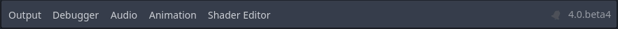
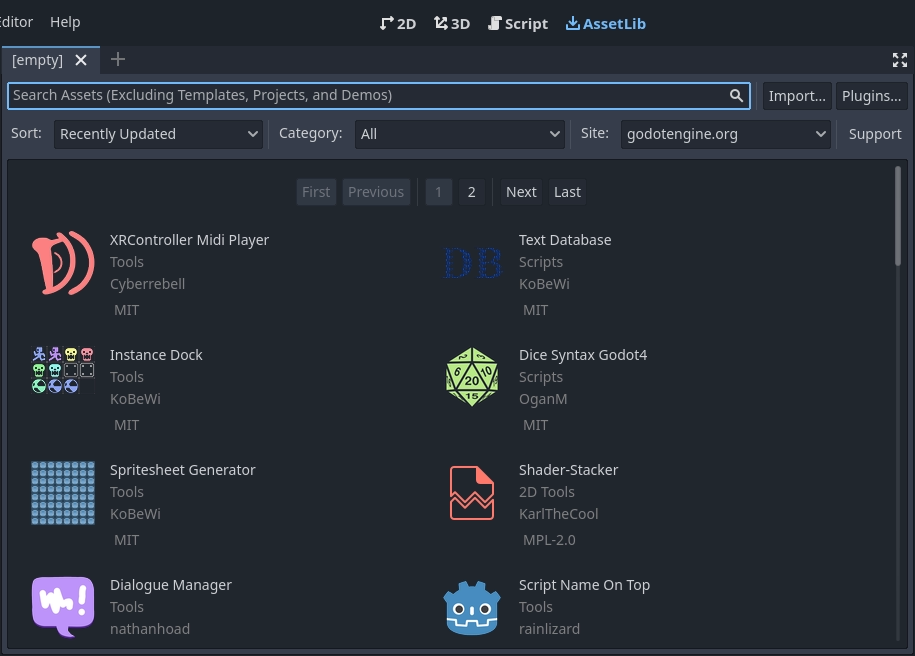
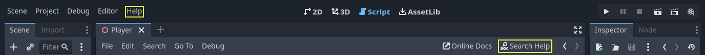
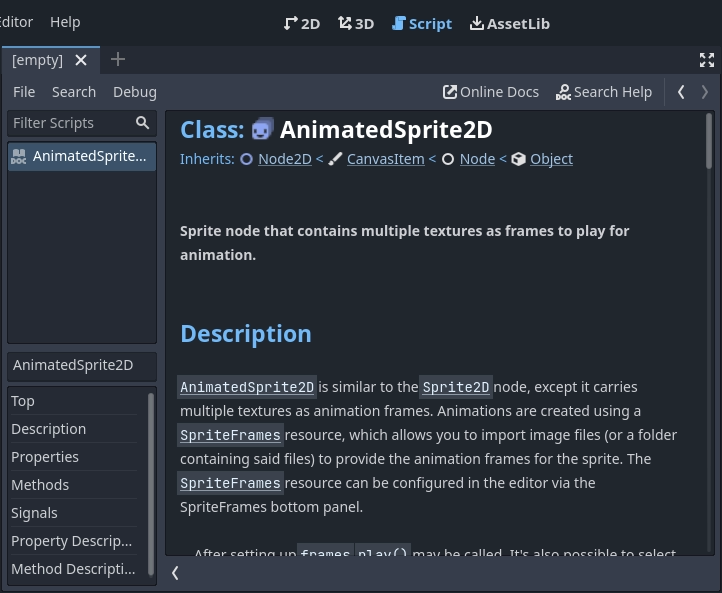

## Capítulo 1. Introducción	

Godot puede crear tanto juegos como aplicaciones de tipo desktop, mobile o web. También juegos de consola pero se debe tener altas habilidades de programación y adecuación a estandares de producción internacionales.

Algunos juegos realizados en la plataforma:

- Ex-Zodiac
- Helms of Fury
- Pixelorama

Tiene un editor de juego que incluye:

- un editor de código,
- un editor de animación,
- un editor de tilemap,
- un editor de shader,
- un debugger,
- un profiler, y mucho más.

### Aprende a programar con GDScript: GDScript en 27 lecciones

[Learn GDScript From Zero app](https://gdquest.github.io/learn-gdscript/?ref=godot-docs)

Lesson 1: What code is like
Lesson 2: Your first error
Lesson 3: We stand on the Shoulders of Giants
Lesson 4: Drawing a Rectangle
Lesson 5: Coding your first function
Lesson 6: Your First Function Parameter
Lesson 7: Introduction to Member Variables
Lesson 8: Defining your own variables
Lesson 9: Adding and subtracting
Lesson 10: The Game Loop
Lesson 11: Time Delta
Lesson 12: Using Variables to Make Code Easier to Read
Lesson 13: Conditions
Lesson 14: Multiplying
Lesson 15: 2D Vectors
Lesson 16: Introduction to While Loops
Lesson 17: Introduction to For Loops
Lesson 18: Creating Arrays
Lesson 19: Looping Over Arrays
Lesson 20: Strings
Lesson 21: Functions that return a value
Lesson 22: Appending and Popping values from arrays
Lesson 23: Accessing values in arrays
Lesson 24: Creating Dictionaries
Lesson 25: Looping over dictionaries
Lesson 26: Value types
Lesson 27: Specifying types with type hints

### Descripción de los conceptos clave de Godot

En Godot, un juego es un **árbol de escenas** y cada escena es un **árbol de nodos**. Los nodos pueden comunicarse entre sí mediante **señales**.

#### Escenas

La idea es que las escenas son elementos flexibles que suelen ser reutilizados. Una escena puede ser un personaje, un arma, un menú en la interfaz de usuario, una sola casa, un nivel entero o cualquier cosa que puedas imaginar.

#### Nodos

Un nodo es un componente de una escena, el bloque de construcción más pequeño. A continuación podemos ver los nodos que componen el personaje _Player_: 

Está compuesto de un nodo `CharacterBody2D` llamado _Player_, un nodo `Camera2D`, un nodo `Sprite2D`, y un nodo `CollisionShape2D`.

> **Nota:**
>
> Los nombres de los nodos terminan con "2D" porque se trata de una escena 2D. Sus contrapartes 3D tienen nombres que terminan con "3D". Tenga en cuenta que los nodos `Spatial` ahora se denominan `Nodo3D` a partir de Godot 4.

Godot ofrece una amplia biblioteca de `tipos de nodos` base que puedes combinar y ampliar para crear otros más potentes. 2D, 3D o interfaz de usuario, harás la mayoría de las cosas con estos nodos.

#### El árbol de escena

Todas las escenas de tu juego se reúnen en el **árbol de escena**, que es literalmente un árbol de escenas. Y como las escenas son árboles de nodos, el árbol de escenas también es un árbol de nodos. Pero es más fácil pensar en tu juego en términos de escenas, ya que pueden representar personajes, armas, puertas o tu interfaz de usuario.

All your game's scenes come together in the scene tree, literally a tree of scenes. And as scenes are trees of nodes, the scene tree also is a tree of nodes. But it's easier to think of your game in terms of scenes as they can represent characters, weapons, doors, or your user interface.

#### Señales

Los nodos emiten **señales** cuando se produce algún evento. Esta función le permite hacer que los nodos se comuniquen sin necesidad de cablearlos en el código. Le brinda mucha flexibilidad en la forma en que estructura sus escenas.

> **Nota:**
>
> Las señales son la versión de Godot del _patrón del observador_. Puedes leer más sobre esto aquí: https://gameprogrammingpatterns.com/observer.html.

Por ejemplo, los botones emiten una señal cuando se presionan. Puedes conectarte a esta señal para ejecutar código en reacción a este evento, como iniciar el juego o abrir un menú.

Otras señales integradas pueden indicarte cuándo chocaron dos objetos, cuándo un personaje o monstruo ingresó a un área determinada y mucho más. También puedes definir nuevas señales adaptadas a tu juego.

#### Resumen

Los nodos, las escenas, el árbol de escena y las señales son cuatro conceptos básicos de Godot que manipularás todo el tiempo.

Los `nodos` son los bloques de construcción más pequeños de tu juego. Los combinas para crear `escenas` que luego combinas y anidan en el `árbol de escena`. Luego puedes usar `señales` para hacer que los nodos reaccionen a eventos en otros nodos o en diferentes ramas del árbol de escena.

### Primer vistazo a la interfaz de Godot

#### El `Project Manager`

Cuando Godot inicia, la primera ventana que ve es el `Project Manager` (Administrador de Proyectos). En la pestaña predeterminada `Projects`, puede administrar proyectos existentes, importar o crear nuevos, y más.

En la parte superior de la ventana, hay otra pestaña llamada `Asset Library` (Biblioteca de activos). La primera vez que acceda a esta pestaña, verá un botón "Conectarse". Por razones de privacidad, el administrador de proyectos de Godot no accede a Internet de manera predeterminada. Para cambiar esto, haga clic en el botón "Conectarse". Puede cambiar esta opción más adelante en la configuración.

Una vez que el modo de red esté configurado en "en línea", puede buscar proyectos de demostración en la biblioteca de recursos de código abierto, que incluye muchos proyectos desarrollados por la comunidad:

La configuración del `Project Manager` se puede abrir mediante el menú `Settings`:

Desde aquí, puede cambiar el idioma del editor (el idioma predeterminado es el idioma del sistema), el tema de la interfaz, la escala de visualización, el modo de red y también la convención de nombres de directorios.

> **Consulte también:**
>
> Para conocer los entresijos del `Project Manager`, lea [Using the Project Manager](https://docs.godotengine.org/en/stable/tutorials/editor/project_manager.html#doc-project-manager).

#### Primer vistazo al editor de Godot

Cuando abres un proyecto nuevo o uno existente, aparece la interfaz del editor. Veamos sus áreas principales:

De manera predeterminada, a lo largo del borde superior de la ventana, se encuentra el `menú principal`. En el menú principal a la izquierda, los botones de cambio de `workspace` (espacio de trabajo) en el centro (el espacio de trabajo activo está resaltado) y los botones de `playtest` (prueba de juego) a la derecha:

Justo debajo de los botones del `workspace`, se ven las escenas abiertas como pestañas. El botón más (+) junto a las pestañas agregará una nueva escena al proyecto. Con el botón del extremo derecho se puede activar el modo sin distracciones, que maximiza o restaura el tamaño de la ventana gráfica ocultando los elementos acoplados en la interfaz:

En el centro, debajo del selector de escenas, se encuentra la `viewport` (ventana gráfica) con su `toolbar` (barra de herramientas) en la parte superior, donde encontrará diferentes herramientas para mover, escalar o bloquear los nodos de la escena (actualmente, el espacio de trabajo 3D está activo):

Esta `toolbar` cambia según el contexto y el nodo seleccionado. Aquí está la barra de herramientas 2D:

A continuación se muestra la barra de herramientas 3D:

A ambos lados de la `viewport` se encuentran los `docks` (muelles). Y en la parte inferior de la ventana se encuentra el `bottom panel` (panel inferior).

Veamos los docks. El dock `FileSystem` (sistema de archivos) muestra una lista de los archivos de su proyecto, incluidos scripts, imágenes, muestras de audio y más:

El dock `Scene` (Escena) muestra una lista de los nodos de la escena activa:

El dock `Inspector` le permite editar las propiedades de un nodo seleccionado:

El `bottom panel` (panel inferior), ubicado debajo de la _viewport_, es el host de la consola de depuración, el editor de animación, el mezclador de audio y más. Pueden ocupar un espacio muy valioso, por eso están plegados de forma predeterminada:

Al hacer clic en uno, se expande verticalmente. A continuación, puedes ver el editor de animaciones abierto:

Los paneles inferiores también se pueden mostrar u ocultar mediante los accesos directos definidos en `Editor Settings > Shortcuts`, en la categoría `Bottom Panels`.

#### Las cuatro pantallas principales

Hay cuatro botones de la pantalla principal centrados en la parte superior del editor: `2D`, `3D`, `Script` y `Asset Library` (biblioteca de recursos).

Usarás la `2D screen` para todo tipo de juegos. Además de los juegos 2D, la pantalla 2D es donde crearás tus interfaces.

En la `3D screen`, puedes trabajar con meshes (mallas), luces y niveles de diseño para juegos 3D.

La `Script screen` es un editor de código completo con un depurador, autocompletado enriquecido y referencia de código incorporada.

Por último, la `Asset Library screen` es una biblioteca de complementos, scripts y activos gratuitos y de código abierto para usar en sus proyectos.

#### Referencia de clase integrada (Integrated class reference)

Godot viene con una referencia de clase incorporada.

Puede buscar información sobre una clase, método, propiedad, constante o señal mediante cualquiera de los siguientes métodos:

- Presionando `F1` (u `Opt + Space` en macOS, o `Fn + F1` para computadoras portátiles con una tecla `Fn`) en cualquier parte del editor.
- Haciendo clic en el botón `Search Help` en la esquina superior derecha de la pantalla principal de Script.
- Haciendo clic en el menú Ayuda y Buscar ayuda.
- `Ctrl + clic` (`Cmd + clic` en macOS) en un nombre de clase, nombre de función o variable integrada en el editor de scripts.

Cuando haces cualquiera de estas cosas, aparece una ventana. Escribe para buscar cualquier elemento. También puedes usarla para explorar los objetos y métodos disponibles.

Haz doble clic en un elemento para abrir la página correspondiente en la pantalla principal del script.

Alternativamente,

- Haz clic mientras presionas la tecla `Ctrl` en un nombre de clase, nombre de función o variable integrada en el editor de scripts.
- Haz clic derecho en los nodos y elige `Open Documentation` o elige `Lookup Symbol` para elementos en el editor de scripts para abrir directamente su documentación.

### Aprendiendo nuevas funciones

Recomendamos:

- El curso CS50 de la universidad Harvard,
- El libro "Automate The Boring Stuff With Python" de _Al Sweigart_,
- y los [Community tutorials and resources](https://docs.godotengine.org/en/stable/community/tutorials.html#doc-community-tutorials)

### La filosofía del diseño de Godot

Cada motor de juegos ofrece una variedad de funciones que determinan flujos de trabajo (workflows) y estructuras de juegos con características específicas. 

#### Diseño y composición orientada a objetos

Esencialmente Godot adopta el **diseño orientado a objetos** que incorpora un **sistema de escenas flexible** y una **jerarquía de nodos**. Intenta mantenerse alejado de los patrones de programación estrictos para ofrecer una forma intuitiva de estructurar el juego.

En primer lugar, Godot te permite **componer o agregar escenas**. Es como prefabs (prefabricados) anidados. Además de eso, puedes **heredar** de cualquier escena.

##### Escenas

Una **escena** de Godot puede ser un arma, un personaje, un objeto, una puerta, un nivel, parte de un nivel... lo que quieras. Funciona como una **clase** en código puro, excepto que eres libre de diseñarla usando el editor, usando solo el código o mezclando y combinando los dos.

Es diferente de los prefabs que encuentras en varios motores 3D, ya que luego puedes **heredar** y **extender** esas escenas. Puedes crear un `Wizard` que extienda tu `Character`. Modifica el `Character` en el editor y el `Wizard` también se actualizará:

Te ayuda a construir tus proyectos para que su estructura coincida con el diseño del juego.

##### Nodos

Godot también ofrece muchos tipos diferentes de objetos llamados **nodos**, cada uno con un propósito específico. Los nodos son parte de un **árbol** y siempre heredan de sus padres hasta la clase `Node`. Aunque el motor sí presenta algunos nodos como _formas de colisión_ que utilizará un _cuerpo de física_ padre, la mayoría de los nodos funcionan de forma independiente entre sí.

`Sprite2D` es un `Node2D`, un `CanvasItem` y un `Node` (ver las relaciones en la imagen precedente). Tiene todas las _propiedades_ y _características_ de sus tres clases padre, como transformaciones o la capacidad de dibujar formas personalizadas y renderizar con un sombreador personalizado.

#### Paquete todo-incluido

Godot intenta ofrecer sus propias herramientas para responder a las necesidades más comunes.

Tiene: 
- un **espacio de trabajo dedicado a la creación de scripts** (`scripting workspace`),
- un **editor de animación** (`animation editor`),
- un editor de mapas de mosaicos (`tilemap editor`),
- un editor de sombreadores (`shader editor`),
- un depurador (`debugger`),
- un generador de perfiles (`profiler`),
- la capacidad de recarga en caliente (`hot-reload`) de forma local y en dispositivos remotos, etc.

!

Godot ofrece su propio **lenguaje de programación** `GDScript` junto con _C#_. GDScript está diseñado para las necesidades de los desarrolladores y diseñadores de juegos, y está estrechamente integrado en el motor y el editor.

GDScript te permite escribir código utilizando una sintaxis basada en indentación, pero detecta tipos y ofrece la calidad de autocompletado de un lenguaje estático. También está optimizado para código de juego con tipos integrados como **Vectores** y **Colores**.

Ten en cuenta que con `GDExtension`, puedes escribir código de alto rendimiento utilizando lenguajes compilados como _C_, _C++_, _Rust_, _D_, _Haxe_ o _Swift_ sin tener que volver a compilar el motor.

Ten en cuenta que el espacio de trabajo 3D no cuenta con tantas herramientas como el espacio de trabajo 2D. Necesitarás programas externos o complementos para editar terrenos, animar personajes complejos, etc. Godot proporciona una API completa para ampliar la funcionalidad del editor utilizando código de juego.

A continuación se puede ver una imagen correspondiente al plugin `State Machine editor` el cual permite administrar estados y transiciones de forma visual:

#### El editor Godot es un juego Godot

El editor Godot se ejecuta en el motor del juego. Utiliza el sistema de interfaz de usuario propio del motor, puede recargar en caliente el código y las escenas cuando pruebas tus proyectos o ejecutar el código del juego en el editor. Esto significa que puedes usar el mismo código y las mismas escenas para tus juegos o crear complementos y ampliar el editor.

Esto genera un sistema de interfaz de usuario confiable y flexible, ya que impulsa el editor en sí. Con la anotación `@tool`, puedes ejecutar cualquier código de juego en el editor.

Coloque la anotación `@tool` en la parte superior de cualquier archivo GDScript y se ejecutará en el editor. Esto le permite importar y exportar complementos, crear complementos como editores de niveles personalizados o crear scripts con los mismos nodos y API que usa en sus proyectos.

Por poner un sólo ejemplo, `RPG in a Box` es un editor de RPG de vóxeles creado con Godot 2. Utiliza las herramientas de interfaz de usuario de Godot para su sistema de programación basado en nodos y para el resto de la interfaz:

#### Motores 2D y 3D independientes

Godot ofrece motores de renderizado 2D y 3D dedicados. Como resultado, **la unidad base para las escenas 2D son los píxeles**. Aunque los motores están separados, puedes renderizar 2D en 3D, 3D en 2D y superponer sprites e interfaces 2D sobre tu mundo 3D.
