# Godot Engine v4.3

## Índice
- [Capítulo 1. Introducción](#capítulo-1-introducción)
- [Capítulo 2. Primeros pasos](#capítulo-2-primeros-pasos)
- [Capítulo 3. Tu primer juego 2D](#capítulo-3-tu-primer-juego-2d)

## Capítulo 3. Tu primer juego 2D

En esta serie de tutoriales, crearás tu primer juego 2D completo con Godot. Al final de la serie, tendrás un juego simple pero completo propio, como la imagen de abajo:


Aprenderás a partir de la práctica cómo funciona el editor Godot, cómo estructurar un proyecto y crear un juego 2D.

> **Nota:** Este proyecto es una introducción al motor Godot. Se supone que ya tienes algo de experiencia en programación. Si eres nuevo en programación, deberías comenzar aquí: [Lenguajes de programación](capitulo-2-primeros-pasos.md#lenguajes-de-programación).

El juego se llama _"Dodge the Creeps!"_. Tu personaje debe moverse y evitar a los enemigos durante el mayor tiempo posible.

Aprenderás a:

- Crear un juego 2D completo con el editor Godot.
- Estructurar un proyecto de juego simple.
- Mover al personaje del jugador y cambiar su sprite.
- Generar enemigos aleatorios.
- Contar la puntuación.

Y más.

Encontrarás otra serie en la que crearás un juego similar pero en 3D. Sin embargo, te recomendamos que comiences con este.

**¿Por qué comenzar con 2D?**

Si eres nuevo en el desarrollo de juegos o no estás familiarizado con Godot, te recomendamos comenzar con juegos 2D. Esto te permitirá sentirte cómodo con ambos antes de abordar los juegos 3D, que tienden a ser más complicados.

Puedes encontrar una versión completa de este proyecto en esta ubicación:

https://github.com/godotengine/godot-demo-projects/tree/master/2d/dodge_the_creeps

### Requisitos previos

Este tutorial paso a paso está destinado a principiantes que siguieron el tutorial completo de [Capítulo 2 - Primeros pasos](capitulo-2-primeros-pasos.md).

Si eres un programador experimentado, puedes encontrar el código fuente de la demostración completa aquí: [Código fuente de Dodge the Creeps](https://github.com/godotengine/godot-demo-projects/tree/master/2d/dodge_the_creeps).

Preparamos algunos recursos del juego que necesitarás descargar para que podamos pasar directamente al código.

Puedes descargarlos haciendo clic en el enlace a continuación.

[dodge_the_creeps_2d_assets.zip](./assets/2d/dodge_the_creeps_2d_assets.zip)

### Contenido

- Configuración del proyecto
- Creación de la escena del jugador
- Codificación del jugador
- Creación del enemigo
- La escena principal del juego
- Pantalla de visualización frontal
- Finalización

### Configuración del proyecto

En esta breve primera parte, configuraremos y organizaremos el proyecto.

Ejecuta Godot y crea un nuevo proyecto.


Al crear el nuevo proyecto, solo necesitas elegir una _Project Path_ válida. Puedes dejar las otras configuraciones predeterminadas como están.

> **Nota:** Descarga [dodge_the_creeps_2d_assets.zip](./assets/2d/dodge_the_creeps_2d_assets.zip). El archivo contiene las imágenes y sonidos que usarás para crear el juego. Extrae el archivo y mueve los directorios `art/` y `fonts/` al directorio de tu proyecto.

La carpeta de tu proyecto debería verse así.


Este juego está diseñado para el modo vertical, por lo que necesitamos ajustar el tamaño de la ventana del juego. Haz clic en _Project -> Project Settings_ para abrir la ventana de configuración del proyecto, en la columna de la izquierda abre la pestaña _Display -> Window_. Allí, configure **Size > Viewport Width** en `480` y **Size > Viewport Height** en `720`.


Además, en las opciones de **Stretch**, configure **Mode > Stretch** en `canvas_items` y **Aspect** en `keep`. Esto garantiza que el juego se escale de manera uniforme en pantallas de diferentes tamaños. Luego de estos cambios clic en el botón _Close_.


#### Organización del proyecto

En este proyecto, crearemos 3 escenas independientes: `Player`, `Mob` y `HUD`, que combinaremos en la escena `Main` del juego.

En un proyecto más grande, puede ser útil crear carpetas para almacenar las distintas escenas y sus scripts, pero para este juego relativamente pequeño, puede guardar sus escenas y scripts en la carpeta raíz del proyecto, identificada por `res://`. Puedes ver las carpetas de tu proyecto en el dock _FileSystem_ en la esquina inferior izquierda:

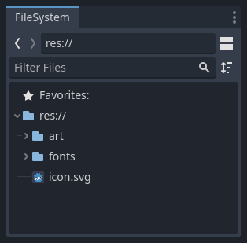

Con el proyecto en marcha, estamos listos para diseñar la escena del jugador en la próxima lección.

### Creación de la escena del jugador

Una vez que hayamos configurado el proyecto, podemos empezar a trabajar en el personaje controlado por el jugador.

La primera escena definirá el objeto `Player`. Uno de los beneficios de crear una escena Jugador independiente es que podemos probarla por separado, incluso antes de haber creado otras partes del juego.

#### Estructura de nodos

Para comenzar, debemos elegir un nodo raíz para el objeto `Player`. Como regla general, el nodo raíz de una escena debe reflejar la **funcionalidad** deseada del objeto: qué _es_ el objeto. Haga clic en el botón **Other Node** y agregue un nodo `Area2D` a la escena.

../../_images/add_node.webp

Cuando agregue el nodo `Area2D`, Godot mostrará el siguiente _ícono de advertencia_ junto a él en el árbol de la escena:

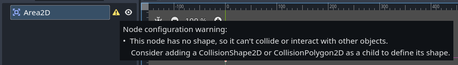

Esta advertencia nos indica que el nodo `Area2D` requiere una _shape_ (forma) para detectar colisiones o superposiciones. Podemos **ignorar la advertencia temporalmente** porque primero configuraremos los elementos visuales del jugador (usando un sprite animado). Una vez que los elementos visuales estén listos, agregaremos una _collision shape_ (forma de colisión) como un nodo hijo. Esto nos permitirá dimensionar y posicionar con precisión la forma en función de la apariencia del sprite.

Con `Area2D` podemos detectar objetos que se superponen o chocan con el jugador. Cambie el nombre del nodo a `Player` haciendo doble clic en él. Ahora que hemos configurado el nodo raíz de la escena, podemos agregar nodos adicionales para darle más funcionalidad.

Antes de agregar cualquier elemento hijo al nodo `Player`, queremos asegurarnos de no moverlos o cambiar su tamaño accidentalmente al hacer clic en ellos. Seleccione el nodo y haga clic en el ícono a la derecha del candado. Su información sobre herramientas dice `Group Selected Node(s) (Ctrl + G)`. Esto hace que se seleccione el elemento principal cuando se hace clic en cualquier nodo secundario en la vista 2D y 3D.


Guarde la escena. Haz clic en `Scene > Save`, o presiona `Ctrl + S` en Windows/Linux o `Cmd + S` en macOS. Guardar la escena como `Player.tscn`.

> **Nota:** Para este proyecto, seguiremos las convenciones de nomenclatura de Godot.
>
> **GDScript:** las clases (nodos) usan `PascalCase`, las variables y funciones usan `snake_case` y las constantes usan `ALL_CAPS` (Consulta la [guía de estilo de GDScript](https://docs.godotengine.org/en/stable/tutorials/scripting/gdscript/gdscript_styleguide.html#doc-gdscript-styleguide)).
>
> **C#:** las clases, las variables de exportación y los métodos usan `PascalCase`, los campos privados usan `_camelCase`, las variables locales y los parámetros usan `camelCase` (Consulta la [guía de estilo de C#](https://docs.godotengine.org/en/stable/tutorials/scripting/c_sharp/c_sharp_style_guide.html#doc-c-sharp-styleguide)).

#### Animación de sprites

Haz clic en el nodo `Player` y agrega (`Ctrl + A` en Windows/Linux o `Cmd + A` en macOS) un nodo hijo **AnimatedSprite2D**. _AnimatedSprite2D_ se encargará de la apariencia y las animaciones de nuestro nodo `Player`. Observa que hay un símbolo de advertencia junto al nodo. Un _AnimatedSprite2D_ requiere un recurso **SpriteFrames**, que es una lista de las animaciones que puede mostrar. Para crear uno, busque la propiedad `Sprite Frames` en la pestaña `Animation` del `Inspector` y haga clic en `[empty] > New SpriteFrames`:


Haga clic en el campo `SpriteFrames` que acaba de crear para abrir el panel **SpriteFrames**:


A la izquierda hay una lista de animaciones. Haga clic en la `default` y cámbiele el nombre a `walk`. Luego, haga clic en el botón **Add Animation** para crear una segunda animación llamada `up`. Busque las imágenes del jugador en la pestaña **FileSystem**; están en la carpeta `art` dentro de la carpeta `res` que descomprimió anteriormente. Arrastre las dos imágenes para cada animación, llamadas `playerGrey_walk[1/2]` y `playerGrey_walk[2/2]`, hacia el lado **Animation Frame** del panel para la animación correspondiente. Haga lo mismo con `up` llamando a `playerGrey_up[1/2]` y `playerGrey_up[2/2]`:


Las imágenes del jugador son un poco  grandes para la ventana del juego, por lo que debemos reducir su tamaño. Haga clic en el nodo `AnimatedSprite2D` y configure la propiedad `Scale` en `(0.5, 0.5)`. Puede encontrarla en el **Inspector** bajo el encabezado **Node2D > Transform**.


Por último, agregue un `CollisionShape2D` como nodo hijo de `Player`. Esto determinará el _hitbox_ del jugador, o los límites de su área de colisión. Para este personaje, un nodo `CapsuleShape2D` brinda el mejor ajuste, por lo que junto a `Shape` en el **Inspector**, haga clic en `[empty] > New CapsuleShape2D`. Utilizando los dos controladores de tamaño, cambia el tamaño de la forma para cubrir el sprite:


Cuando hayas terminado, tu escena del jugador debería verse así:


Una vez hecho esto, la advertencia en el nodo **Area2D** desaparecerá, ya que ahora tiene una forma asignada y puede interactuar con otros objetos.

Asegúrate de guardar la escena nuevamente después de estos cambios.

En la siguiente parte, agregaremos un **script** al nodo del jugador para moverlo y animarlo. Luego, configuraremos la detección de colisiones para saber cuándo el jugador fue golpeado por algo.

### Código del jugador

En esta lección, agregaremos movimiento y animación al jugador y lo configuraremos para detectar colisiones.

Para ello, necesitamos agregar alguna funcionalidad que no podemos obtener de un nodo integrado, por lo que agregaremos un script. Haga clic en el nodo `Player` y luego en el botón `Attach a new or existing script to the selected node`:

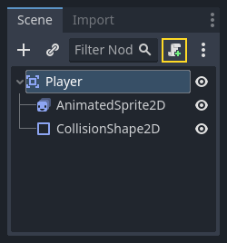

En la ventana de configuración del script, puede dejar la configuración predeterminada como está. Simplemente haga clic en el botón `Create`:

> **Nota:** Si está creando un script en C# u otros lenguajes, seleccionelo en el menú desplegable **Language** antes de hacer clic en `Create`.

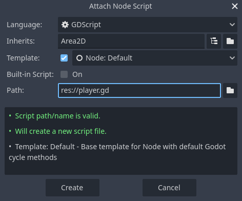

> **Nota:** Si es la primera vez que se encuentra con GDScript, lea [Lenguajes de programación](capitulo-2-primeros-pasos.md#lenguajes-de-programación) antes de continuar.

Comience por declarar las _variables miembro_ que necesitará este objeto:

```
extends Area2D

@export var speed = 400 # La velocidad en la que el jugador se moverá (píxeles/segundo).
var screen_size # Tamaño de la ventana del juego.
```

El uso de la _palabra clave_ `export` en la primera variable `speed` nos permite establecer su valor en el **Inspector**. Esto puede ser útil para valores que desea poder ajustar al igual que las propiedades integradas de un nodo. Haga clic en el nodo `Player` y verá que la propiedad ahora aparece en el **Inspector** en una nueva sección con el nombre del script. Recuerde, si cambia el valor aquí, anulará el valor escrito en el script.


> **Advertencia:** Si está usando C#, debe (re)compilar los ensambles del proyecto cada vez que desee ver nuevas variables o señales de exportación. Esta compilación se puede activar manualmente haciendo clic en el botón `Build` (compilar) en la parte superior derecha del editor.
>
> 

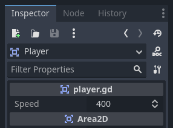

Tu ​​script `player.gd` ya debería contener una función `_ready()` y una función `_process()`. Si no seleccionaste la _plantilla predeterminada_ que se muestra arriba, crea estas funciones mientras sigues la lección.

La función `_ready()` se llama cuando un nodo ingresa al árbol de escena, que es un buen momento para encontrar el tamaño de la ventana del juego:

```
func _ready():
	screen_size = get_viewport_rect().size
```

Ahora podemos usar la función `_process()` para definir lo que hará el jugador. 

La función `_process()` se llama en cada cuadro, por lo que la usaremos para actualizar elementos de nuestro juego, que esperamos que cambien a menudo. Para el jugador, necesitamos hacer lo siguiente:

- Verificar el input.
- Moverse en la dirección dada.
- Reproducir la animación apropiada.

Primero, necesitamos verificar el input: ¿el jugador está presionando una tecla? Para este juego, tenemos para verificar 4 entradas de dirección. Las _input actions_ (acciones de entrada) se definen en **Project Settings > Input Map**. Aquí, puedes definir _custom events_ (eventos personalizados) y asignarles diferentes teclas, eventos del mouse u otras entradas. Para este juego, asignaremos las teclas de flecha a las cuatro direcciones.

Haz clic en **Project Settings> Project Settings** para abrir la ventana de configuración del proyecto y haz clic en la pestaña **Input Map** en la parte superior. Escribe `move_right` en la barra superior cuyo placeholder dice **Add New Action** y haz clic en el botón **Add Action** para agregar la acción `move_right`.


Necesitamos asignar una tecla a esta acción. Haz clic en el ícono `+` a la derecha para abrir la ventana _Configuración de Eventos_:


El campo `Listening for Input` debería seleccionarse automáticamente. Presiona la tecla `right` en tu teclado y el menú debería verse así ahora:

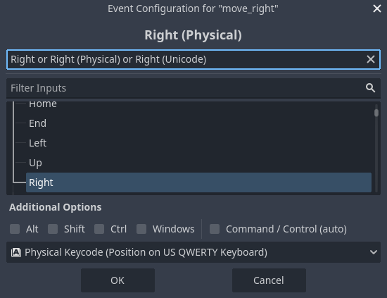

Seleccione el botón **OK**. La tecla `right` ahora está asociada con la acción `move_right`.

Repita estos pasos para agregar tres asignaciones más:

- `move_left` está asignada a la tecla de **flecha izquierda**.
- `move_up` está asignada a la tecla de **flecha arriba**.
- Y `move_down` está asignada a la tecla de **flecha abajo**.

La pestaña de asignación de entrada debería verse así:


Haga clic en el botón **Close** para cerrar la configuración del proyecto.

> **Nota:** Solo asignamos una tecla a cada acción de entrada, pero puede asignar varias teclas, botones del joystick o botones del mouse a la misma acción de entrada.

Puede detectar si se presiona una tecla usando `Input.is_action_pressed()`, que devuelve `true` si está presionada o `false` si no lo está.

```
func _process(delta):
	var velocity = Vector2.ZERO # The player's movement vector.
	if Input.is_action_pressed("move_right"):
		velocity.x += 1
	if Input.is_action_pressed("move_left"):
		velocity.x -= 1
	if Input.is_action_pressed("move_down"):
		velocity.y += 1
	if Input.is_action_pressed("move_up"):
		velocity.y -= 1

	if velocity.length() > 0:
		velocity = velocity.normalized() * speed
		$AnimatedSprite2D.play()
	else:
		$AnimatedSprite2D.stop()
```

Comenzamos estableciendo `velocity` en `(0, 0)`: de manera predeterminada, el jugador no debería estar moviéndose. Luego verificamos cada input y sumamos/restamos de `velocity` para obtener una dirección total. Por ejemplo, si mantienes presionados las teclas **right** y **down** al mismo tiempo, el vector de velocidad resultante será (1, 1). En este caso, dado que estamos sumando un movimiento horizontal y uno vertical, el jugador se movería más rápido en diagonal que si solo se moviera horizontalmente.

Podemos evitarlo si _normalizamos_ la velocidad, lo que significa que establecemos su _longitud_ en `1` y luego multiplicamos por la velocidad deseada. Esto significa que no habrá más movimientos diagonales rápidos.

> **Consejo:** Si nunca antes usaste matemáticas vectoriales o necesitas un repaso, puedes ver una explicación del uso de vectores en Godot en [Vector Math](https://docs.godotengine.org/en/stable/tutorials/math/vector_math.html#doc-vector-math). Es bueno saberlo, pero no será necesario para el resto de este tutorial.

También verificamos si el jugador se está moviendo para poder llamar a _play()_ o _stop()_ en **AnimatedSprite2D**.

> **Sugerencia:** `$` es la abreviatura de `get_node()`. Por lo tanto en el código anterior, `$AnimatedSprite2D.play()` es la forma abreviada de `get_node("AnimatedSprite2D").play()`.
>
> En GDScript, `$` devuelve el _nodo en la ruta relativa desde el nodo actual_, o devuelve `null` si no se encuentra el nodo. Dado que **AnimatedSprite2D** es un nodo hijo del nodo actual, podemos usar `$AnimatedSprite2D`.

Ahora que tenemos una dirección de movimiento, podemos actualizar la posición del jugador. También podemos usar `clamp()` para evitar que abandone la pantalla. **Fijar** un valor (clamping a value) significa restringirlo a un rango determinado. Agregue lo siguiente al final de la función `_process` (asegúrese de que no esté sangrado debajo del `else`):

```
position += velocity * delta
position = position.clamp(Vector2.ZERO, screen_size)
```

> **Sugerencia:** El parámetro _delta_ en la función `_process()` se refiere a la _longitud del cuadro_: es decir, la cantidad de tiempo que tardó en completarse el cuadro anterior. El uso de este valor garantiza que el movimiento se mantendrá constante incluso si cambia la velocidad de cuadros.

Haga clic en **Run Current Scene** (`F6`, `Cmd + R` en macOS) y confirme que puede mover el jugador por la pantalla en todas las direcciones.

> **Advertencia:** Si recibe un error en el panel **Debugger** que dice:
>
> `Attempt to call function 'play' in base 'null instance' on a null instance`
>
> es probable que esto signifique que escribió mal el nombre del nodo **AnimatedSprite2D**. Los nombres de los nodos distinguen entre mayúsculas y minúsculas y **$NodeName** debe coincidir con el nombre que ve en el árbol de la escena.

#### Elección de animaciones

Ahora que el jugador puede moverse, debemos cambiar la animación que reproduce **AnimatedSprite2D** en función de su dirección. Tenemos la animación **walk**, que muestra al reproductor caminando hacia la derecha. Esta animación debe voltearse horizontalmente usando la propiedad `flip_h` para el movimiento hacia la izquierda. También tenemos la animación "arriba", que debe voltearse verticalmente con `flip_v` para el movimiento hacia abajo. Coloquemos este código al final de la función `_process()`:

```
if velocity.x != 0:
	$AnimatedSprite2D.animation = "walk"
	$AnimatedSprite2D.flip_v = false
	# Vea la nota a continuación sobre la siguiente asignación booleana.
	$AnimatedSprite2D.flip_h = velocity.x < 0
elif velocity.y != 0:
	$AnimatedSprite2D.animation = "up"
	$AnimatedSprite2D.flip_v = velocity.y > 0
```

> **Nota:** Las asignaciones booleanas (boolean assignments) en el código anterior son una abreviatura común para los programadores. Dado que estamos haciendo una prueba de comparación (booleana) y también _asignando_ un valor booleano, podemos hacer ambas cosas al mismo tiempo. Considere este código en comparación con la _asignación booleana_ de una línea anterior:
>
>```
> if velocity.x < 0:
>	$AnimatedSprite2D.flip_h = true
>else:
>	$AnimatedSprite2D.flip_h = false
>```

Reproduzca la escena nuevamente y verifique que las animaciones sean correctas en cada una de las direcciones.

> **Sugerencia:** Un error común aquí es escribir mal los nombres de las animaciones. Los nombres de las animaciones en el panel **SpriteFrames** deben coincidir con lo que escribe en el código. Si nombró la animación `Walk`, también debe usar una `W` mayúscula en el código.

Cuando esté seguro de que el movimiento funciona correctamente, agregue esta línea a `_ready()`, para que el jugador esté oculto cuando comience el juego:

```
hide()
```

#### Preparación para colisiones

Queremos que el jugador detecte cuando es golpeado por un enemigo, ¡pero aún no hemos creado ningún enemigo! Eso está bien, porque vamos a usar _señales_ para que funcione.

Agrega lo siguiente en la parte superior del script. Si estás usando GDScript, agrégalo después de `extends Area2D`. Si estás usando C#, agrégalo después de `public partial class Player : Area2D`:

```
signal hit
```

Esto define una _señal personalizada_ llamada `hit` que nuestro jugador emitirá (enviará) cada vez que colisione con un enemigo. Usaremos **Area2D** para detectar la colisión. Selecciona el nodo `Player` y haz clic en la pestaña "Node" junto a la pestaña Inspector para ver la lista de señales que el jugador puede emitir:


¡Observa que nuestra señal `hit` personalizada también está allí! Dado que nuestros enemigos serán nodos **RigidBody2D**, entonces seleccionamos la señal `body_entered(body: Node2D)`. Esta señal se emitirá cuando un cuerpo entre en contacto con el jugador. Luego haz clic en **Connect...** y aparecerá la ventana **Connect a Signal to a Method**.

Godot creará una función con ese nombre exacto directamente en el script para ti. No es necesario cambiar la configuración predeterminada. Por último haz clic en el botón **Connect**.

> **Advertencia:** Si estás usando un editor de texto externo (por ejemplo, **Visual Studio Code**), un error impide que Godot lo haga. Serás enviado a tu editor externo, pero la nueva función no estará allí.
>
> En este caso, tendrás que escribir la función tú mismo en el archivo de script del jugador.


Observa el _icono verde_ que indica que una señal está conectada a esta función; esto no significa que la función exista, solo que la señal intentará conectarse a una función con ese nombre, así que comprueba que la ortografía de la función coincida exactamente.

A continuación, agrega este código a la función:

```
func _on_body_entered(body):
	hide() # Player disappears after being hit.
	hit.emit()
	# Debe posponerse ya que no podemos cambiar las propiedades físicas en una devolución de llamada de física.
	$CollisionShape2D.set_deferred("disabled", true)
```

Cada vez que un enemigo golpea al jugador, se emitirá la señal. Necesitamos desactivar la colisión del jugador para no activar la señal de impacto más de una vez.

> **Nota:** Desactivar la forma de colisión del área puede causar un error si sucede en medio del procesamiento de colisión del motor. El uso de `set_deferred()` le indica a Godot que espere para desactivar la forma hasta que sea seguro hacerlo.

La última parte es agregar una función que podemos llamar para restablecer el jugador al comenzar un nuevo juego.

```
func start(pos):
	position = pos
	show()
	$CollisionShape2D.disabled = false
```

Con el jugador ya funcionando, en la siguiente lección trabajaremos en el enemigo.

### Creando al enemigo

Ahora es el momento de crear a los **mobs** (mobile, equivalente a _hostile NPC_ (Hostile Non-Playable Character)) que nuestro jugador tendrá que esquivar. Su comportamiento no será muy complejo: los _mobs_ aparecerán aleatoriamente en los bordes de la pantalla, elegirán una dirección aleatoria y se moverán en línea recta.

Crearemos una escena `Mob`, que luego podremos _instanciar_ para crear cualquier cantidad de mobs independientes en el juego.

#### Configuración de nodos

Haz clic en `Scene > New Scene` en el menú superior y agrega los siguientes nodos:

- RigidBody2D (renombrar como `Mob`)
    - AnimatedSprite2D
    - CollisionShape2D
    - VisibleOnScreenNotifier2D

No olvides configurar los nodos hijos para que no se puedan seleccionar, como hiciste con la escena `Player`.

Selecciona el nodo `Mob` y establece su propiedad `Gravity Scale` en la sección **RigidBody2D** del **Inspector** en `0`. Esto evitará que el _mob_ caiga hacia abajo (neutralizamos la gravedad).

Además, en la sección **CollisionObject2D**, justo debajo de la sección **RigidBody2D**, expande el grupo `Collision` y desmarca el `1` correspondiente a la propiedad `Mask`. Esto garantizará que los _mobs_ no colisionen entre sí.

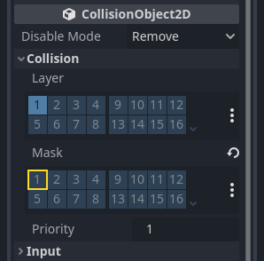

Configura **AnimatedSprite2D** como lo hiciste para el jugador. Esta vez, tenemos 3 animaciones: `fly`, `swim` y `walk`. Hay dos imágenes para cada animación en la carpeta `art`:

> - `AnimatedSprite2D` > Inspector > AnimatedSprite2D > Animation > Sprite Frame > New SpriteFrames > `fly`, `swim` y `walk`

La propiedad **Animation Speed** ​​debe configurarse para cada animación individual. Ajústala a `3` para las 3 animaciones.


Puedes usar los botones **Play Animation** a la derecha del campo de entrada **Animation Speed** ​​para obtener una vista previa de tus animaciones.

Seleccionaremos una de estas animaciones al azar para que los _mobs_ tengan algo de variedad.

Al igual que las imágenes del jugador, estas imágenes de _mobs_ deben reducirse. Establezca la propiedad **Scale** de **AnimatedSprite2D** en `(0.75, 0.75)`.

Al igual que en la escena `Player`, agregue un `CapsuleShape2D` para la colisión. Para alinear la forma con la imagen, deberá establecer la propiedad **Position** en `X: 12` (en **Transform** en el **Inspector**).

Guarde la escena.

#### Script del enemigo

Agregue un script a `Mob` y verá la base del script como el siguiente:

```
extends RigidBody2D
```

Ahora veamos el resto del script. En `_ready()` reproducimos la animación y elegimos aleatoriamente uno de los 3 tipos de animación:

```
func _ready():
	var mob_types = $AnimatedSprite2D.sprite_frames.get_animation_names()
	$AnimatedSprite2D.play(mob_types[randi() % mob_types.size()])
```

Primero, obtenemos la lista de nombres de animación de la propiedad **sprite_frames** de **AnimatedSprite2D**. Esto devuelve una matriz que contiene los tres nombres de animación: `["walk", "swim", "fly"]`.

Luego debemos elegir un número aleatorio entre `0` y `2` para seleccionar uno de estos nombres de la lista (los índices de la matriz comienzan en 0). `randi() % n` selecciona un entero aleatorio entre `0` y `n-1`.

Ahora, la última parte es hacer que los _mobs_ se borren a sí mismos cuando abandonan la pantalla. Conecta la señal `screen_exited()` del nodo **VisibleOnScreenNotifier2D** al `Mob` y agrega este código:

```
func _on_visible_on_screen_notifier_2d_screen_exited():
	queue_free()
```

Esto completa la escena `Mob`.

Con el jugador y los enemigos listos, en la siguiente parte los reuniremos en una nueva escena. Haremos que los enemigos aparezcan aleatoriamente alrededor del tablero de juego y avanzaremos, convirtiendo nuestro proyecto en un juego jugable.

### La escena `Main` del juego

Ahora es momento de reunir todo lo que hicimos en una escena de juego jugable.

Cree una nueva escena y agregue un `Node`o llamelo `Main`. (La razón por la que usamos **Node** en lugar de **Node2D** es porque este nodo será un contenedor para manejar la lógica del juego. No requiere funcionalidad 2D en sí mismo).

Haga clic en el botón **Instantiate Child Scene...** (Ctrl + Shift + A) (representado por un ícono de enlace de cadena) y seleccione su `Player.tscn` guardado.


Ahora, agrega los siguientes nodos como hijos de `Main` y nómbralos como se muestra:

- **Timer** (renómbrelo `MobTimer`): para controlar la frecuencia con la que aparecen los _mobs_.
- **Timer** (renómbrelo `ScoreTimer`): para incrementar el puntaje cada segundo.
- **Timer** (renómbrelo `StartTimer`): para dar un retraso antes de comenzar.
- **Marker2D** (renómbrelo `StartPosition`): para indicar la posición inicial del jugador.

Establece la propiedad `Wait Time` de cada uno de los nodos **Timer** de la siguiente manera (los valores están en segundos):

- **MobTimer**: `0.5`
- **ScoreTimer**: `1`
- **StartTimer**: `2`

Además, para el nodo **StartTimer** establece la propiedad `One Shot` en `On` y para el nodo **StartPosition** la propiedad `Position` en `(240, 450)`.

#### Generación de mobs

El nodo `Main` generará nuevos _mobs_ y aparecerán en una ubicación aleatoria en el borde de la pantalla. Agrega un nodo **Path2D** (renómbrelo `MobPath`) como hijo de `Main`. Cuando selecciones **Path2D**, verás algunos botones nuevos en la parte superior del editor:


Selecciona el del medio (**Add Point**) y dibuja la ruta haciendo clic para agregar los puntos en las esquinas que se muestran. Para que los puntos se ajusten a la cuadrícula, asegúrate de que **Use Grid Snap** y **Use Smart Snap** estén seleccionados. Estas opciones se pueden encontrar a la izquierda del botón **Lock**, y aparecen como un imán junto a algunos puntos y líneas que se cruzan, respectivamente.


> **Importante:**
>
>¡Dibuja la ruta en el sentido de las agujas del reloj o tus _mobs_ aparecerán apuntando hacia afuera en lugar de hacia adentro!

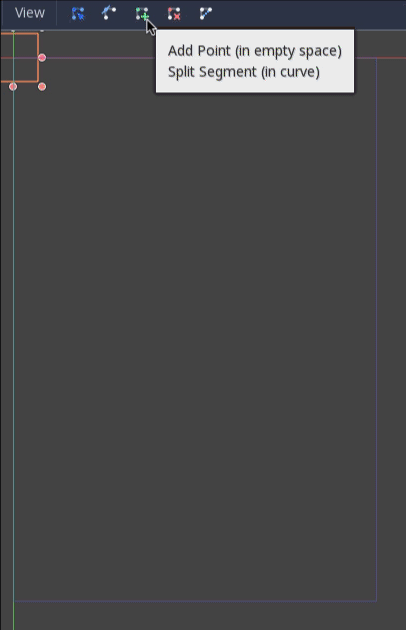

Después de colocar el punto `4` en la imagen, haz clic en el botón **Close Curve** y tu curva estará completa.


Ahora que la ruta está definida, agrega un nodo **PathFollow2D** como hijo de **MobPath** y nómbralo `MobSpawnLocation`. Este nodo rotará automáticamente y seguirá la ruta a medida que se mueve, por lo que podemos usarlo para seleccionar una posición y dirección aleatorias a lo largo de la ruta.

Tu escena debería verse así:


#### Script principal

Agrega un script a `Main`. En la parte superior del script, usamos `@export var mob_scene: PackedScene` para permitirnos elegir la escena **Mob** que queremos instanciar.

```
extends Node

@export var mob_scene: PackedScene
var score
```

Haz clic en el nodo `Main` y verás la propiedad **Mob Scene** en el **Inspector** bajo `main.gd`.

Puedes asignar el valor de esta propiedad de dos maneras:

- Arrastra `Mob.tscn` desde el dock **FileSystem** y suéltalo en la propiedad **Mob Scene**.
- Haz clic en la flecha hacia abajo junto a `[empty]` y elige **Load**. Selecciona `Mob.tscn`.

A continuación, selecciona la instancia de la escena **Player** en el nodo `Main` en el dock **Scene** y accede al dock **Node** en la barra lateral derecha. Asegúrate de tener la pestaña **Signals** seleccionada en el dock **Node**.

Deberías ver una lista de las señales para el nodo `Player`. Busque y haga doble clic en la señal de `hit` en la lista (o haga clic derecho en ella y seleccione **Connect...**). Esto abrirá el cuadro de diálogo de conexión de la señal. Queremos crear una nueva función llamada `game_over`, que se encargará de lo que debe suceder cuando finaliza un juego. Escriba `game_over` en el cuadro **Receiver Method** en la parte inferior del cuadro de diálogo de conexión de la señal y haga clic en el botón **Connect**. El objetivo es que la señal `hit` se emita desde `Player` y se gestione en el script de `Main`. Agregue el siguiente código a la nueva función, así como una función _new_game_ que configurará todo para un nuevo juego:

```
func game_over():
	$ScoreTimer.stop()
	$MobTimer.stop()

func new_game():
	score = 0
	$Player.start($StartPosition.position)
	$StartTimer.start()
```

Ahora conecte la señal `timeout()` de cada uno de los nodos **Timer** (`StartTimer`, `ScoreTimer` y `MobTimer`) al script `Main`. `StartTimer` iniciará los otros dos temporizadores. `ScoreTimer` incrementará la puntuación en `1`.

```
func _on_score_timer_timeout():
	score += 1

func _on_start_timer_timeout():
	$MobTimer.start()
	$ScoreTimer.start()
```

En `_on_mob_timer_timeout()`, crearemos una instancia `Mob`, elegiremos una ubicación de inicio aleatoria a lo largo de **Path2D** y pondremos al _mob_ en movimiento. El nodo **PathFollow2D** rotará automáticamente a medida que sigue el camino, por lo que lo usaremos para seleccionar la dirección del monstruo y su posición. Cuando generemos un _mob_, elegiremos un valor aleatorio entre `150.0` y `250.0` para la velocidad a la que se moverá cada _mob_ (sería aburrido si todos se movieran a la misma velocidad).

Tenga en cuenta que se debe agregar una nueva instancia a la escena usando `add_child()`.

```
func _on_mob_timer_timeout():
	# Crea una nueva instancia de la escena Mob.
	var mob = mob_scene.instantiate()

	# Elige una ubicación aleatoria en Path2D.
	var mob_spawn_location = $MobPath/MobSpawnLocation
	mob_spawn_location.progress_ratio = randf()

	# Establece la dirección del mob perpendicular a la dirección del Path.
	var direction = mob_spawn_location.rotation + PI / 2

	# Establece la posición del mob en una ubicación aleatoria.
	mob.position = mob_spawn_location.position

	# Agrega algo de aleatoriedad a la dirección.
	direction += randf_range(-PI / 4, PI / 4)
	mob.rotation = direction

	# Elige la velocidad del mob.
	var velocity = Vector2(randf_range(150.0, 250.0), 0.0)
	mob.linear_velocity = velocity.rotated(direction)

	# Genera el mob agregándolo a la escena Main.
	add_child(mob)
```

> **Importante:**
>
>¿Por qué `PI`? En las funciones que requieren ángulos, Godot usa _radianes_, no grados. **Pi** representa media vuelta en radianes, aproximadamente `3,1415` (también existe `TAU` que es igual a `2 * PI`). Si te sientes más cómodo trabajando con grados, necesitarás usar las funciones `deg_to_rad()` y `rad_to_deg()` para convertir entre los dos.

#### Probando la escena

Probemos la escena para asegurarnos de que todo esté funcionando. Agrega esta llamada `new_game` a `_ready()`:

```
func _ready():
	new_game()
```

Guardemos la escena como: `Main.tscn`

También asignemos `Main` como nuestra **Main Scene**, la que se ejecuta automáticamente cuando se inicia el juego. 


Presiona el botón **Run Project** y selecciona `Main.tscn` como escena principal cuando se te solicite.

> Otra variante para configurar la escena principal: Project > Project settings > General > Application > Run > `Main Scene:Main.tscn`

> **Consejo:**
>
> Si ya habías configurado otra escena como la **Main Scene**, puedes hacer clic derecho en `Main.tscn` en el dock del **FileSystem** y seleccionar la opción `Set As Main Scene`.

Deberías poder mover a _Player_, ver cómo aparecen los _mobs_ y ver cómo desaparece _Player_ cuando un _mob_ lo golpea.

Cuando estés seguro de que todo funciona, elimina la llamada a `new_game()` de `_ready()` y reemplázala con `pass`.

¿Qué le falta a nuestro juego? Un poco de _interfaz de usuario_. En la próxima lección, agregaremos una _pantalla de título_ y mostraremos el _puntaje del jugador_.

### Pantalla de visualización frontal (HUD, heads-up display)

La última pieza que necesita nuestro juego es una _interfaz de usuario (IU)_ para mostrar elementos como la puntuación, un mensaje de "game over" y un botón de reinicio.

Cree una nueva escena, haga clic en el botón **Other Node** y agregue un nodo **CanvasLayer** llamado `HUD`. "HUD" significa "pantalla de visualización frontal", una pantalla informativa que aparece como una superposición sobre la vista del juego.

El nodo **CanvasLayer** nos permite dibujar nuestros elementos de IU en una capa sobre el resto del juego, de modo que la información que muestra no esté cubierta por ningún elemento del juego, como el jugador o los monstruos.

El HUD debe mostrar la siguiente información:

- _Puntuación_, modificada por `ScoreTimer`.
- Un _mensaje_, como "Game Over" o "Get Ready!"
- Un _botón_ "Start" para comenzar el juego.

El nodo básico para los elementos de IU es **Control**. Para crear nuestra IU, usaremos dos tipos de nodos de _Control_: **Label** y **Button**.

Crea los siguientes nodos hijo de `HUD`:

- **Label** denominada `ScoreLabel`.
- **Label** denominada `Message`.
- **Button** denominado `StartButton`.
- **Timer** denominado `MessageTimer`.

Haz clic en **ScoreLabel** y escribe el número `0` en el campo `Text` del **Inspector**. La fuente predeterminada para los nodos **Control** es pequeña y no se escala bien. Hay un archivo de fuente incluido en los recursos del juego llamado `Xolonium-Regular.ttf`. Para usar esta fuente, haz lo siguiente:

En `ScoreLabel > Control > Theme Overrides > Fonts`, elige **Load** y selecciona el archivo `Xolonium-Regular.ttf`.

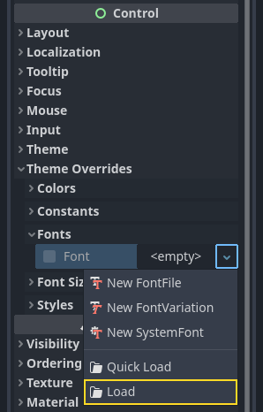

El tamaño de fuente sigue siendo demasiado pequeño, auméntalo a `64` en `ScoreLabel > Control > Theme Overrides > Font Sizes`. Una vez que hayas hecho esto con **ScoreLabel**, repite los cambios para los nodos **Message** y **StartButton**.


> **Nota:** 
>
> **Anclajes:** los nodos `Control` tienen una posición y un tamaño, pero también tienen anclajes. Los anclajes definen el origen, el punto de referencia para los bordes del nodo.

Organice los nodos como se muestra a continuación:

#### ScoreLabel

1. Agrega a **Label > Text** el valor `0`.
2. Establece en **Label > Horizontal Alignment** y **Label > Vertical Alignment** el valor `Center`.
3. Elige en **Control > Layout > Anchors Preset** el valor `Center Top`.

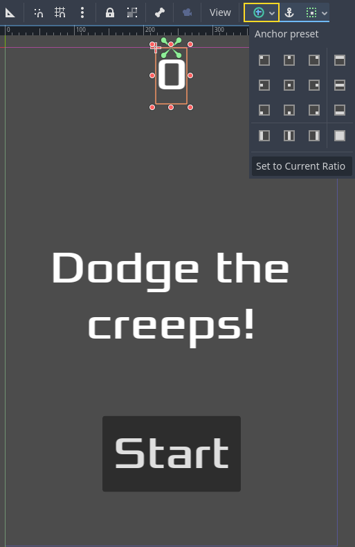

Puede arrastrar los nodos para colocarlos manualmente o, para una colocación más precisa, utilice **Anchor Presets**.

#### Message

1. Agrega a **Label > Text** el valor `Dodge the creeps!`.
2. Establece en **Label > Horizontal Alignment** y **Label > Vertical Alignment** el valor `Center`.
3. Establece **Label > Autowrap Mode** en `Word`; de lo contrario, la etiqueta permanecerá en una línea.
4. En **Control > Layout > Transform > Size > X**, establece `480` para utilizar todo el ancho de la pantalla.
5. Elige en **Control > Layout > Anchors Preset** el valor `Center`.

#### StartButton

1. Agrega a **Label > Text** el valor `Start`.
2. En **Control > Layout > Transform > Size > X**, establece `200` y **Control > Layout > Transform > Size > X**, establece `100`  para agregar un poco más de relleno entre el borde y el texto.
3. Elige en **Control > Layout > Anchors Preset** el valor `Center Bottom`.
4. En **Control > Layout > Transform > Size > Position Y**, establece `580`.

En `MessageTimer`, configure **Timer > Wait Time** en `2` y configure la propiedad **Timer > One Shot** en "On".

Ahora agregue este script al nodo `HUD`:

```
extends CanvasLayer

# Notifica al nodo `Main` que se presionó el botón
signal start_game
```

Ahora queremos mostrar un mensaje temporalmente, como `Get Ready`, por lo que agregamos el siguiente código:

```
func show_message(text):
	$Message.text = text
	$Message.show()
	$MessageTimer.start()
```

También necesitamos procesar lo que sucede cuando el jugador pierde. El código a continuación mostrará `Game Over` durante 2 segundos, luego volverá a la pantalla de título y, después de una breve pausa, mostrará el botón **Start**.

```
func show_game_over():
	show_message("Game Over")
	# Espere hasta que MessageTimer haya contado regresivamente.
	await $MessageTimer.timeout

	$Message.text = "Dodge the Creeps!"
	$Message.show()
	# Crea un temporizador de un solo uso y espera a que termine.
	await get_tree().create_timer(1.0).timeout
	$StartButton.show()
```

Esta función se llama cuando el jugador pierde. Mostrará `Game Over` durante 2 segundos, luego volverá a la pantalla de título y, después de una breve pausa, mostrará el botón `Start`.

> **Nota:** Cuando necesitas hacer una pausa por un breve tiempo, una alternativa al uso de un nodo **Timer** es usar la función `create_timer()` de **SceneTree**. Esto puede ser muy útil para agregar demoras como en el código anterior, donde queremos esperar un tiempo antes de mostrar el botón **Start**.

Agregue el código a continuación al nodo `HUD` para actualizar la puntuación:

```
func update_score(score):
	$ScoreLabel.text = str(score)
```

Conecte la señal `pressed()` de **StartButton** y la señal `timeout()` de **MessageTimer** al nodo `HUD` y agregue el siguiente código a las nuevas funciones:

```
func _on_start_button_pressed():
	$StartButton.hide()
	start_game.emit()

func _on_message_timer_timeout():
	$Message.hide()
```

#### Conectar el HUD al nodo principal

Ahora que hemos terminado de crear la escena `HUD`, vuelve al nodo `Main`. Crea una instancia de la escena del `HUD` en el nodo `Main` como lo hiciste con la escena `Player`. El árbol de la escena debería verse así, así que asegúrate de no olvidarte de nada:

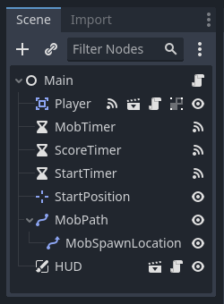

Ahora necesitamos conectar la funcionalidad de `HUD` a nuestro script `Main`. Esto requiere algunas adiciones a la escena `Main`:

Selecciona la escena hija `Hud` de `Main` y elige en la pestaña **Node** del Inspector, conecta la señal `start_game` de **HUD** a la función `new_game()` del nodo `Main` haciendo clic en el botón **Pick a method** en la ventana **Connect a Signal** y seleccionando el método `new_game()` o escribe `new_game` debajo de **Receiver Method** en la ventana. Verifica que el ícono de conexión verde ahora aparezca junto a `func new_game()` en el script.

En `new_game()`, actualiza la visualización de la puntuación y muestra el mensaje `Get Ready`:

```
$HUD.update_score(score)
$HUD.show_message("Get Ready")
```

En `game_over()`, debemos llamar a la función `HUD` correspondiente:

```
$HUD.show_game_over()
```

Por último, agrega esto a `_on_score_timer_timeout()` para mantener la visualización sincronizada con el cambio de puntuación:

```
$HUD.update_score(score)
```

> **Advertencia:**
>
> Recuerda eliminar la llamada a `new_game()` de `_ready()` si aún no lo has hecho, de lo contrario, tu juego comenzará automáticamente.

¡Ahora estás listo para jugar! Haz clic en el botón **Play the Project**.

#### Eliminación de los creeps antiguos

Si juegas hasta **Game Over** y luego comienzas un nuevo juego de inmediato, los creeps del juego anterior pueden seguir en la pantalla. Sería mejor si todos desaparecieran al comienzo de un nuevo juego. Solo necesitamos una forma de decirle a todos los _mobs_ que se retiren. Podemos hacerlo con la funcionalidad **group**.

En la escena `Mob`, selecciona el nodo raíz y haz clic en la pestaña **Nodo** junto al **Inspector** (el mismo lugar donde se encuentran las señales del nodo). Junto a **Señales**, haz clic en **Groups** para abrir la descripción general del grupo y en el botón `+` para abrir el cuadro de diálogo **Create New Group**.


Nombra el grupo `mobs` y haz clic en **Ok** para agregar un nuevo grupo de escena.

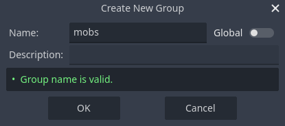

Ahora todos los _mobs_ estarán en el grupo `mobs`.

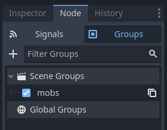

Podemos agregar la siguiente línea a la función `new_game()` en `Main`:

```
get_tree().call_group("mobs", "queue_free")
```

La función `call_group()` llama a la función nombrada en cada nodo de un grupo; en este caso, le estamos indicando a cada _mob_ que se elimine a sí mismo.

El juego está prácticamente terminado en este punto. En la próxima y última parte, lo perfeccionaremos un poco agregando un fondo, música en bucle y algunos atajos de teclado.

### Terminando

Ya hemos completado todas las funciones de nuestro juego. A continuación, se muestran algunos pasos restantes para agregar un poco más de "jugo" para mejorar la experiencia de juego.

No dudes en ampliar la jugabilidad con tus propias ideas.

#### Fondo

El fondo gris predeterminado no es muy atractivo, así que cambiemos su color. Una forma de hacerlo es usar un nodo `ColorRect`. Hazlo el primer nodo debajo de `Main` para que se dibuje detrás de los otros nodos. `ColorRect` solo tiene una propiedad: Color. Elige un color que te guste (por ejemplo: `#416c6d`) y selecciona **Control > Layout > Anchors Preset:** `Full Rect` ya sea en la barra de herramientas en la parte superior de la ventana gráfica o en el inspector para que cubra toda la pantalla.

También puedes agregar una imagen de fondo, si tienes una, usando un nodo `TextureRect` en su lugar.

#### Efectos de sonido

El sonido y la música pueden ser la forma más efectiva de agregar atractivo a la experiencia de juego. En la carpeta `art` de tu juego, tienes dos archivos de sonido: `House In a Forest Loop.ogg` para la música de fondo y `gameover.wav` para cuando el jugador pierde.

Agrega dos nodos `AudioStreamPlayer` como hijos de `Main`. Nombra uno de ellos `Music` y el otro `DeathSound`. En cada uno, haz clic en la propiedad `Stream`, selecciona **Load** y elige el archivo de audio correspondiente.

Todo el audio se importa automáticamente con la propiedad `Loop` deshabilitada. Si quieres que la música se reproduzca sin interrupciones, haz clic en la _flecha abajo_ del archivo cargado en **AudioStreamPlayer > Stream**, selecciona `Make Unique`, y luego haz clic en el archivo cargado en **AudioStreamPlayer > Stream** y marca la tilde en la casilla `Loop > On`:


Para reproducir la música, agrega `$Music.play()` en la función **new_game()** y `$Music.stop()` en la función **game_over()**.

Finalmente, agrega `$DeathSound.play()` en la función **game_over()**.

```
func game_over():
	...
	$Music.stop()
	$DeathSound.play()

func new_game():
	...
	$Music.play()
```

#### Atajo de teclado

Dado que el juego se juega con controles de teclado, sería conveniente si también pudiéramos iniciar el juego presionando una tecla del teclado. Podemos hacer esto con la propiedad `Shortcut` del nodo **Button**.

En una lección anterior, creamos cuatro acciones de entrada para mover el personaje. Crearemos una acción de entrada similar para asignarla al botón de inicio.

Seleccione **Project" > "Project Settings** y luego haga clic en la pestaña **Input Map**. De la misma manera que creó las acciones de entrada de movimiento, cree una nueva acción de entrada llamada `start_game` y agregue una asignación de teclas para la tecla `Enter`.


Ahora sería un buen momento para agregar compatibilidad con el controlador si tiene uno disponible. Conecte o empareje su controlador y luego, debajo de cada acción de entrada para la que desea agregar compatibilidad con el controlador, haga clic en el botón `+` y presione el botón, el pad direccional o la dirección del joystick correspondiente que desea asignar a la acción de entrada respectiva.

En la escena `HUD`, seleccione **StartButton** y busque su propiedad **StartButton > BaseButton > Shortcut** en el **Inspector**. Cree un nuevo _recurso_ **Shortcut** haciendo clic dentro del cuadro y seleccionando `New Shortcut`, luego haga clic en el reciente creado `[rayo] Shortcut` y abra la matriz **Events** y agréguele un nuevo elemento de matriz haciendo clic en `Array[InputEvent] (size 0)` y luego clic en botón `+ Add Element` .


Cree una nueva **InputEventAction** haciendo clic en la caja `<empty>` y seleccionar `New InputEventAction`. Luego clic en la caja recientemente creada `InputEventAction` y en el área de texto **Action** escriba `start_game` luego del signo `&`.

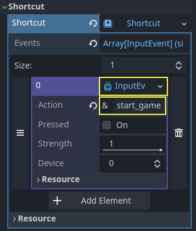

Ahora, cuando aparezca el botón `Start`, puede hacer clic en él o presionar Enter para iniciar el juego.

Y con eso, completó su primer juego 2D en Godot.


Haz creado un personaje controlado por el jugador, enemigos que aparecen aleatoriamente en el tablero de juego, un contador de puntuación, implementado una finalización de juego terminado y un volver a empezar, una interfaz de usuario, sonidos y más. ¡Felicitaciones!

Aún queda mucho por aprender, pero puedes tomarte un momento para apreciar lo que lograste.

Y cuando estés listo, puedes pasar a **Tu primer juego en 3D** para aprender a crear un juego en 3D completo desde cero, en Godot.

#### Compartir el juego terminado con otros

Si quieres que la gente pruebe tu juego sin tener que instalar Godot, tendrás que exportar el proyecto para cada sistema operativo en el que quieras que se pueda jugar el juego. Consulta [Exportar proyectos](https://docs.godotengine.org/en/stable/tutorials/export/exporting_projects.html#doc-exporting-projects) para obtener instrucciones.

##### Exportar el juego a Windows Desktop con ícono

1. Descargar [**rcedit-x64**](https://github.com/electron/rcedit/releases) y guardarlo en el raiz de la carpeta **Godotv4.3**.

> Ante alguna duda, puedes ver el video: [Godot 4 Rcedit Tutorial (Export With Custom Icon)](https://youtu.be/LcpZu0nYKU0?si=8yMMs-qX5ogsFLEj)

2. Usaremos la versión x64: `rcedit-x64`
3. Configuramos **rcedit** en el editor: `Editor > Editor Settings > General > Export > Windows > rcedit: rcedit-x64.exe`.
4. Configuramos el ícono del proyecto: `Project > Project Settings > General > Application > Config > Icon: res://icon/icon.webp`
5. Configuramos ícono de exportación a Windows Desktop: `Project > Export > Presets > Windows Desktop > Options > Application > Icon: res://icon/icon.webp`
6. Clic en botón **Export Project**

> Nota: el tamaño idel del ícono es `256 x 256` pero puede ser menor. El tipo de archivo puede ser: `*.png`, `*.svg` o `*.webp`.

Después de exportar el proyecto, puedes comprimir el _archivo ejecutable_ y _PCK_ exportados (no los archivos del proyecto sin procesar) en un archivo **ZIP**, luego carga este archivo ZIP en un sitio web para compartir archivos.

