## Capítulo 4. Tu primer juego 3D

En esta serie de tutoriales paso a paso, crearás tu primer juego 3D completo con Godot. Al final de la serie, tendrás un proyecto propio simple pero terminado como el gif animado que aparece a continuación:


El juego que codificaremos aquí es similar a [Tu primer juego 2D](capitulo-3-tu-primer-juego-2d), con un giro: ahora puedes saltar y tu objetivo es aplastar a los bichos. De esta manera, reconocerás los patrones que aprendiste en el tutorial anterior y los desarrollarás con nuevo código y características.

Aprenderás a:

- Trabajar con _coordenadas 3D_ con una _mecánica de salto_.
- Usar _cuerpos cinemáticos_ para mover personajes 3D y detectar _cuándo y cómo chocan_.
- Usar _capas físicas_ y un _grupo_ para detectar interacciones con entidades específicas.
- Codificar un _juego procedimental_ básico creando instancias de monstruos en intervalos de tiempo regulares.
- Diseñar una animación de movimiento y cambiar su velocidad en tiempo de ejecución.
- Dibujar una _interfaz de usuario en un juego 3D_.

Y más.

Este tutorial es para principiantes que siguieron la serie completa de introducción. Comenzaremos lentamente con instrucciones detalladas y las acortaremos a medida que sigamos pasos similares. Si eres un programador experimentado, puedes buscar el código fuente de la demostración completa aquí: [Código fuente de Squash the Creep](https://github.com/godotengine/godot-3d-dodge-the-creeps).

> **Nota:** Puedes seguir esta serie sin haber hecho la de 2D. Sin embargo, si eres nuevo en el desarrollo de juegos, te recomendamos que comiences con 2D. El código de juego 3D siempre es más complejo y la serie 2D te dará las bases para seguir con más comodidad.

Preparamos algunos recursos del juego para que podamos pasar directamente al código. Puedes descargarlos aquí: [Recursos de Squash the Creeps](./assets/3d/squash_the_creeps_start_1.1.0.zip).

Primero trabajaremos en un _prototipo básico para el movimiento del jugador_. Luego _agregaremos los monstruos_ que generaremos aleatoriamente alrededor de la pantalla. Después de eso, _implementaremos la mecánica de salto y aplastamiento_ antes de refinar el juego con una buena animación. Terminaremos con la _puntuación_ y la _pantalla de reinicio_.

### Contenido

- [Configuración del área de juego](#configuración-del-área-de-juego)
- Escena del jugador y acciones de entrada
- Movimiento del jugador con código
- Diseño de la escena de la multitud
- Generación de monstruos
- Saltar y aplastar monstruos
- Matar al jugador
- Puntuación y repetición
- Animación de personajes
- Más allá

### Configuración del área de juego

En esta primera parte, vamos a configurar el área de juego. Empecemos importando los recursos de inicio y configurando la escena del juego.

Hemos preparado un proyecto Godot con los modelos 3D y los sonidos que usaremos para este tutorial, cuyo enlace se encuentra en el Índice. Si aún no lo has hecho, puedes descargar el archivo aquí: [Recursos de Squash the Creeps](./assets/3d/squash_the_creeps_start_1.1.0.zip).

Una vez que lo hayas descargado, extrae el archivo `.zip` en tu computadora. Abre el **Project Manager** de Godot y haz clic en el botón **Import**.


En la ventana emergente de importación, ingresa la ruta completa al directorio recién creado al descomprimir el archivo **.zip**: `squash_the_creeps_start/`. Puedes hacer clic en el botón **Browse** a la derecha para abrir un explorador de archivos y navegar hasta el archivo `project.godot` que contiene la carpeta.


Haz clic en **Import & Edit** para abrir el proyecto en el editor.


Puede aparecer una ventana que te notifique que el proyecto fue generado por una versión anterior de Godot. Haz clic en **Convert Full Project** para convertir el proyecto a tu versión actual de Godot.


El proyecto de inicio contiene un **ícono** y dos carpetas: `art/` y `fonts/`. Allí, encontrarás los recursos artísticos y la música que usaremos en el juego.


Hay dos modelos 3D, `player.glb` y `mob.glb`, algunos materiales que pertenecen a estos modelos y una pista de música.

#### Configuración del área jugable

Vamos a crear nuestra escena principal con un nodo simple (`Node`) como raíz. En el dock `Scene`, haz clic en el botón **Add Child Node** representado por un ícono `+` en la parte superior izquierda y haz doble clic en `Node`. ​​Nombra el nodo `Main`. Un método alternativo para cambiar el nombre del nodo es hacer clic derecho en nodo y elegir `Rename` (o `F2`). Alternativamente, para agregar un nodo a la escena, puedes presionar `Ctrl + A` (`Cmd + A` en macOS).

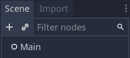

Guarda la escena como `main.tscn` presionando `Ctrl + S` (`Cmd + S` en macOS).

Comenzaremos agregando un piso que evitará que los personajes se caigan. Para crear colisionadores estáticos como el piso, las paredes o los techos, puedes usar nodos `StaticBody3D`. Requieren nodos hijos `CollisionShape3D` para definir el área de colisión. Con el nodo principal seleccionado, agregue un nodo **StaticBody3D** y luego un nodo **CollisionShape3D**. Cambie el nombre de **StaticBody3D** a `Ground`.


Su árbol de escena debería verse así:

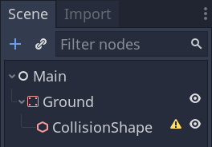

Aparece un _signo de advertencia_ junto a **CollisionShape3D** porque no hemos definido su **forma**. Si hace clic en el _ícono_, aparece una ventana emergente para brindarle más información.

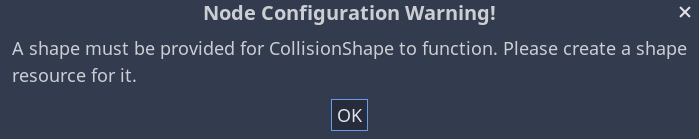

Para crear una **forma**, seleccione el nodo **CollisionShape3D**, diríjase al **Inspector** y haga clic en el campo `<empty>` junto a la propiedad **Shape**. Cree un `New BoxShape3D`.


La `BoxShape3D` es perfecta para paredes y suelos planos. Su grosor la hace fiable para bloquear incluso objetos que se mueven rápidamente.

Un _cubo con estrutura de alambre_ aparece en la ventana gráfica con **tres puntos naranjas**. Puede hacer clic y arrastrarlos para editar las extensiones de la forma de manera interactiva. También podemos establecer con precisión el tamaño en el inspector. Haga clic en `BoxShape3D` para expandir el recurso. Establezca **Size** en `x: 60`, `y: 2` y `z: 60`.


Las `CollisionShape` son invisibles. Necesitamos agregar un piso visual que vaya con él. Seleccione el nodo `Ground` y agregue un **MeshInstance3D** como su hijo.


En `Inspector`, haz clic en el campo junto a **Mesh** y crea un recurso `New BoxMesh` para crear un cubo visible.

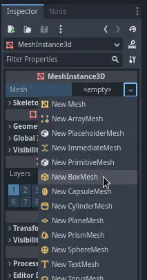

Una vez más, es demasiado pequeño de forma predeterminada. Haz clic en el icono del cubo para expandir el recurso y establecer `Size` en `x: 60`, `y: 2` y `z: 60`.


Deberías ver una _losa ancha gris clara _ que cubre la cuadrícula y el _gizmo_ con los ejes azul, verde y rojo en el viewport.

Vamos a mover `Ground` hacia abajo para que podamos ver la cuadrícula del piso. Para ello, se puede utilizar la función  _ajuste a cuadrícula_ (grid snapping). El ajuste a cuadrícula se puede activar de dos formas en el editor 3D. La primera es presionando el botón **Use Snap** (o presionando la tecla `Y`). El segundo es seleccionar un nodo, arrastrar un controlador en el _gizmo_ y **luego** mantener presionada la tecla `Ctrl` mientras se hace clic para habilitar el ajuste mientras se mantiene presionada la tecla `Ctrl`.


Comience por configurar el ajuste con su método preferido. Luego mueva el nodo `Ground` usando el **eje Y** (la flecha verde en el gizmo).


> **Nota:** Si no puede ver el manipulador de objetos 3D como en la imagen anterior, asegúrese de que el modo **Select** esté activo en la barra de herramientas sobre la vista.


Mueva el suelo hacia abajo `1` metro para tener una cuadrícula de editor visible. Una etiqueta en la esquina inferior izquierda de la ventana gráfica le indica cuánto está trasladando el nodo.


> **Nota:** Al mover el nodo `Ground` hacia abajo, se mueven los dos elementos secundarios junto con él. Asegúrate de mover el nodo `Ground`, **no** _MeshInstance3D_ o _CollisionShape3D_.

En última instancia, **transform.position.y** de `Ground` debe ser `-1`.


Agreguemos una luz direccional para que nuestra escena no sea toda gris. Selecciona el nodo `Main` y agrega un nodo hijo **DirectionalLight3D**.

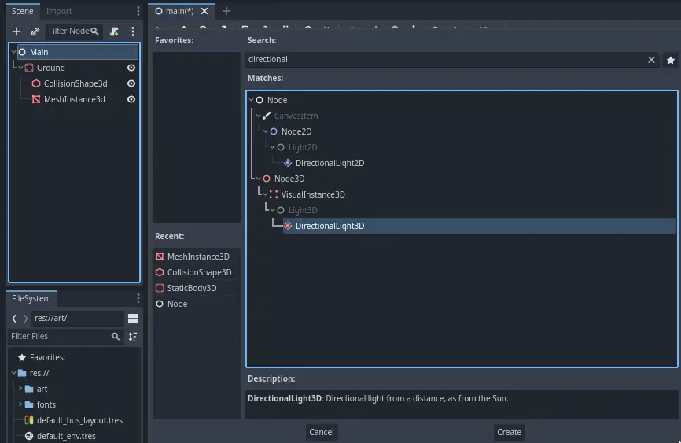

Necesitamos mover y rotar el nodo `DirectionalLight3D`. Muévelo hacia arriba haciendo clic y arrastrando la flecha verde del _gizmo_ y haz clic y arrastra en el arco rojo para rotarlo alrededor del eje X, hasta que el suelo esté iluminado.

En **Inspector**, activa **Shadow > Enabled** haciendo clic en la casilla de verificación.

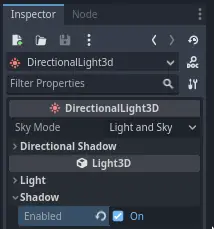

En este punto, tu proyecto debería verse así:


Ese es nuestro punto de partida. En la siguiente parte, trabajaremos en la escena del jugador y el movimiento de la base.

### Escena del jugador y acciones de entrada

En las próximas dos lecciones, diseñaremos la escena del jugador, registraremos input actions (acciones de entrada) personalizadas y codificaremos el movimiento del jugador. Al final, tendrás un personaje jugable que se mueve en ocho direcciones.

Crea una nueva escena yendo al menú **Scene** en la parte superior izquierda y haciendo clic en **New Scene**.


Crea un **CharacterBody3D** como nodo raíz:

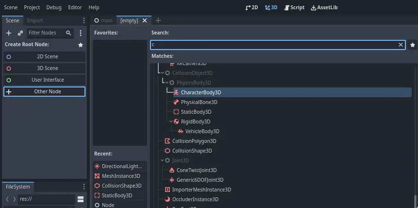

Nombra el **CharacterBody3D** como `Player`. Los **CharacterBody** son complementarios a los **RigidBody2D** y **Area2D** utilizados en el tutorial del juego 2D. Al igual que los _rigid bodies (cuerpos rígidos)_, pueden moverse y colisionar con el entorno, pero en lugar de ser controlados por el motor de física, **tú** dictas su movimiento. Verás cómo usamos las características únicas del nodo cuando codificamos la mecánica de salto y aplastamiento.

> **Consulte:**
>
> Para obtener más información sobre los diferentes tipos de nodos de física, consulta la [Introducción a la física](https://docs.godotengine.org/en/stable/tutorials/physics/physics_introduction.html#doc-physics-introduction).

Por ahora, vamos a crear una _configuración básica_ para el modelo 3D de nuestro personaje. Esto nos permitirá rotar el modelo más tarde a través del código mientras reproduce una animación.

Agrega un nodo `Node3D` como hijo de **Player** y nómbralo `Pivot`

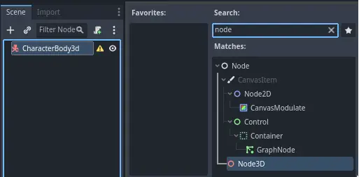

Luego, en el dock **FileSystem**, expande la carpeta `art/` haciendo doble clic en ella y arrastra y suelta `player.glb` en **Pivot**.

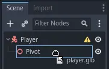

Esto debería _instanciar_ el modelo como hijo de `Pivot`. Puedes cambiarle el nombre a `Character`.


> **Nota:**
>
> Los archivos `.glb` contienen datos de escenas 3D basados ​​en la especificación de código abierto **glTF 2.0**. Es una alternativa moderna y poderosa a un formato propietario como _FBX_, que Godot también admite. Para producir estos archivos, diseñamos el modelo en **Blender 3D** y lo exportamos a **glTF**.

Al igual que con todos los tipos de nodos de física, necesitamos un **collision shape** para que nuestro personaje colisione con el entorno. Seleccione el nodo `Player` nuevamente y agregue un nodo hijo **CollisionShape3D**. En el **Inspector**, en la propiedad **Shape**, agregue un `New SphereShape3D`.

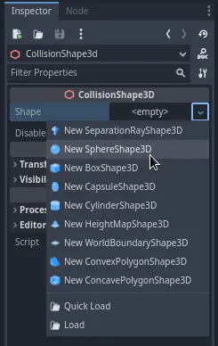

El _estructura de alambre_ de la esfera aparece debajo del personaje.


Será la _forma_ que el motor de física use para colisionar con el entorno, por lo que queremos que se ajuste mejor al modelo 3D. Hazla un poco más grande arrastrando el _punto naranja_ en el viewport. Mi esfera tiene un radio de aproximadamente `0.8` metros.

Luego, mueva la _forma de colisión_ hacia arriba para que su parte inferior se alinee aproximadamente con el plano de la cuadrícula.


Para que sea más fácil mover la _forma_, puede alternar la visibilidad del modelo haciendo clic en el _ícono del ojo_ junto a los nodos `Character` o `Pivot`.


Guarda la escena como `player.tscn`.

Con los nodos listos, casi podemos comenzar a codificar. Pero primero, debemos definir algunas _input actions (acciones de entrada)_.

#### Creación de acciones de entrada

Para mover el personaje, escucharemos la entrada del jugador, como presionar las teclas de flecha. En Godot, si bien podríamos escribir todas las combinaciones de teclas en código, existe un sistema poderoso que te permite asignar una etiqueta a un conjunto de teclas y botones. Esto simplifica nuestros scripts y los hace más legibles.

Este sistema es el **Input Map**. Para acceder a su editor, dirígete al menú _Project_ y selecciona _Project Settings_.


En la parte superior, hay varias pestañas. Haz clic en _Input Map_. Esta ventana te permite agregar nuevas _acciones_ en la parte superior; son tus _etiquetas_. En la parte inferior, puedes vincular teclas a estas acciones.


Los proyectos de Godot vienen con algunas acciones predefinidas diseñadas para el diseño de la interfaz de usuario (ver la captura de pantalla anterior). Estas se volverán visibles si habilitas la casilla _Show Built-in Actions_. Podríamos usarlas aquí, pero en su lugar estamos definiendo las nuestras para que sean compatibles con los gamepads. Deja la casilla _Show Built-in Actions_ deshabilitada.

Vamos a nombrar nuestras acciones `move_left`, `move_right`, `move_forward`, `move_back` y `jump`.

Para agregar una acción, escribe su nombre en la barra de la parte superior y presiona **Enter**.


Crea las siguientes cinco acciones:


Para vincular una tecla o botón a una _acción_, haz clic en el botón `+` a su derecha. Haz lo mismo con `move_left`. Presiona la tecla de **flecha izquierda** y haz clic en **OK**.

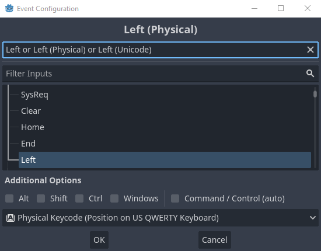

Vincula también la tecla **A** a la acción `move_left`.


Ahora agreguemos compatibilidad con el joystick izquierdo de un gamepad. Haz clic en el botón `+` nuevamente, pero esta vez, selecciona `Manual Selection > Joypad Axes`.


Selecciona el _eje X negativo_ en el joystick izquierdo.

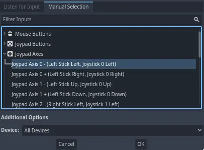

Deja los demás valores como predeterminados y pulsa **OK**.

> **Nota:**
>
> Si quieres que los controladores tengan diferentes acciones de entrada, debes utilizar la opción _Devices_ en _Additional Options_. El _Device 0_ corresponde al primer gamepad conectado, el _Device 1_ corresponde al segundo mando conectado, y así sucesivamente.

Haz lo mismo con las demás acciones de entrada. Por ejemplo, vincula la **flecha derecha**, **D**, y el **eje positivo del joystick izquierdo** a `move_right`. Después de vincular todas las teclas, tu interfaz debería verse así:

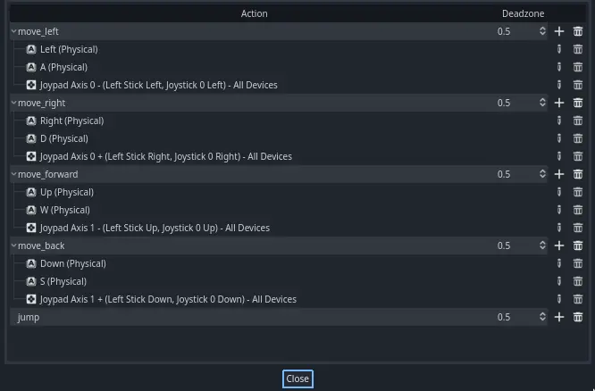

La última acción que debes configurar es la acción `jump`. Vincula la tecla **Space** y el botón **A** del gamepad.


Tu acción de entrada de salto debería verse así:


Esas son todas las acciones que necesitamos para este juego. Puedes utilizar este menú para etiquetar cualquier grupo de teclas y botones en tus proyectos.

En la siguiente parte, codificaremos y probaremos el movimiento del jugador.

### Movemos al jugador con código

¡Es hora de codear! Vamos a usar las _input actions_ que creamos en la última parte para mover al personaje.

> **Nota:**
>
>Para este proyecto, seguiremos las convenciones de nombres de Godot.
>
>**GDScript:** las clases (nodos) usan `PascalCase`, las variables y funciones usan `snake_case` y las constantes usan `ALL_CAPS` (Ver [guía de estilo de GDScript](https://docs.godotengine.org/en/stable/tutorials/scripting/gdscript/gdscript_styleguide.html#doc-gdscript-styleguide)).

Haga clic derecho en el nodo `Player` y seleccione **Attach Script** para agregarle un nuevo script. En la ventana emergente, configure _Template_ en `Empty` antes de presionar el botón **Create**. La configuramos en _empty_ porque queremos escribir nuestro propio código para el movimiento del jugador.


Comencemos con las _propiedades_ de la clase. Vamos a definir una _velocidad de movimiento_ (`speed`), una aceleración de caída que representa la _gravedad_ (`fall_acceleration`) y una _velocidad_ que usaremos para mover al personaje (`target_velocity`).

```
extends CharacterBody3D

# Qué tan rápido se mueve el jugador en metros por segundo.
@export var speed = 14

# La aceleración de caída cuando está en el aire, en metros por segundo al cuadrado.
@export var fall_acceleration = 75

var target_velocity = Vector3.ZERO

```
Estas son propiedades comunes para un cuerpo en movimiento. El `target_velocity` es un _vector 3D_ que combina una velocidad con una dirección. Aquí, lo definimos como una propiedad porque queremos actualizar y reutilizar su valor en todos los fotogramas.

> **Nota:**
>
>Los valores son bastante diferentes del código 2D porque las distancias están expresadas en _metros_. Mientras que en 2D, mil unidades (píxeles) pueden corresponder solo a la mitad del ancho de la pantalla, en 3D, es un kilómetro.

Vamos a codificar el movimiento. Comenzamos calculando el vector de dirección de entrada utilizando el objeto global `Input`, en `_physics_process()`.

```
func _physics_process(delta):
  # Creamos una variable local para almacenar la dirección del input.
  var direction = Vector3.ZERO

  # Comprobamos cada entrada de movimiento y consecuentemente actualizamos la dirección.
  if Input.is_action_pressed("move_right"):
    direction.x += 1
  if Input.is_action_pressed("move_left"):
    direction.x -= 1
  if Input.is_action_pressed("move_back"):
    # Observa cómo trabajamos con los ejes x y z del vector.
    # En 3D, el plano XZ es el plano del suelo.
    direction.z += 1
  if Input.is_action_pressed("move_forward"):
    direction.z -= 1
```

Aquí, vamos a realizar todos los cálculos utilizando la función virtual `_physics_process()`. Al igual que `_process()`, permite actualizar el nodo en cada fotograma, pero está diseñado específicamente para código relacionado con la física, como mover un cuerpo cinemático o rígido.

> **Ver también:**
>
>Para obtener más información sobre la diferencia entre `_process()` y `_physics_process()`, consulte [Idle and Physics Processing](https://docs.godotengine.org/en/stable/tutorials/scripting/idle_and_physics_processing.html#doc-idle-and-physics-processing).

Comenzamos inicializando una variable `direction` en `Vector3.ZERO`. Luego, verificamos si el jugador está presionando una o más de las entradas `move_*` y actualizamos de forma consecuente los componentes `x` y `z` del vector. Estos corresponden a los ejes del plano del suelo.

Estas cuatro condiciones nos dan _ocho posibilidades_ y, por lo tanto, _ocho direcciones posibles_.

En caso de que el jugador presione, digamos, tanto `W` como `D` simultáneamente, el vector tendrá una longitud de aproximadamente `1.4`. Pero si presiona una sola tecla, tendrá una longitud de `1`. Queremos que la longitud del vector sea constante y que no se mueva más rápido en diagonal. Para hacerlo, podemos llamar a su método `normalized()`.

```
#func _physics_process(delta):
  #...

  if direction != Vector3.ZERO:
    direction = direction.normalized()
    # Establecer la propiedad basis afectará la rotación del nodo.
    $Pivot.basis = Basis.looking_at(direction)
```

Aquí, solo normalizamos el vector si la dirección tiene una longitud mayor que cero, lo que significa que el jugador está presionando una tecla de dirección.

Calculamos la dirección hacia la que mira `$Pivot` creando una [**Basis**](https://docs.godotengine.org/en/stable/classes/class_basis.html#class-basis) que mira en la dirección `direction`.

Luego, actualizamos la velocidad. Tenemos que calcular la _velocidad del suelo_ y la _velocidad de caída_ por separado. Asegúrate de retroceder una pestaña para que las líneas estén dentro de la función `_physics_process()` pero fuera de la condición que acabamos de escribir anteriormente.

```
func _physics_process(delta):
  #...
  if direction != Vector3.ZERO:
    #...

  # Velocidad en el suelo
  target_velocity.x = direction.x * speed
  target_velocity.z = direction.z * speed

  # Velocidad vertical
  if not is_on_floor(): #  Si está en el aire, cae hacia el suelo. Literalmente, gravedad.
    target_velocity.y = target_velocity.y - (fall_acceleration * delta)

  # Movimiento del personaje
  velocity = target_velocity
  move_and_slide()
```

La función `CharacterBody3D.is_on_floor()` devuelve `true` si el cuerpo chocó contra el suelo en este fotograma. Por eso aplicamos gravedad al jugador **solo** mientras está en el aire.

Para la velocidad vertical, restamos la _aceleración de caída_ multiplicada por el _tiempo delta_ en cada fotograma. Esta línea de código hará que nuestro personaje caiga en cada cuadro, siempre que no esté sobre el suelo o colisione con él.

El motor de física solo puede detectar interacciones con paredes, el suelo u otros cuerpos durante un cuadro determinado si se producen movimientos y colisiones. Usaremos esta propiedad más adelante para codificar el salto.

En la última línea, llamamos a `CharacterBody3D.move_and_slide()`, que es un método poderoso de la clase `CharacterBody3D` que te permite mover un personaje suavemente. Si choca contra una pared a mitad de un movimiento, el motor intentará suavizarlo por ti. Utiliza el _velocity_ nativo de **CharacterBody3D**.

Y ese es todo el código que necesitas para mover al personaje en el suelo.

A continuación se incluye el código completo de `player.gd` como referencia:

```
extends CharacterBody3D

# Qué tan rápido se mueve el jugador en metros por segundo.
@export var speed = 14
# La aceleración de caída cuando está en el aire, en metros por segundo al cuadrado.
@export var fall_acceleration = 75

var target_velocity = Vector3.ZERO


func _physics_process(delta):
  var direction = Vector3.ZERO

  if Input.is_action_pressed("move_right"):
    direction.x += 1
  if Input.is_action_pressed("move_left"):
    direction.x -= 1
  if Input.is_action_pressed("move_back"):
    direction.z += 1
  if Input.is_action_pressed("move_forward"):
    direction.z -= 1

  if direction != Vector3.ZERO:
    direction = direction.normalized()
    $Pivot.basis = Basis.looking_at(direction)

  # Velocidad en el suelo
  target_velocity.x = direction.x * speed
  target_velocity.z = direction.z * speed

  # Velocidad vertical
  if not is_on_floor(): # Si está en el aire, cae hacia el suelo. Literalmente, gravedad
    target_velocity.y = target_velocity.y - (fall_acceleration * delta)

  # Mover al personaje
  velocity = target_velocity
  move_and_slide()
```

#### Probando el movimiento de nuestro jugador

Vamos a colocar a nuestro jugador en la escena `Main` para probarlo. Para ello, necesitamos crear una instancia del jugador y luego agregar una **cámara**. A diferencia de lo que ocurre en 2D, en 3D no verás nada si tu _viewport_ no tiene una **cámara** apuntando a algo.

Guarda tu escena `Player` y abre la escena `Main`. Puedes hacer clic en la pestaña `Main` en la parte superior del editor para hacerlo.

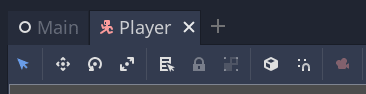

Si antes cerraste la escena, dirígete al dock **FileSystem** y haz doble clic en `main.tscn` para volver a abrirlo.

Para crear una instancia de `Player`, haz clic derecho en el nodo `Main` y selecciona _Instantiate Child Scene_.


En la ventana emergente, haz doble clic en `player.tscn`. El personaje debería aparecer en el centro de la ventana gráfica.

##### Agregar una cámara

A continuación agregaremos la **cámara**. Al igual que hicimos con el _pivote de nuestro jugador_, vamos a crear una estructura básica. Haz clic derecho en el nodo `Main` nuevamente y selecciona _Add Child Node_. Crea un nuevo **Marker3D** y nómbralo `CameraPivot`. Selecciona `CameraPivot` y agrégale un nodo hijo `Camera3D`. Tu árbol de escena debería verse similar a esto:


Observa la casilla de verificación _Preview_ que aparece en la parte superior izquierda de la vista 3D cuando tienes la cámara seleccionada. Puedes hacer clic en ella para obtener una vista previa de la proyección de la cámara en el juego.

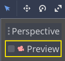

Vamos a usar el _Pivot_ para rotar la cámara como si estuviera en una grúa. Primero, dividiremos la vista 3D para poder navegar libremente por la escena y ver lo que ve la cámara.

En la barra de herramientas justo encima del viewport, haz clic en _View_ y luego en _2 Viewports_. También puedes presionar `Ctrl + 2` (`Cmd + 2` en macOS).


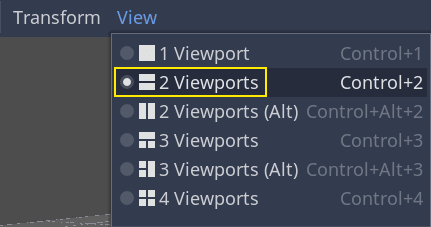

En la vista inferior, selecciona tu `Camera3D` y activa _Preview_ de la cámara haciendo clic en la casilla de verificación correspondiente:

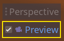

En la vista superior, asegúrate de que tu `Camera3D` esté seleccionada y mueve la cámara unas `19` unidades en el eje Z (arrastra la flecha azul).


Aquí es donde ocurre la magia. Selecciona _CameraPivot_ y gíralo `-45` grados alrededor del eje X (usando el círculo rojo). Verás que la cámara se mueve como si estuviera unida a una grúa.

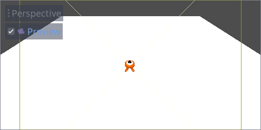

Puedes ejecutar la escena presionando `F6` y las teclas flecha para mover el personaje.


Podemos ver un espacio vacío alrededor del personaje debido a la proyección en perspectiva. En este juego, vamos a usar una proyección ortográfica en su lugar para encuadrar mejor el área de juego y facilitarle al jugador la lectura de distancias.

Vuelve a seleccionar `Camera` y en `Inspector`, establece _Projection to Orthogonal_ y _Size_ en `19`. El personaje ahora debería verse más plano y el suelo debería llenar el fondo.

> **Nota:**
>
> Al usar una cámara ortogonal en Godot 4, la calidad de la sombra direccional depende del valor _Far value_ de la cámara. Cuanto mayor sea el valor _Far_, más lejos podrá ver la cámara. Sin embargo, valores más altos de _Far_ también reducen la calidad de las sombras, ya que la representación de las sombras debe cubrir una distancia mayor.
>
> Si las sombras direccionales se ven demasiado borrosas después de cambiar a una cámara ortogonal, reduzca la propiedad _Far_ de la cámara a un valor menor, como por ejemplo `100`. No reduzca demasiado esta propiedad _Far_, o los objetos en la distancia comenzarán a desaparecer.

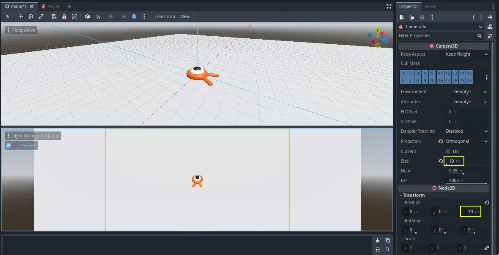

Pruebe su escena y debería poder moverse en las ocho direcciones y no atravesar el piso.

Finalmente ya tenemos el movimiento del jugador y la vista en su lugar. A continuación, trabajaremos en los _mobs_.

### Diseño de la escena de los mobs

En esta parte, vas a codear los monstruos, a los que llamaremos _mobs_. En la siguiente lección los generaremos aleatoriamente alrededor del área jugable.

Diseñemos los _mobs_ en una nueva escena. La estructura de nodos será similar a la escena `player.tscn`.

Crea una escena con, una vez más, un nodo **CharacterBody3D** como raíz. Llámalo `Mob`. Agrega un nodo hijo **Node3D**, llámalo `Pivot`. Arrastra y suelta el archivo `mob.glb` desde el dock **FileSystem** hasta el `Pivot` para agregar el modelo 3D del monstruo a la escena.

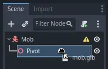

Puedes cambiar el nombre del nodo **mob** recién arrastrado a `Character`.


Necesitamos una _forma de colisión_ para que nuestro cuerpo funcione. Haz clic derecho en el nodo `Mob`, la raíz de la escena, y haz clic en **Add Child Node**.


Agrega un **CollisionShape3D**.

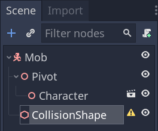

En **Inspector**, asigna un _New BoxShape3D_ a la propiedad _Shape_.


Deberíamos cambiar su tamaño para que se ajuste mejor al modelo 3D. Puedes hacerlo de forma interactiva haciendo clic y arrastrando los puntos naranjas.

El **BoxShape3D** debe tocar el suelo y ser un poco más delgado que el modelo. Los motores de física funcionan de tal manera que si la **SphereShape3D** del jugador llegara a tocar la esquina del **BoxShape3D**, se producirá una colisión. Si el **BoxShape3D** fuera un poco más grande en comparación con el modelo 3D, podrías morir a cierta distancia del monstruo y el juego parecerá injusto para los jugadores.

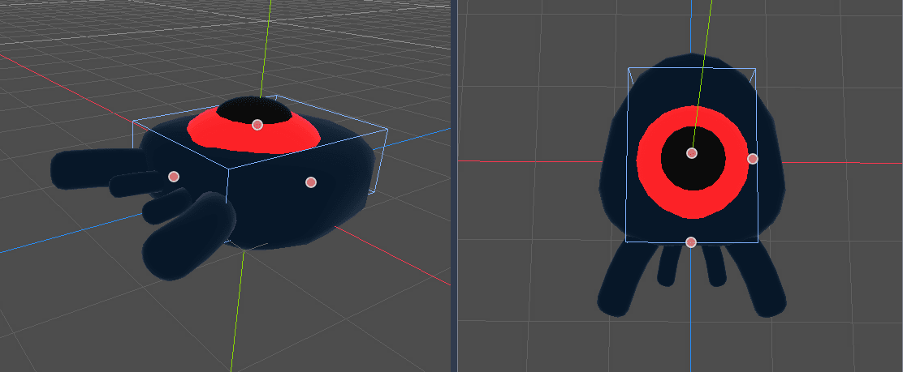

Observa que mi **BoxShape3D** es más alto que el monstruo. Esto está bien en este juego porque estamos mirando la escena desde arriba y usando una perspectiva fija. Las _formas de colisión_ no tienen que coincidir exactamente con el modelo. Cuando pruebas el juego es la _forma en que se siente_ lo que debería determinar su forma y tamaño.

#### Eliminar mobs de la pantalla

Vamos a generar _mobs_ a intervalos regulares de tiempo en el nivel del juego. Si no tenemos cuidado, su número podría aumentar hasta el infinito, y no queremos que eso suceda. Cada instancia de _mobs_ tiene un costo de memoria y de procesamiento, y no queremos pagar por ello cuando el _mob_ está fuera de la pantalla.

Una vez que un _mob_ sale de la pantalla, ya no lo necesitamos, por lo que deberíamos eliminarlo. Godot tiene un nodo que detecta cuando los objetos salen de la pantalla, **VisibleOnScreenNotifier3D**, y lo vamos a usar para destruir a nuestros _mobs_.

> **Nota:**
>
> Cuando sigues creando instancias de un objeto, hay una técnica que puedes usar para evitar el costo de crear y destruir instancias todo el tiempo llamada _pooling (agrupación)_. Consiste en crear previamente una matriz de objetos y reutilizarlos una y otra vez.
>
> Cuando trabajas con GDScript, no necesitas preocuparte por esto. La razón principal para usar _pools_ es evitar congelamientos con lenguajes de _recolección de basura_ como C# o Lua. GDScript usa una técnica diferente para administrar la memoria, _reference counting (conteo de referencias)_, la cual no contempla esa amenaza. Puedes aprender más sobre eso aquí: [Administración de memoria](https://docs.godotengine.org/en/stable/tutorials/scripting/gdscript/gdscript_basics.html#doc-gdscript-basics-memory-management).

Selecciona el nodo `Mob` y agrega un nodo hijo `VisibleOnScreenNotifier3D`. Aparece otro cubo, rosa esta vez. Cuando este cubo salga completamente de la pantalla, el nodo emitirá una señal.

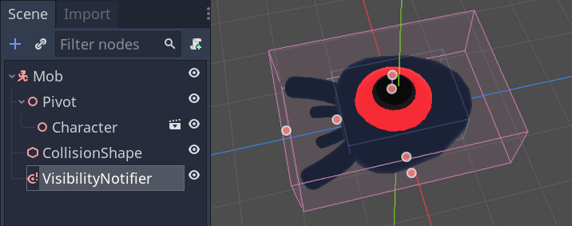

Ajusta el tamaño del cubo usando los _puntos naranjas_ hasta que cubra todo el modelo 3D.

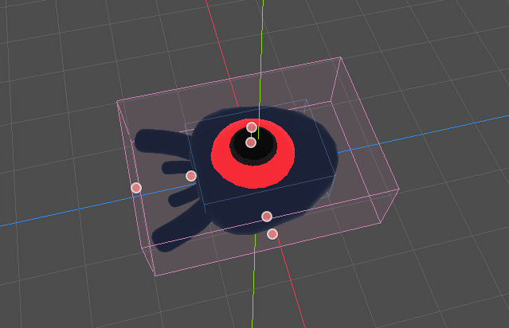

##### Codificación del movimiento deL mob

Implementemos el movimiento del _mob_. Lo haremos en dos pasos. Primero, escribiremos un script en `Mob` que defina una función para inicializar el _mob_. Luego, codificaremos el mecanismo de generación aleatorio en la escena `main.tscn` y llamaremos a la función desde allí.

Adjuntaremos un script a `Mob` con **Attach Script**.

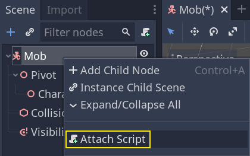

A continuación, se muestra el código de movimiento con el que comenzaremos. Definimos dos propiedades, `min_speed` y `max_speed`, para definir un rango de velocidad aleatorio, que luego usaremos para definir `CharacterBody3D.velocity`.

```
extends CharacterBody3D

# Velocidad mínima de la criatura en metros por segundo.
@export var min_speed = 10
# Velocidad máxima de la criatura en metros por segundo.
@export var max_speed = 18


func _physics_process(_delta):
  move_and_slide()
```

De manera similar al jugador, movemos el _mob_ en cada cuadro llamando a la función `CharacterBody3D.move_and_slide()`. Esta vez, no actualizamos `velocity` en cada fotograma; queremos que el _mob_ se mueva a una velocidad constante y abandone la pantalla, incluso si chocara contra un obstáculo.

Necesitamos definir otra función para calcular `CharacterBody3D.velocity`. Esta función girará al _mob_ hacia el jugador y aleatorizará tanto su ángulo de movimiento como su velocidad.

La función tomará como argumentos a  `start_position`, la posición de aparición del _mob_, y a `player_position`, la posicion del jugador.

Posicionamos al _mob_ en `start_position` y lo giramos hacia el jugador usando el método `look_at_from_position()`, y aleatorizamos el ángulo rotando una cantidad aleatoria alrededor del eje Y. A continuación, `randf_range()` genera un valor aleatorio entre `-PI / 4` radianes y `PI / 4` radianes.

```
# Esta función se llamará desde la escena principal.
func initialize(start_position, player_position):
  # Posicionamos al mob colocándolo en start_position
  # y lo rotamos hacia player_position, de modo que mire al jugador.
  look_at_from_position(start_position, player_position, Vector3.UP)
  # Rotamos este monstruo aleatoriamente dentro del rango de -45 y +45 grados,
  # para que no se mueva directamente hacia el jugador.
  rotate_y(randf_range(-PI / 4, PI / 4))
```

Obtuvimos una posición aleatoria, ahora necesitamos una `random_speed`. `randi_range()` será útil ya que proporciona valores enteros aleatorios, y usaremos `min_speed` y `max_speed`. `random_speed` es solo un entero, y lo usamos para multiplicar nuestro `CharacterBody3D.velocity`. Después de aplicar `random_speed`, rotamos el Vector3 `CharacterBody3D.velocity`  hacia el jugador.

##### Saliendo de la pantalla

Aún tenemos que destruir a los _mobs_ cuando abandonan la pantalla. Para ello, conectaremos la señal `screen_exited` de nuestro nodo **VisibleOnScreenNotifier3D** a `Mob`.

Regresa al viewpor 3D haciendo clic en la etiqueta _3D_ en la parte superior del editor. También puedes presionar `Ctrl + F2` (`Opt + 2` en macOS).


Selecciona el nodo **VisibleOnScreenNotifier3D** y, en el lado derecho de la interfaz, navega hasta el dock **Node**. Haz doble clic en la señal `screen_exited()`.


Conecta la señal a `Mob`


Esto agregará una nueva función en tu script de _mob_, `_on_visible_on_screen_notifier_3d_screen_exited()`. Desde allí, llama al método `queue_free()`. Esta función destruye la instancia en la que se llama.

```
func _on_visible_on_screen_notifier_3d_screen_exited():
  queue_free()
```

¡Nuestro monstruo está listo para entrar al juego! En la siguiente parte, generarás _mobs_ en el nivel del juego.

A continuación, se incluye el script `mob.gd` completo como referencia:

```
extends CharacterBody3D

# Velocidad mínima del monstruo en metros por segundo.
@export var min_speed = 10
# Velocidad máxima del monstruo en metros por segundo.
@export var max_speed = 18

func _physics_process(_delta):
  move_and_slide()

# Esta función será llamada desde la escena Main.
func initialize(start_position, player_position):
  # Posicionamos al monstruo colocándolo en start_position
  # y lo rotamos hacia player_position, de modo que mire al jugador.
  look_at_from_position(start_position, player_position, Vector3.UP)
  # Rotamos este monstruo aleatoriamente dentro de un rango de -45 y +45 grados,
  # para que no se mueva directamente hacia el jugador.
  rotate_y(randf_range(-PI / 4, PI / 4))

  # Calculamos una velocidad aleatoria (entero)
  var random_speed = randi_range(min_speed, max_speed)
  # Calculamos una velocidad hacia adelante (forward velocity) que representa la velocidad.
  velocity = Vector3.FORWARD * random_speed
  # We then rotate the velocity vector based on the mob's Y rotation
  # in order to move in the direction the mob is looking.
  # Luego rotamos el vector de velocidad en función de la rotación del eje Y del mob
  # para moverlo en la dirección en la que mira.
  velocity = velocity.rotated(Vector3.UP, rotation.y)

func _on_visible_on_screen_notifier_3d_screen_exited():
  queue_free()
```
### Generación de mobs

En esta parte, vamos a generar mobs a lo largo de un camino de forma aleatoria. Al final, tendrás mobs deambulando por el tablero de juego.

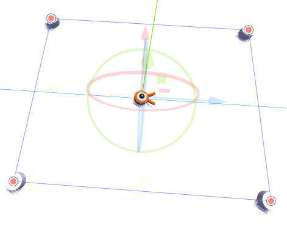

Haz doble clic en main.tscn en el dock del Sistema de archivos para abrir la escena principal.

Antes de dibujar el camino, vamos a cambiar la resolución del juego. Nuestro juego tiene un tamaño de ventana predeterminado de 1152x648. Lo configuraremos en 720x540, un pequeño y bonito cuadro.

Ve a Proyecto -> Configuración del proyecto.

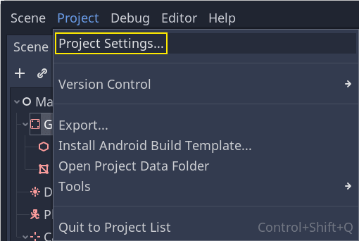

Si todavía tienes abierto el Mapa de entrada, cambia a la pestaña General.

En el menú de la izquierda, navega hacia abajo hasta Pantalla -> Ventana. A la derecha, establece el Ancho en 720 y la Altura en 540.


#### Creando la ruta de aparición

Como hiciste en el tutorial del juego 2D, vas a diseñar una ruta y usar un nodo **PathFollow3D** para tomar muestras de ubicaciones aleatorias en ella.

Sin embargo, en 3D, es un poco más complicado dibujar la ruta. Queremos que esté alrededor de la vista del juego para que los _mobs_ aparezcan justo afuera de la pantalla. Pero si dibujamos una ruta, no la veremos desde la vista previa de la cámara.

Para encontrar los límites de la vista, podemos usar algunas _mallas de sustitución (placeholder meshes)_. Tu ventana gráfica aún debería estar dividida en dos partes, con la vista previa de la cámara en la parte inferior. Si ese no es el caso, presiona `Ctrl + 2` (`Cmd + 2` en macOS) para dividir la vista en dos. Selecciona el nodo **Camera3D** y haz clic en la casilla de verificación _Preview_ en el viewport inferior.


##### Agregado de cilindros de sustitución

Agreguemos las mallas de sustitución. Agregue un nuevo **Node3D** como hijo del nodo principal y nómbrelo `Cylinders`. Lo usaremos para agrupar los cilindros. Seleccione _Cylinders_ y agregue un nodo hijo **MeshInstance3D**.

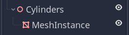

En **Inspector**, asigne un `New CylinderMesh` a la propiedad _Mesh_.

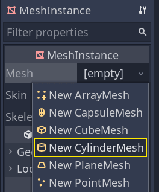

Establezca la ventana gráfica superior en la vista ortogonal superior utilizando el menú en la esquina superior izquierda de la ventana gráfica. Alternativamente, puede presionar la tecla `7` del teclado de números.

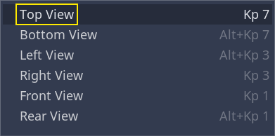

La cuadrícula puede distraer. Puede alternarla yendo al menú _View_ en la barra de herramientas y haciendo clic en _View Grid_.


Ahora desea mover el cilindro a lo largo del plano del suelo, mirando la vista previa de la cámara en la ventana gráfica inferior. Para hacerlo, recomiendo usar el ajuste de cuadrícula. Puedes alternarlo haciendo clic en el _ícono del imán_ en la barra de herramientas o presionando la tecla `Y`.


Mueve el cilindro para que quede justo afuera de la vista de la cámara en la esquina superior izquierda.


Vamos a crear copias del cilindro y colocarlas alrededor del área de juego. Presiona `Ctrl + D` (`Cmd + D` en macOS) para duplicar el nodo. También puedes hacer clic derecho en el nodo en el dock _Scene_ y seleccionar _Duplicate_. Mueve la copia hacia abajo a lo largo del _eje Z azul_ hasta que esté justo afuera de la vista previa de la cámara.

Selecciona ambos cilindros seleccionando uno de ellos, luego presionando la tecla `Shift` y sin soltarla, hacer clic en el que no está seleccionado y por último duplícalos.


Muévelos hacia la derecha arrastrando el _eje X rojo_.

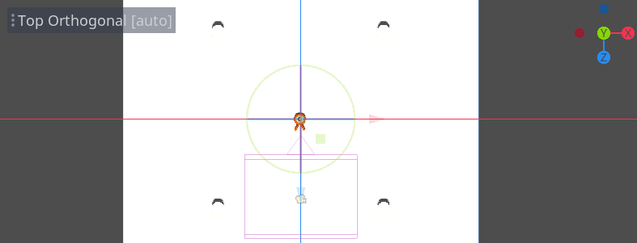

Son un poco difíciles de ver en blanco, ¿no? Hagamos que se destaquen dándoles un nuevo material.

En 3D, los _materiales_ definen las propiedades visuales de una superficie, como su color, cómo refleja la luz y más. Podemos usarlos para cambiar el color de una malla.

Podemos actualizar los cuatro cilindros a la vez. Seleccione todas las instancias de las mallas en el dock _Scene_. Para ello, puede hacer clic en la primera y hacer clic con la tecla `Shift` en la última.


En _Inspector_, expanda la sección _Material_ y asigne un `New StandardMaterial3D` a la ranura `0`.

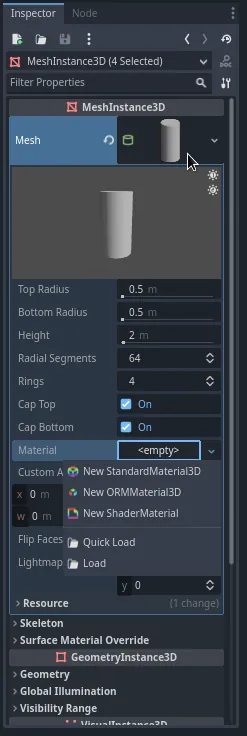

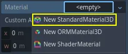

Haga clic en el icono de esfera para abrir el recurso de _material_. Obtendrá una vista previa del material y una larga lista de secciones llenas de propiedades. Puede usarlas para crear todo tipo de superficies, desde metal hasta roca o agua.

Expanda la sección _Albedo_.

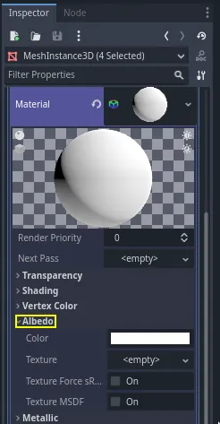

Establezca el color en algo que contraste con el fondo, como un naranja brillante.


Ahora podemos usar los cilindros como guías. Plégelos en el dock _Scene_ haciendo clic en la _flecha gris_ junto a ellos. En el futuro, también puede alternar su visibilidad haciendo clic en el icono del _ojo_ junto a `Cylinders`.


Agregue un nodo hijo **Path3D** al nodo `Main`. En la barra de herramientas, aparecen cuatro iconos. Haga clic en la herramienta _Add Point_, el icono con el signo `+` verde.


> **Nota:**
>
> Puede pasar el cursor sobre cualquier icono para ver una descripción emergente de la herramienta.

Haga clic en el centro de cada cilindro para crear un punto. Luego, haga clic en el icono _Close Curve_ en la barra de herramientas para cerrar la ruta. Si algún punto está un poco desviado, puede hacer clic y arrastrarlo para reposicionarlo.


Su ruta debería verse así:


Para muestrear posiciones aleatorias en ella, necesitamos un nodo **PathFollow3D**. Agregue un _PathFollow3D_ como hijo de _Path3D_. Cambie el nombre de los dos nodos a `SpawnLocation` (para _PathFollow3D_) y `SpawnPath` (para _Path3D_). Son nombres más denominativos que descriptivos:

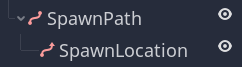

Con esto, estamos listos para codificar el mecanismo de generación.

#### Generación aleatoria de mobs

Haz clic derecho en el nodo `Main` y adjúntale un nuevo script.

Primero exportamos una variable `mob_scene` a _Inspector_ para poder asignarle `mob.tscn` o cualquier otro _mobs_.

```
extends Node

@export var mob_scene: PackedScene
```

Queremos generar _mobs_ a intervalos de tiempo regulares. Para ello, debemos volver a la escena y agregar un temporizador. Sin embargo, antes de eso, debemos asignar el archivo `mob.tscn` a la propiedad `mob_scene` anterior (de lo contrario, ¡es nula!).

Vuelve a la pantalla **3D** y selecciona el nodo `Main`. Arrastra `mob.tscn` desde el dock _FileSystem_ hasta la ranura _Mob Scene_ en _Inspector_.

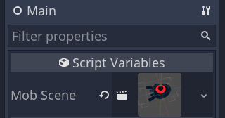

Agrega un nuevo nodo **Timer** como hijo de `Main`. Nómbralo `MobTimer`.

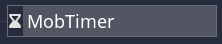

En _Inspector_, establece _Wait Time_ en `0.5` segundos y activa en `On` la propiedad _Autostart_ para que se inicie automáticamente cuando ejecutemos el juego.

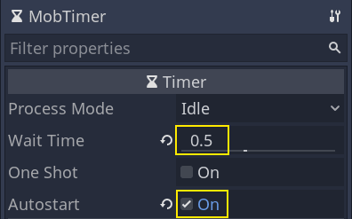

Los temporizadores emiten una señal `timeout` cada vez que llegan al final de su _Wait Time_. De forma predeterminada, se reinician automáticamente y emiten la señal de forma cíclica. Podemos conectarnos a esta señal desde el nodo **Main** para generar monstruos cada `0.5` segundos.

Con `MobTimer` aún seleccionado, dirígete al dock **Node** a la derecha y haz doble clic en la señal `timeout`.


Conéctalo al nodo `Main`.

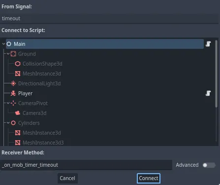

Esto te llevará de regreso al script, con una nueva función `_on_mob_timer_timeout()` vacía.

Codifiquemos la lógica de generación de mobs. Vamos a:

1. Instanciar la escena _mob_.
2. Tomar una muestra de una posición aleatoria en la ruta de generación.
3. Obtener la posición del jugador.
4. Llama al método `initialize()` del mob, pasándole la posición aleatoria y la posición del jugador.
5. Agrega un mob como un hijo del nodo _Main_.

```
func _on_mob_timer_timeout():
  # Crea una nueva instancia de la escena Mob.
  var mob = mob_scene.instantiate()

  # Elige una ubicación aleatoria en SpawnPath.
  # Almacenamos la referencia al nodo SpawnLocation.
  var mob_spawn_location = get_node("SpawnPath/SpawnLocation")
  # Y le damos un valor de desplazamiento aleatorio.
  mob_spawn_location.progress_ratio = randf()

  var player_position = $Player.position
  mob.initialize(mob_spawn_location.position, player_position)

  # Genera el mob agregándolo a la escena Main.
  add_child(mob)
```

Arriba, `randf()` produce un valor aleatorio entre `0` y `1`, que es lo que espera el `progress_ratio` del nodo **PathFollow**: _0_ es el comienzo de la ruta, _1_ es el final de la ruta. La ruta que hemos establecido es alrededor de la ventana gráfica de la cámara, por lo que cualquier valor aleatorio entre _0_ y _1_ es una posición aleatoria junto a los bordes de la ventana gráfica.

Ten en cuenta que si eliminas `Player` de la escena principal, la siguiente línea:

```
var player_position = $Player.position
```
da un error porque no habría ningún `$Player`.

A continuación, se muestra el script `main.gd` completo hasta el momento, como referencia:

```
extends Node

@export var mob_scene: PackedScene


func _on_mob_timer_timeout():
  # Crea una nueva instancia de la escena Mob.
  var mob = mob_scene.instantiate()

  # Elige una ubicación aleatoria en SpawnPath.
  # Almacenamos la referencia al nodo SpawnLocation.
  var mob_spawn_location = get_node("SpawnPath/SpawnLocation")
  # Y le damos un valor de desplazamiento aleatorio.
  mob_spawn_location.progress_ratio = randf()

  var player_position = $Player.position
  mob.initialize(mob_spawn_location.position, player_position)

  # Genera el mob agregándolo a la escena Main.
  add_child(mob)
```

Puedes probar la escena presionando `F6`. Deberías ver que los mobs aparecen y se mueven en línea recta.

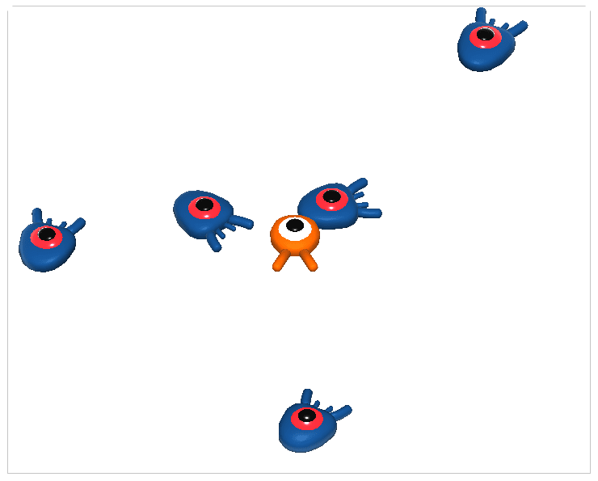

Por ahora, chocan y se deslizan entre sí cuando sus caminos se cruzan. Abordaremos esto mismo en la siguiente parte.

### Salto y aplastamiento de mobs

En esta parte, agregaremos la capacidad de saltar y aplastar a los mobs. En la próxima lección, haremos que el jugador muera cuando un monstruo lo golpee en el suelo.

Primero, tenemos que cambiar algunas configuraciones relacionadas con las interacciones físicas. Ingrese al mundo de las [capas físicas](https://docs.godotengine.org/en/stable/tutorials/physics/physics_introduction.html#doc-physics-introduction-collision-layers-and-masks).

#### Control de interacciones físicas

Los cuerpos físicos tienen acceso a dos propiedades complementarias: _layers (capas)_ y _masks (máscaras)_:

- Las _layers_ definen en qué capa(s) física(s) se encuentra un objeto.
- Las _masks_ controlan las capas que un cuerpo escuchará y detectará. Esto afecta la _detección de colisiones_. Cuando desea que dos cuerpos interactúen, necesita que al menos uno tenga una máscara correspondiente al otro.

Si esto es confuso, no se preocupe, veremos tres ejemplos en un segundo.

El punto importante es que puede usar _layers_ y _masks_ para filtrar _interacciones físicas_, controlar el rendimiento y eliminar la necesidad de condiciones adicionales en su código.

De forma predeterminada, todos los cuerpos y áreas de física se configuran tanto en la _layer_ como en la _mask_ número `1`. Esto significa que todos colisionan entre sí.

Las capas de física se representan con números, pero podemos darles nombres para llevar un registro de cada una.

##### Establecer nombres de capa

Démosle un nombre a nuestras capas de física. Vaya a _Project > Project Settings_.

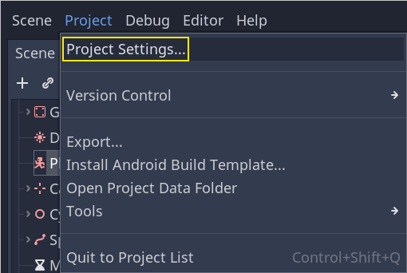

En el menú de la izquierda, navegue hacia abajo hasta _Layer Names > 3D Physics_. Puede ver una lista de capas con un campo al lado de cada una de ellas a la derecha. Puede establecer sus nombres allí. Nombra las primeras tres capas: `player`, `enemies` y `world`, respectivamente.


Ahora, podemos asignarlas a nuestros nodos de física.

##### Asignación de layers y masks

En la escena **Main**, seleccione el nodo `Ground`. En **Inspector**, expanda la sección _Collision_. Allí, puede ver las capas y máscaras del nodo como una cuadrícula de botones.

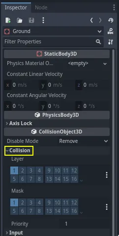

El _Ground (suelo)_ es parte del _world (mundo)_, por lo que queremos que sea parte de la tercera capa. Haz clic en el botón iluminado para **desactivar** la primera _Layer_ y **activar** la _tercera_. Luego, **desactiva** la _Mask_ haciendo clic en ella.


Como se mencionó anteriormente, la propiedad _Mask_ permite que un nodo escuche la interacción con otros objetos físicos, pero no necesitamos que tenga colisiones. El suelo no necesita escuchar nada; solo está allí para evitar que las criaturas caigan.

Ten en cuenta que puedes hacer clic en el botón `...` en el lado derecho de las propiedades para ver una lista de casillas de verificación con nombre.


A continuación están `Player` y la `Mob`. Abre `player.tscn` haciendo doble clic en el archivo en el dock _FileSystem_.

Selecciona el nodo _Player_ y establece su _Collision > Mask_ en "enemies" y "world". Puedes dejar la propiedad predeterminada _Layer_ como está, porque la primera capa es la capa "player".

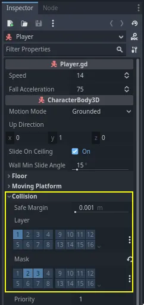

Luego, abre la escena `Mob` haciendo doble clic en `mob.tscn` y selecciona el nodo **Mob**.

Configura su _Collision > Layer_ en "enemies" y desconfigura su _Collision > Mask_, dejando la máscara vacía.

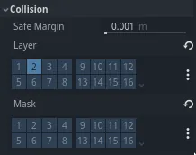

Estas configuraciones significan que los mobs se moverán entre sí. Si quieres que los mobs colisionen y se deslicen entre sí, **activa** la máscara "enemies".

> **Nota:**
>
> Los mobs no necesitan enmascarar la capa `world` porque solo se mueven en el plano XZ. No les aplicamos ninguna gravedad por diseño.

#### Salto

La mecánica de salto en sí requiere solo dos líneas de código. Abre el script _Player_. Necesitamos un valor para controlar la fuerza del salto y actualizar `_physics_process()` para codificar el salto.

Después de la línea que define `fall_acceleration`, en la parte superior del script, agrega `jump_impulse`.

```
#...
# Impulso vertical aplicado al personaje al saltar, en metros por segundo.
@export var jump_impulse = 20
```

Dentro de `_physics_process()`, agrega el siguiente código antes del bloque de código `move_and_slide()`.

```
func _physics_process(delta):
  #...

  # Salto.
  if is_on_floor() and Input.is_action_just_pressed("jump"):
    target_velocity.y = jump_impulse

  #...
```

¡Esto es todo lo que necesitas para saltar!

El método `is_on_floor()` es una herramienta de la clase **CharacterBody3D**. Devuelve `true` si el cuerpo chocó contra el suelo en este fotograma. Por eso aplicamos gravedad a _Player_: chocamos contra el suelo en lugar de flotar sobre él como los mobs.

Si el personaje está en el suelo y el jugador presiona _"jump"_, le damos instantáneamente mucha velocidad vertical. En el mundo de los juegos, quieres que los controles sean muy sensibles, como por ejemplo: dar aumentos de velocidad instantáneos como estos, si bien son poco realistas, se sienten genial.

Observa que el _eje Y_ es positivo hacia **arriba**. Eso es diferente en 2D, donde el _eje Y_ es positivo hacia **abajo**.

#### Aplastamiento de mobs

A continuación, agreguemos la mecánica de _aplastamiento_. Haremos que el personaje rebote sobre los mobs y los mate al mismo tiempo.

Necesitamos detectar colisiones con un mob y diferenciarlas de las colisiones con el suelo. Para hacerlo, podemos usar la función de etiquetado de [grupo](https://docs.godotengine.org/en/stable/tutorials/scripting/groups.html#doc-groups) de Godot.

Abre la escena `mob.tscn` nuevamente y selecciona el nodo `Mob`. Vaya al dock _Node_ a la derecha para ver una lista de _señales_. El dock _Node_ tiene dos pestañas: _Signals_, que ya ha utilizado, y _Groups_, que le permite asignar etiquetas a los nodos.

Haga clic en él para revelar un campo donde puedas escribir un _nombre de etiqueta_. Ingrese `mob` en el campo y haga clic en el botón _Add_.


Aparece un ícono en el dock _Scene_ para indicar que el nodo es parte de al menos un grupo.

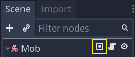

Ahora podemos usar el _grupo_ del código para distinguir las colisiones _con monstruos_ de las colisiones _con el piso_.

##### Codificación de la mecánica del aplastamiento

Vuelve al script de _Player_ para codificar el aplastamiento y el rebote.

En la parte superior del script, necesitamos otra propiedad, `bounce_impulse`. Al aplastar a un enemigo, no necesariamente queremos que el personaje se eleve tan alto como cuando salta.

```
# Impulso vertical aplicado al personaje al rebotar sobre un mob en
# metros por segundo.
@export var bounce_impulse = 16
```

Luego, después del bloque de código **Salto** que agregamos anteriormente en `_physics_process()`, agrega el siguiente bucle. Con `move_and_slide()`, Godot hace que el cuerpo se mueva a veces varias veces seguidas para suavizar el movimiento del personaje. Por lo tanto, tenemos que repetir todas las colisiones que puedan haber ocurrido.

En cada iteración del bucle, verificamos si aterrizamos sobre un enemigo. Si es así, lo eliminamos y rebotamos.

Con este código, si no se produjeron colisiones en un fotograma determinado, el bucle no se ejecutará.

```
func _physics_process(delta):
  #...

  # Iteramos a través de todas las colisiones que ocurrieron en este fotograma
  for index in range(get_slide_collision_count()):
    # Obtenemos una de las colisiones con el jugador
    var collision = get_slide_collision(index)

    # Si la colisión es con el suelo:
    if collision.get_collider() == null:
      continue

    # Si colisión es con un mob:
    if collision.get_collider().is_in_group("mob"):
      var mob = collision.get_collider()
      # Comprobamos que lo estemos golpeando desde arriba:
      if Vector3.UP.dot(collision.get_normal()) > 0.1:
        # Si es así, lo aplastamos y rebotamos
        mob.squash()
        target_velocity.y = bounce_impulse
        # Prevenimos más llamadas duplicadas
        break
```

Son muchas funciones nuevas. Aquí hay más información sobre ellos.

Las funciones `get_slide_collision_count()` y `get_slide_collision()` provienen de la clase **CharacterBody3D** y están relacionadas con `move_and_slide()`.

`get_slide_collision()` devuelve un objeto **KinematicCollision3D** que contiene información sobre dónde y cómo ocurrió la colisión. Por ejemplo, usamos su propiedad `get_collider` para verificar si chocamos con un _mob_ llamando a `is_in_group()` en ella: `clash.get_collider().is_in_group("mob")`.

> **Nota:**
>
> El método `is_in_group()` está disponible en cada [Node](https://docs.godotengine.org/en/stable/classes/class_node.html#class-node).

Para verificar que estamos aterrizando sobre el mob, usamos el _producto escalar_: `Vector3.UP.dot(collision.get_normal()) > 0.1`. La normal de colisión es un vector 3D que es perpendicular al plano donde ocurrió la colisión. El _producto escalar_ nos permite compararlo con la dirección ascendente.

Con productos escalares, cuando el resultado es mayor que `0`, los dos vectores están en un ángulo de menos de 90 grados. Un valor mayor que `0.1` nos indica que estamos aproximadamente por encima del monstruo.

Después de manejar la lógica de aplastamiento y rebote, finalizamos el bucle de manera anticipada mediante la declaración `break` para evitar más llamadas duplicadas a `mob.squash()`, que de otra manera podrían resultar en errores no deseados, como contar el puntaje varias veces para una muerte.

Estamos llamando a una función indefinida, `mob.squash()`, por lo que tenemos que agregarla a la clase **Mob**.

Abre el script `mob.gd` haciendo doble clic en él en el dock _FileSystem_. En la parte superior del script, queremos definir una nueva señal llamada `squashed`. Y en la parte inferior, puedes agregar la función `squash`, donde emitimos la señal y destruimos al mob.

```
# Señal emitida cuando el jugador salta sobre el mob.
signal squashed

# ...


func squash():
  squashed.emit()
  queue_free()
```

Usaremos la señal para agregar puntos al puntaje en la próxima lección.

Con eso, deberías poder matar monstruos saltando sobre ellos. Puedes presionar `F5` para probar el juego y configurar `main.tscn` como la escena principal de tu proyecto.

Sin embargo, el jugador no morirá todavía. Trabajaremos en eso en la próxima parte.

### Muerte del jugador

Podemos matar enemigos saltando sobre ellos, pero el jugador no puede morir. Vamos a solucionar esto.

Queremos detectar si un enemigo nos golpea de forma diferente a si lo aplastamos. Queremos que el jugador muera cuando se mueve por el suelo, pero no si está en el aire. Podríamos usar matemáticas vectoriales para distinguir los dos tipos de colisiones. Sin embargo, en su lugar, usaremos un nodo [Area3D](https://docs.godotengine.org/en/stable/classes/class_area3d.html#class-area3d), que funciona bien para las _hitboxes (zonas de impacto)_.

#### Hitbox con el nodo Area

Vuelve a la escena `player.tscn` y agrega un nuevo nodo hijo **Area3D**. Nómbralo `MobDetector`. Agrega un nodo **CollisionShape3D** como hijo de este.

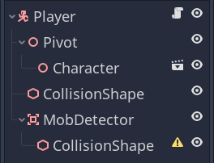

En **Inspector**, asígnale un `New CylinderShape`.

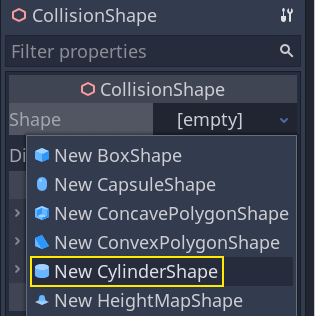

Aquí tienes un truco que puedes usar para que las colisiones solo ocurran cuando el jugador esté en el suelo o cerca de él. Puedes reducir la altura del cilindro y moverlo hasta la parte superior del personaje. De esta manera, cuando el jugador salte, la forma estará demasiado alta para que los enemigos colisionen con ella.


También quieres que el cilindro sea más ancho que la esfera. De esta manera, el jugador recibe el golpe antes de chocar y ser empujado hacia la parte superior del cubo de colisión del mob.

Cuanto más ancho sea el cilindro, más fácilmente morirá el jugador.

A continuación, selecciona el nodo `MobDetector` nuevamente y, en _Inspector_, **desactiva** su propiedad _Monitorable_. Esto hace que otros nodos de física no puedan detectar el área. La propiedad complementaria _Monitoring_ le permite detectar colisiones. Luego, elimina _Collision -> Layer_ y establece _Mask_ en la capa "enemies".


Cuando las áreas detectan una colisión, emiten señales. Vamos a conectar una al nodo `Player`. Selecciona `MobDetector` y ve a la pestaña _Nodo_ de _Inspector_, haz doble clic en la señal `body_entered` y conéctala a `Player`.


_MobDetector_ emitirá `body_entered` cuando un nodo **CharacterBody3D** o **RigidBody3D** ingrese en él. Ya que solo enmascara las capas físicas de los "enemies", solo detectará los nodos `Mob`.

En cuanto al código, vamos a hacer dos cosas: emitir una señal que luego usaremos para terminar el juego y destruir al jugador. Podemos envolver estas operaciones en una función `die()` que nos ayude a poner una etiqueta descriptiva en el código.

```
# Se emite cuando el jugador es golpeado por un mob.
# Pon esto en la parte superior del script.
signal hit


# Y esta función en la parte inferior.
func die():
  hit.emit()
  queue_free()


func _on_mob_detector_body_entered(body):
  die()
```

#### Finalización del juego

Podemos usar la señal `hit` de `Player` para finalizar el juego. Todo lo que tenemos que hacer es conectarlo al nodo `Main` y, como consecuencia, detener el `MobTimer`.

Abre `main.tscn`, selecciona el nodo `Player` y, en el dock _Node_, conecta su señal `hit` al nodo `Main`:

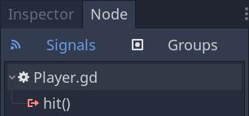

Obtén el temporizador y deténlo en la función `_on_player_hit()`.

```
func _on_player_hit():
  $MobTimer.stop()
```

Si pruebas el juego ahora, los mobs dejarán de aparecer cuando mueras y los que queden dejarán de aparecer en la pantalla.

Observa también que el juego ya no se bloquea ni muestra un error cuando el jugador muere. Como estamos deteniendo el _MobTimer_, ya no activa la función `_on_mob_timer_timeout()`.

Observa también que la colisión del enemigo con el jugador y su muerte depende del tamaño y la posición de las _formas de colisión_ de `Player` y `Mob`. Es posible que tengas que moverlos y cambiarles el tamaño para lograr una sensación de juego más realista.

Ahora puedes felicitarte: creaste un prototipo de juego en 3D completo, aunque todavía falte pulirlo.

A partir de aquí, agregaremos una puntuación, la opción de volver a intentar el juego y verás cómo puedes hacer que el juego se sienta mucho más vivo con animaciones minimalistas.

#### Punto de control del código

A continuación se muestran los scripts completos para los nodos `Main`, `Mob` y `Player`, como referencia. Puede usarlos para comparar y verificar su código.

Empezando con `main.gd`:

```
extends Node

@export var mob_scene: PackedScene


func _on_mob_timer_timeout():
  # Crea una nueva instancia de la escena Mob.
  var mob = mob_scene.instantiate()

  # Elige una ubicación aleatoria en SpawnPath.
  # Almacenamos la referencia al nodo SpawnLocation.
  var mob_spawn_location = get_node("SpawnPath/SpawnLocation")
  # Y le damos un desplazamiento aleatorio.
  mob_spawn_location.progress_ratio = randf()

  var player_position = $Player.position
  mob.initialize(mob_spawn_location.position, player_position)

  # Genera el mob agregándolo a la escena Main.
  add_child(mob)

func _on_player_hit():
  $MobTimer.stop()
```

El siguiente es `mob.gd`:

```
extends CharacterBody3D

# Velocidad mínima del mob en metros por segundo.
@export var min_speed = 10
# Velocidad máxima del mob en metros por segundo.
@export var max_speed = 18

# Emitida cuando el jugador salta sobre el mob.
signal squashed

func _physics_process(_delta):
  move_and_slide()

# Esta función será llamada desde la escena Main.
func initialize(start_position, player_position):
  # Posicionamos al mob al colocarlo en start_position
  # y lo rotamos hacia player_position, de modo que mire al jugador.
  look_at_from_position(start_position, player_position, Vector3.UP)
  # Rotamos este mob aleatoriamente dentro de un rango de -45 y +45 grados,
  # para que no se mueva directamente hacia el jugador.
  rotate_y(randf_range(-PI / 4, PI / 4))

  # Calculamos una velocidad aleatoria (entero).
  var random_speed = randi_range(min_speed, max_speed)
  # Calculamos una velocidad hacia adelante que representa la velocidad.
  velocity = Vector3.FORWARD * random_speed
  # Luego rotamos el vector de velocidad en función de la rotación Y del mob
  # para moverlo en la dirección en la que mira el mismo.
  velocity = velocity.rotated(Vector3.UP, rotation.y)

func _on_visible_on_screen_notifier_3d_screen_exited():
  queue_free()

func squash():
  squashed.emit()
  queue_free() # Destruye este nodo
```

Por último, el script más largo, `player.gd`:

```
extends CharacterBody3D

signal hit

# Qué tan rápido se mueve el jugador en metros por segundo.
@export var speed = 14
# La aceleración de caída cuando está en el aire, en metros por segundo al cuadrado.
@export var fall_acceleration = 75
# Impulso vertical aplicado al personaje al saltar, en metros por segundo.
@export var jump_impulse = 20
# Impulso vertical aplicado al personaje al rebotar sobre un mob
# en metros por segundo.
@export var bounce_impulse = 16

var target_velocity = Vector3.ZERO


func _physics_process(delta):
  # Creamos una variable local para almacenar la dirección del input.
  var direction = Vector3.ZERO

  # Comprobamos cada entrada de movimiento y consecuentemente actualizamos la dirección.
  if Input.is_action_pressed("move_right"):
    direction.x = direction.x + 1
  if Input.is_action_pressed("move_left"):
    direction.x = direction.x - 1
  if Input.is_action_pressed("move_back"):
    # Observa cómo trabajamos con los ejes x y z del vector.
    # En 3D, el plano XZ es el plano del suelo.
    direction.z = direction.z + 1
  if Input.is_action_pressed("move_forward"):
    direction.z = direction.z - 1

  # Evitamos el movimiento diagonal rápido
  if direction != Vector3.ZERO:
    direction = direction.normalized()
    $Pivot.look_at(position + direction, Vector3.UP)

  # Velocidad en el suelo
  target_velocity.x = direction.x * speed
  target_velocity.z = direction.z * speed

  # Velocidad vertical
  if not is_on_floor(): # If in the air, fall towards the floor. Literally gravity
    target_velocity.y = target_velocity.y - (fall_acceleration * delta)

  # Salto
  if is_on_floor() and Input.is_action_just_pressed("jump"):
    target_velocity.y = jump_impulse

  # Iteramos a través de todas las colisiones que ocurrieron en este fotograma
  # en lenguaje C sería: for(int i = 0; i < collisions.Count; i++)
  for index in range(get_slide_collision_count()):
    # Obtenemos una de las colisiones con el jugador
    var collision = get_slide_collision(index)

    # Si la colisión es con el suelo:
    if collision.get_collider() == null:
      continue

    # Si colisión es con un mob:
    if collision.get_collider().is_in_group("mob"):
      var mob = collision.get_collider()
      # Comprobamos que lo estemos golpeando desde arriba:
      if Vector3.UP.dot(collision.get_normal()) > 0.1:
        # Si es así, lo aplastamos y rebotamos
        mob.squash()
        target_velocity.y = bounce_impulse
        # Prevenimos más llamadas duplicadas
        break

  # Movemos el personaje
  velocity = target_velocity
  move_and_slide()

# Y esta función al final.
func die():
  hit.emit()
  queue_free()

func _on_mob_detector_body_entered(body):
  die()
```

Nos vemos en la próxima lección para agregar la puntuación y la opción de reintentar.

### Puntuación y repetición

En esta parte, agregaremos la puntuación, la reproducción de música y la capacidad de reiniciar el juego.

Debemos llevar un registro de la puntuación actual en una variable y mostrarla en la pantalla mediante una interfaz mínima. Para ello, usaremos una _etiqueta de texto_.

En la escena `Main`, agregue un nuevo nodo hijo [**Control**](https://docs.godotengine.org/en/stable/classes/class_control.html#class-control) a `Main` y nómbrelo `UserInterface`. Asegúrese de estar en la pantalla 2D, donde puede editar su interfaz de usuario (IU).

Agregue un nodo **Label** y nómbrelo `ScoreLabel`:

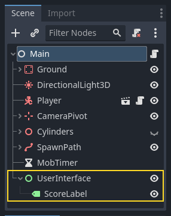

En **Inspector**, configure _Text_ del campo _Label_ con un placeholder como: `Score: 0`.


Además, de forma predeterminada el texto es blanco como lo es el fondo de nuestro juego. Necesitamos cambiar su color para verlo en tiempo de ejecución.

Desplázate hacia abajo hasta _Theme Overrides_, expande _Colors_ y habilita _Font Color_ para teñir el texto de negro (que contrasta bien con la escena 3D blanca);


Por último, haz clic y arrastra el texto en la ventana gráfica para alejarlo de la esquina superior izquierda.

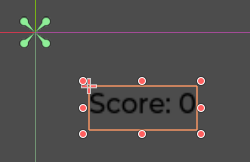

El nodo `UserInterface` nos permite agrupar nuestra IU en una rama del árbol de la escena y usar un recurso de tema que se propagará a todos sus hijos. Lo usaremos para configurar la fuente tipográfica de nuestro juego.

#### Creación de un tema de IU

Una vez más, seleccione el nodo `UserInterface`. En **Inspector**, cree un nuevo recurso de tema en _Theme > Theme_.


Haga clic en él para abrir el editor de temas en el panel inferior. Le ofrece una vista previa de cómo se verán todos los widgets de IU integrados con su recurso de tema.


De manera predeterminada, un tema solo tiene algunas propiedades: _Default Base Scale, Default Font and Default Font Size_.

> **Consulte también:**
>
> Puede agregar más propiedades al recurso de tema para diseñar interfaces de usuario complejas, pero eso está fuera del alcance de esta serie. Para obtener más información sobre la creación y edición de temas, consulte [Introducción a la personalización de GUI](https://docs.godotengine.org/en/stable/tutorials/ui/gui_skinning.html#doc-gui-skinning).

La propiedad _Default Font_ espera un archivo de fuente como los que tiene en su computadora. Dos formatos de archivo de fuente comunes son TrueType Font (TTF) y OpenType Font (OTF).

En el dock _FileSystem_, expanda el directorio `fonts` y haga clic y arrastre el archivo `Montserrat-Medium.ttf` que incluimos en el proyecto hacia _Default Font_. El texto volverá a aparecer en la vista previa del tema.

El texto es un poco pequeño. Establezca el _Default Font Size_ en `22` píxeles para aumentar el tamaño del texto.


#### Seguimiento de la puntuación

Trabajemos ahora en la puntuación. Adjunte un nuevo script a `ScoreLabel` y defina la variable `score`.

```
extends Label

var score = 0
```

La puntuación debería aumentar en `1` cada vez que aplastemos un mob. Podemos usar su señal `squashed` para saber cuándo sucede eso. Sin embargo, debido a que instanciamos monstruos desde el código, no podemos conectar la señal del mob a `ScoreLabel` a través del editor.

En cambio, tenemos que hacer la conexión desde el código cada vez que generemos un mob.

Abra el script `main.gd`. Si aún está abierto, puede hacer clic en su nombre en la columna izquierda del editor de scripts.


Alternativamente, puede hacer doble clic en el archivo `main.gd` en el dock _FileSystem_.

En la parte inferior de la función `_on_mob_timer_timeout()`, agregue la siguiente línea:

```
func _on_mob_timer_timeout():
  #...
  # Conectamos el mob a la etiqueta de puntuación para actualizar la puntuación al aplastar una.
  mob.squashed.connect($UserInterface/ScoreLabel._on_mob_squashed.bind())
```
Esta línea significa que cuando el mob emite la señal `squashed`, el nodo `ScoreLabel` la recibirá y llamará a la función `_on_mob_squashed()`.

Regrese al script `score_label.gd` para definir la función callback `_on_mob_squashed()`.

Allí, incrementamos la puntuación y actualizamos el texto mostrado.

```
func _on_mob_squashed():
  score += 1
  text = "Score: %s" % score
```

La segunda línea usa el valor de la variable `score` para reemplazar el placeholder `%s`. Al utilizar esta función, Godot convierte automáticamente los valores en cadena de texto, lo que resulta práctico cuando se genera texto en etiquetas o cuando se utiliza la función `print()`.

> **Consulte también:**
>
> Puede obtener más información sobre el formato de cadenas de texto aquí: [formato de cadenas de texto GDScript](https://docs.godotengine.org/en/stable/tutorials/scripting/gdscript/gdscript_format_string.html#doc-gdscript-printf).

Ahora puede jugar y aplastar a algunos enemigos para ver cómo aumenta la puntuación.


> **Nota:**
>
> En un juego complejo, es factible que desee separar por completo su interfaz de usuario del mundo del juego. En ese caso, no llevaría un registro de la puntuación en una etiqueta. En cambio, es posible que desee almacenarla en un objeto separado y dedicado. Pero cuando se crea un prototipo o cuando su proyecto es simple, está bien mantener su código simple. La programación es siempre un acto de equilibrio.

#### Reintentar el juego

Ahora agregaremos la posibilidad de volver a jugar después de morir. Cuando el jugador muera, mostraremos un mensaje en la pantalla y esperaremos la entrada.

Regrese a la escena `main.tscn`, seleccione el nodo **UserInterface**, agregue un nodo hijo [**ColorRect**](https://docs.godotengine.org/en/stable/classes/class_colorrect.html#class-colorrect) y nómbrelo `Retry`. Este nodo llena un rectángulo con un color uniforme y servirá como una capa superpuesta para oscurecer la pantalla.

Para que se extienda por toda la ventana gráfica, puede usar el menú _Anchor Preset_ en la barra de herramientas.


Ábralo y aplique el comando **Full Rect**.


No sucede nada. Bueno, casi nada; solo los cuatro pines verdes se mueven a las esquinas del cuadro de selección.


Esto se debe a que los nodos de la interfaz de usuario (todos los que tienen un ícono verde) funcionan con anclas y márgenes relativos al cuadro delimitador de su padre. Aquí, el nodo `UserInterface` tiene un tamaño pequeño y `Retry` está limitado por él.

Selecciona `UserInterface` y aplícale también _Anchor Preset > Full Rect_. El nodo `Retry` debería abarcar ahora toda la ventana gráfica.

Cambiemos su color para que oscurezca el área de juego. Selecciona `Retry` y en _Inspector_, establece _Color_ en algo oscuro y transparente. Para ello, en el selector de color, arrastra el _control deslizante A_ hacia la izquierda a un valor aproximado en `96`. Controla el canal _Alfa_ del color, es decir, su opacidad/transparencia:


A continuación, añade una [**Label**](https://docs.godotengine.org/en/stable/classes/class_label.html#class-label) como hijo de `Retry` y en _Text_ ingresa `Press Enter to retry`. Para moverla y anclarla en el centro de la pantalla, aplícale `Anchor Preset > Center`:


##### Codificación de la opción de reintento

Ahora podemos dirigirnos al código para mostrar y ocultar el nodo `Retry` de acuerdo a si el jugador muere o decide volver a jugar.

Abre el script `main.gd`. Primero, queremos ocultar la superposición al comienzo del juego. Agregue esta línea a la función `_ready()`.

```
func _ready():
  $UserInterface/Retry.hide()
```

Luego, cuando el jugador recibe un golpe, mostramos la superposición.

```
func _on_player_hit():
  #...
  $UserInterface/Retry.show()
```

Finalmente, cuando el nodo `Retry` está visible, necesitamos escuchar el input del jugador y reiniciar el juego si presiona _Enter_. Para hacer esto, usamos el callback incorporado `_unhandled_input()`, que se activa con cualquier entrada.

Si el jugador presionó la acción de entrada predefinida `ui_accept` y `Retry` está visible, recargamos la escena actual.

```
func _unhandled_input(event):
  if event.is_action_pressed("ui_accept") and $UserInterface/Retry.visible:
    # Esto reinicia la escena actual.
    get_tree().reload_current_scene()
```

La función `get_tree()` nos da acceso al objeto global **SceneTree**, lo que nos permite recargar y reiniciar la escena actual.

#### Añadir música

Para añadir música que se reproduzca de forma continua en segundo plano, vamos a utilizar otra función de Godot: las [**autoloads**](https://docs.godotengine.org/en/stable/tutorials/scripting/singletons_autoload.html#doc-singletons-autoload) (cargas automáticas).

Para reproducir audio, todo lo que tienes que hacer es añadir un nodo [**AudioStreamPlayer**](https://docs.godotengine.org/en/stable/classes/class_audiostreamplayer.html#class-audiostreamplayer) a tu escena y adjuntarle un archivo de audio. Cuando empiezas la escena, se puede reproducir automáticamente. Sin embargo, cuando vuelves a cargar la escena como cuando reintemos el juego, los nodos de audio también se restablecen y la música vuelve a empezar desde el principio.

Puedes utilizar la función _autoload_ para que Godot cargue un nodo o una escena automáticamente al comienzo del juego, fuera de la escena actual. También puedes utilizarla para crear objetos accesibles globalmente.

Crea una nueva escena yendo al menú _Scene_ y haciendo clic en _New Scene_ o utilizando el icono `+` junto a la escena abierta actualmente.


Haz clic en el botón _Other Node_ y crea un nodo **AudioStreamPlayer**. Cámbiale el nombre a `MusicPlayer`.


Incluimos una banda sonora musical en el directorio `art/`: `House In a Forest Loop.ogg`. Haz clic y arrástralo a la propiedad _Stream_ en _Inspector_. Además, activa _Autoplay_ para que la música se reproduzca automáticamente al inicio del juego.


Guarda la escena como `music_player.tscn`.

Ahora tenemos que registrarla como _autoload_. Dirígete al menú _Project > Project Settings…_ y haz clic en la pestaña _Globals > Autoload_.

En el campo _Path_, debes ingresar la ruta a tu escena. Haz clic en el ícono de la carpeta para abrir el explorador de archivos y haz doble clic en `music_player.tscn`. Luego, haz clic en el botón _Add_ a la derecha para registrar el nodo.


`music_player.tscn` ahora se carga en cualquier escena que abras o juegues. Entonces, si ejecutas el juego ahora, la música se reproducirá automáticamente en cualquier escena.

Antes de terminar esta lección, veremos rápidamente cómo funciona _autoload_ en profundidad. Cuando ejecutas el juego, tu panel _Scene_ cambia para darte dos pestañas: _Remote_ y _Local_.


La pestaña _Remote_ te permite visualizar el árbol de nodos de tu juego en ejecución. Allí, verás el nodo _Main_ y todo lo que contiene dicha escena, y en la parte inferior los mobs instanciados.


En la parte superior está _MusicPlayer_ "autocargado" y un nodo _root_, que es la ventana gráfica de tu juego.

Y eso es todo por esta lección. En la siguiente parte, agregaremos una animación para que el juego se vea y se sienta mucho mejor.

Aquí está el script `main.gd` completo para referencia:

```
extends Node

@export var mob_scene: PackedScene

func _ready():
  $UserInterface/Retry.hide()


func _on_mob_timer_timeout():
  # Crea una nueva instancia de la escena Mob.
  var mob = mob_scene.instantiate()

  # Elige una ubicación aleatoria en SpawnPath.
  # Almacenamos la referencia al nodo SpawnLocation.
  var mob_spawn_location = get_node("SpawnPath/SpawnLocation")
  # Y le damos un desplazamiento aleatorio.
  mob_spawn_location.progress_ratio = randf()

  var player_position = $Player.position
  mob.initialize(mob_spawn_location.position, player_position)

  # Genera el mob agregándolo a la escena Main.
  add_child(mob)

  # Conectamos el mob a la etiqueta de puntuación para actualizar la puntuación al aplastar una.
  mob.squashed.connect($UserInterface/ScoreLabel._on_mob_squashed.bind())

func _on_player_hit():
  $MobTimer.stop()
  $UserInterface/Retry.show()

func _unhandled_input(event):
  if event.is_action_pressed("ui_accept") and $UserInterface/Retry.visible:
    # Esto reinicia la escena actual.
    get_tree().reload_current_scene()
```

### Animación de personajes

En esta última lección, utilizaremos las herramientas integradas de animación  de Godot para hacer que nuestros personajes floten y se agiten. Aprenderás a diseñar animaciones en el editor y a usar código para que tu juego parezca más vivo.


Comenzaremos con una introducción al uso del editor de animación.

#### Uso del editor de animación

El motor incluye herramientas para crear animaciones en el editor. Luego, puedes usar el código para reproducirlas y controlarlas en tiempo de ejecución.

Vamos a abrir la escena del jugador: selecciona el nodo `Player` y agrega un nodo [**AnimationPlayer**](https://docs.godotengine.org/en/stable/classes/class_animationplayer.html#class-animationplayer).

El dock _Animation_ aparece en el panel inferior.


Tiene una _barra de herramientas_ y el _menú desplegable de animación_ en la parte superior, un _editor de pistas_ en el medio que actualmente está vacío y opciones de _filtro_, _ajuste_ y _zoom_ en la parte inferior.

Vamos a crear una animación. Haz clic en _Animation > New_:


Nombra la animación `float`:


Una vez que hayas creado la animación, aparecerá la _línea de tiempo_ con números que representan el tiempo en segundos.


Queremos que la animación comience a reproducirse automáticamente al comienzo del juego. Además, debería repetirse.

Para ello, puedes hacer clic en el botón _reproducción automática_ (Autoplay: ) en la barra de herramientas de animación, y clic en las _flechas de repetición_, respectivamente.


También puedes pinnear (fijar) el editor de animación haciendo clic en el icono _pin_ en la parte superior derecha. Esto evita que se pliegue cuando haces clic en la ventana gráfica y deseleccionas los nodos.


Establece la _duración de la animación_ en `1.2` segundos en la parte superior derecha del dock.


Deberías ver que la cinta gris se ensancha un poco. Te muestra el inicio y el final de tu animación y la línea azul vertical es tu _cursor de tiempo_.


Puedes hacer clic y arrastrar el _control deslizante_ en la parte inferior derecha para acercar o alejar la línea de tiempo.


#### La animación float

Con el nodo [**AnimationPlayer**](https://docs.godotengine.org/en/stable/classes/class_animationplayer.html#class-animationplayer), puedes animar la mayoría de las propiedades en tantos nodos como necesites. Observa el icono con forma de _llave_ junto a las propiedades en _Inspector_. Puedes hacer clic en cualquiera de ellas para crear un _keyframe (fotograma clave)_, un par de _tiempo_ y _valor_ para la propiedad correspondiente. El _keyframe_ se inserta donde está el _cursor de tiempo_ en la línea de tiempo.

Insertemos nuestras primeras "llaves". Aquí, animaremos tanto la _posición_ como la _rotación_ del nodo `Character`.

Selecciona `Character` y en _Inspector_ expande la sección _Transform_. Haz clic en los iconos con forma de llave junto a _Position_ y _Rotation_.


Para este tutorial, solo crea **RESET Track(s)** que es la opción predeterminada.

En el editor aparecen dos pistas con un icono con forma de _diamante_ que representa cada _keyframe_.


Puedes hacer clic y arrastrar los diamantes para moverlos en el tiempo. Mueve el keyframe _position_ a `0.3` segundos y el keyframe `rotation` a `0.1` segundos.


Mueva el _cursor de tiempo_ a `0.5` segundos haciendo clic y arrastrando en la línea de tiempo gris.


En _Inspector_, establezca el _eje Y de Position_ en `0.65` metros y el _eje X de Rotation_ en `8`.

Si no ve las propiedades en el panel _Inspector_, primero haga clic en el nodo `Character` nuevamente en el dock _Scene_.


Cree un _keyframe_ para ambas propiedades:


Ahora, mueva el _keyframe_ de _Position_ a `0.7` segundos arrastrándolo en la línea de tiempo.


> **Nota:**
>
> Una lección sobre los _principios de la animación_ está fuera del alcance de este tutorial. Solo tenga en cuenta que no es conveniente hacer coincidir en tiempo y espacio todo cambio de propiedad de animación. Los animadores juegan con el _timing_ y el _spacing_, dos principios básicos de la animación. Es conveniente compensar y contrastar el movimiento de su personaje para que parezca vivo.

Mueva el _cursor de tiempo_ al final de la animación, a `1.2` segundos. Establezca la _Position Y_ en aproximadamente `0.35` y la _Rotation X_ en `-9` grados. Una vez más, cree un _keyframe_ para ambas propiedades.


Puede obtener una vista previa del resultado haciendo clic en el botón de reproducción o presionando `Shift + D`. Haga clic en el botón de detención o presione `S` para detener la reproducción.


Puede ver que el motor interpola entre sus _keyframes_ para producir una animación continua. Sin embargo, en este momento, el movimiento se siente muy robótico. Esto se debe a que la interpolación predeterminada es _lineal_, lo que provoca transiciones constantes, a diferencia de cómo se mueven los seres vivos en el mundo real.

Podemos controlar la transición entre _keyframes_ mediante _easing curves (curvas de suavizado)_.

Haga clic y arrastre alrededor de los dos primeros _keyframes_ en la línea de tiempo para seleccionarlas.


Puede editar simultáneamente las propiedades de ambas claves en _Inspector_, donde puede ver una propiedad _Easing_.


Haga clic y arrastre sobre la _curva_, tirándola hacia la izquierda. Esto hará que la transición sea más lenta, es decir, que la transición sea rápida al principio y se ralentice a medida que el cursor de tiempo llega al siguiente fotograma clave.


Reproduce la animación nuevamente para ver la diferencia. La primera mitad ya debería verse un rebote más acentuado.

Aplica una _easy-out (transición más lenta)_ al segundo keyframe en la pista de _rotación_.


Haz lo opuesto para el segundo keyframe de _posición_, arrastrándolo hacia la derecha.


Tu animación debería verse así:


Nota

Las animaciones actualizan las propiedades de los nodos animados en cada fotograma, anulando los valores iniciales. Si animáramos directamente el nodo _Player_, nos impediría moverlo en el código. Aquí es donde el nodo _Pivot_ resulta útil: aunque animamos _Character_, aún podemos mover y rotar el _Pivot_ y los cambios de capa sobre la animación en un script.

Si juegas, ¡la criatura del jugador ahora flotará!

Si la criatura está demasiado cerca del suelo, puedes mover `Pivot` hacia arriba para compensarla.

##### Controlar la animación en código

Podemos usar código para controlar la reproducción de la animación en función del input del jugador. Cambiemos la _velocidad de la animación_ cuando el personaje se mueve.

Abra el script de `Player` haciendo clic en el ícono del script que se encuentra junto a él.


En `_physics_process()`, después de la línea donde verificamos el vector `direction`, agregue el siguiente código:

```
func _physics_process(delta):
  #...
  if direction != Vector3.ZERO:
    #...
    $AnimationPlayer.speed_scale = 4
  else:
    $AnimationPlayer.speed_scale = 1
```

Este código hace que cuando el jugador se mueva, aumentamos la velocidad de reproducción a `4`. Cuando se detenga, la restablezcamos a la normalidad que corresponde a `1`.

Mencionamos que `Pivot` podría superponer transformaciones sobre la animación. Podemos hacer que el personaje se arquee cuando salte usando la siguiente línea de código. Agréguela al final de `_physics_process()`:

```
func _physics_process(delta):
  #...
  $Pivot.rotation.x = PI / 6 * velocity.y / jump_impulse
```

#### Animación de los mobs

Aquí hay otro truco interesante con las animaciones en Godot: siempre que uses una estructura de nodos similar, puedes copiarlas en diferentes escenas.

Por ejemplo, tanto las escenas `Mob` como `Player` tienen un nodo `Pivot` y un nodo `Character`, por lo que podemos reutilizar animaciones entre ellas.

Abre la escena `Player`, selecciona el nodo **AnimationPlayer** y haz clic en _Animation > Manage Animations..._ Haz clic en el botón _Copy animation to clipboard_ (dos cuadrados pequeños) junto a la animación _float_. Haz clic en _OK_ para cerrar la ventana.

A continuación, abre `mob.tscn`, crea un nodo hijo [**AnimationPlayer**](https://docs.godotengine.org/en/stable/classes/class_animationplayer.html#class-animationplayer) y selecciónalo. Haz clic en **Animation > Manage Animations** y, a continuación, en **Add Library**. Deberías ver el mensaje _"Global library will be created"_. Deja el campo de texto en blanco y haz clic en _OK_. Haz clic en el icono _Paste_ (portapapeles) y debería aparecer en la ventana. Haz clic en _OK_Aceptar para cerrar la ventana.

A continuación, asegúrate de que el botón _reproducción automática_ (Autoplay: [autoplay_button](./img/autoplay_button.webp)) y las flechas de bucle (Animation looping) también estén activados en el editor de animación del panel inferior. Eso es todo; todos los _mobs_ reproducirán ahora la animación _float_.

Podemos cambiar la velocidad de reproducción en función de la _random_speed_ de la criatura. Abre el script de _Mob_ y al final de la función `initialize()`, agrega la siguiente línea:

```
func initialize(start_position, player_position):
  #...
  $AnimationPlayer.speed_scale = random_speed / min_speed
```

Y con eso, terminaste de codificar tu primer juego 3D completo.

**¡Felicitaciones!**

En la siguiente parte, recapitularemos rápidamente lo que aprendiste y te daremos algunos enlaces para que sigas aprendiendo más. Pero por ahora, aquí están los archivos `player.gd` y `mob.gd` completos para que puedas comparar tu código con ellos.

Aquí está el script _Player_:

```
extends CharacterBody3D

signal hit

# Qué tan rápido se mueve el jugador en metros por segundo.
@export var speed = 14
# La aceleración de caída cuando está en el aire, en metros por segundo al cuadrado.
@export var fall_acceleration = 75
# Impulso vertical aplicado al personaje al saltar, en metros por segundo.
@export var jump_impulse = 20
# Impulso vertical aplicado al personaje al rebotar sobre un mob
# en metros por segundo.
@export var bounce_impulse = 16

var target_velocity = Vector3.ZERO


func _physics_process(delta):
  # Creamos una variable local para almacenar la dirección del input.
  var direction = Vector3.ZERO

  # Comprobamos cada entrada de movimiento y consecuentemente actualizamos la dirección.
  if Input.is_action_pressed("move_right"):
    direction.x = direction.x + 1
  if Input.is_action_pressed("move_left"):
    direction.x = direction.x - 1
  if Input.is_action_pressed("move_back"):
    # Observa cómo trabajamos con los ejes x y z del vector.
    # En 3D, el plano XZ es el plano del suelo.
    direction.z = direction.z + 1
  if Input.is_action_pressed("move_forward"):
    direction.z = direction.z - 1

  # Evitamos el movimiento diagonal rápido
  if direction != Vector3.ZERO:
    direction = direction.normalized()
    $Pivot.look_at(position + direction,Vector3.UP)
    $AnimationPlayer.speed_scale = 4
  else:
    $AnimationPlayer.speed_scale = 1

  # Velocidad en el suelo
  target_velocity.x = direction.x * speed
  target_velocity.z = direction.z * speed

  # Velocidad vertical
  if not is_on_floor(): # If in the air, fall towards the floor
    target_velocity.y = target_velocity.y - (fall_acceleration * delta)

  # Salto
  if is_on_floor() and Input.is_action_just_pressed("jump"):
    target_velocity.y = jump_impulse

  # Iteramos a través de todas las colisiones que ocurrieron en este fotograma
  # en lenguaje C sería: for(int i = 0; i < collisions.Count; i++)
  for index in range(get_slide_collision_count()):
    # Obtenemos una de las colisiones con el jugador
    var collision = get_slide_collision(index)

    # Si la colisión es con el suelo:
    if collision.get_collider() == null:
      continue

    # Si colisión es con un mob:
    if collision.get_collider().is_in_group("mob"):
      var mob = collision.get_collider()
      # Comprobamos que lo estemos golpeando desde arriba:
      if Vector3.UP.dot(collision.get_normal()) > 0.1:
        # Si es así, lo aplastamos y rebotamos.
        mob.squash()
        target_velocity.y = bounce_impulse
        # Prevenimos más llamadas duplicadas.
        break

  # Movemos el personaje
  velocity = target_velocity
  move_and_slide()

  $Pivot.rotation.x = PI / 6 * velocity.y / jump_impulse

# Y esta función al final.
func die():
  hit.emit()
  queue_free()

func _on_mob_detector_body_entered(body):
  die()
```

Y el script de _Mob_:

```
extends CharacterBody3D

# Velocidad mínima del mob en metros por segundo.
@export var min_speed = 10
# Velocidad máxima del mob en metros por segundo.
@export var max_speed = 18

# Emitida cuando el jugador salta sobre el mob.
signal squashed

func _physics_process(_delta):
  move_and_slide()

# Esta función será llamada desde la escena Main.
func initialize(start_position, player_position):
  # Posicionamos al mob al colocarlo en start_position
  # y lo rotamos hacia player_position, de modo que mire al jugador.
  look_at_from_position(start_position, player_position, Vector3.UP)
  # Rotamos este mob aleatoriamente dentro de un rango de -45 y +45 grados,
  # para que no se mueva directamente hacia el jugador.
  rotate_y(randf_range(-PI / 4, PI / 4))

  # Calculamos una velocidad aleatoria (entero).
  var random_speed = randi_range(min_speed, max_speed)
  # Calculamos una velocidad hacia adelante que representa la velocidad.
  velocity = Vector3.FORWARD * random_speed
  # Luego rotamos el vector de velocidad en función de la rotación Y del mob
  # para moverlo en la dirección en la que mira el mismo.
  velocity = velocity.rotated(Vector3.UP, rotation.y)

  $AnimationPlayer.speed_scale = random_speed / min_speed

func _on_visible_on_screen_notifier_3d_screen_exited():
  queue_free()

func squash():
  squashed.emit()
  queue_free() # Destroy this node
```

### Más allá

Puedes darte una palmadita en la espalda por haber completado tu primer juego en 3D con Godot.

En esta serie, repasamos una amplia gama de técnicas y funciones del editor. Esperamos que hayas visto lo intuitivo que puede ser el sistema de escenas de Godot y hayas aprendido algunos trucos que puedes aplicar en tus proyectos.

Pero solo hemos arañado la superficie: Godot tiene mucho más para ofrecerte para ahorrar tiempo en la creación de juegos. Y puedes aprender todo eso explorando la documentación.

¿Por dónde deberías empezar? A continuación, encontrarás algunas páginas para comenzar a explorar y desarrollar lo que has aprendido hasta ahora.

Pero antes de eso, aquí tienes un enlace para descargar una versión completa del proyecto: https://github.com/godotengine/godot-demo-projects/releases.

#### Explorando el manual

El manual es tu aliado siempre que tengas una duda o sientas curiosidad por una característica. No contiene tutoriales sobre géneros o mecánicas de juego específicos. En lugar de eso, explica cómo funciona Godot en general. En él, encontrarás información sobre 2D, 3D, física, renderizado y rendimiento, y mucho más.

Estas son las secciones que le recomendamos explorar a continuación:

1. Lea la sección [Scripting](https://docs.godotengine.org/en/stable/tutorials/scripting/index.html#toc-scripting-core-features) para aprender las características de programación esenciales que usará en cada proyecto.
2. Las secciones [3D](https://docs.godotengine.org/en/stable/tutorials/3d/index.html#toc-learn-features-3d) y [Physics](https://docs.godotengine.org/en/stable/tutorials/physics/index.html#toc-learn-features-physics) le enseñarán más sobre la creación de juegos 3D en el motor.
3. [Inputs](https://docs.godotengine.org/en/stable/tutorials/inputs/index.html#toc-learn-features-inputs) son otra parte importante para cualquier proyecto de juego.

Puedes comenzar con estas o, si lo prefiere, mirar el menú de la barra lateral a la izquierda y elegir sus opciones.

Esperamos que haya disfrutado de esta serie de tutoriales y estamos ansiosos por ver lo que logra usando Godot.
